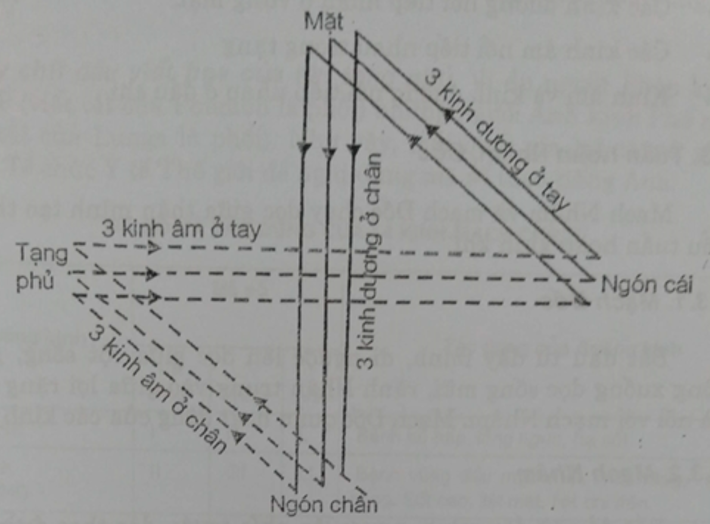
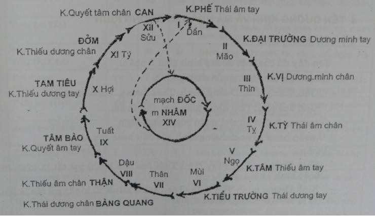

# Bài 2 HỆ KINH LẠC

## MỤC TIÊU

_1. Nêu được những tác dụng của kinh lạc_

_2. Vẽ đường tuần hoàn của kinh khí (thứ tự và kinh chính) và hướng đi khái quát của 12 đường kinh chính._

## 1. ĐẠI CƯƠNG

### 1.1. Thuyết kinh lạc

Từ thực tiễn lâm sàng hàng ngàn năm, y học cổ truyền phương Đông đã xây dựng nên thuyết Kinh lạc. Thuyết Kinh lạc là một bộ phận của lý luận cơ bản Đông y, nó chỉ đạo các khâu chẩn đoán bệnh, chữa bệnh, chế thuốc, dùng thuốc và xoa bóp. Người xưa nói: "Nghề làm thuốc nếu không biết kinh lạc thì dễ sai lầm".

### 1.2. Hệ kinh lạc

Kinh là những đường chạy dọc cơ thể, là cái khung của hệ Kinh lạc, đi ở sâu; lạc là đường ngang, là cái lưới, đi ở nông. Kinh lạc toả khắp toàn thân, là đường vận hành của khí huyết, thực hiện sự cân bằng âm dương, kết hợp các tạng phủ thành khối chỉnh thể và con người với môi trường thiên nhiên.

_**Có 12 kinh chính gồm:**_

- 3 Kinh âm ở tay (Thủ tam âm): Thái âm Phế, Thiếu âm Tâm và Quyết âm Tâm bào.
- 3 Kinh dương ở tay (Thủ tam dương): Dương minh Đại trường, Thiếu dương Tam tiêu và Thái dương Tiểu trường.
- 3 Kinh âm ở chân (Túc tam âm): Thái âm Tỳ, Thiếu âm Thận và Quyết âm Can.
- 3 Kinh dương ở chân (Túc tam dương): Dương minh Vị, Thái dương Bàng quang và Thiếu dương Đởm.

8 Kinh mạch phụ: Nhâm mạch, Đốc mạch, Xung mạch, Đới mạch, Âm duy, Dương duy, Âm kiểu, Dương kiểu.

12 Kinh biệt tách ra từ 12 kinh chính.

12 Kinh cân nối các đầu xương ở tứ chi với tạng phủ.

15 Biệt lạc đi từ 14 kinh mạch biểu lý với nhau và 1 tổng lạc. Các biệt lạc lại phân ra các lạc nhỏ là tôn lạc, phù lạc.

## 2. TÁC DỤNG CỦA KINH LẠC

### 2.1. Về sinh lý và bệnh lý

Kinh lạc là đường vận hành của khí huyết đi nuôi dưỡng cơ thể, bảo vệ cơ thể chống lại bệnh tật. Đồng thời kinh lạc cũng là đường xâm nhập và truyền dẫn bệnh tà vào cơ thể. Những rối loạn ở bên trong cơ thể cũng qua truyền dẫn bệnh tà vào cơ thể. Những rối loạn ở bên trong cơ thể cũng qua kinh lạc mà phản ánh ra bên ngoài.

Ví dụ: Tạng phế bị bệnh sẽ thể hiện đau vùng ngực và dọc theo đường đi của kinh Phế, tạng can bị bệnh thường đau hai bên mạng sườn là nơi kinh Can tỏa ra ở đó

### 2.2. Về chẩn đoán và chữa bệnh

Dựa vào vị trí đau có thể biết kinh nào hoặc tạng phủ nào bị bệnh (Kinh lạc chẩn). Đau đầu phía trán thuộc kinh Dương minh, đau đầu hai bên thái dương thuộc kinh Thiếu dương, đau đầu phía chẩm gáy thuộc kinh Thái dương, đau đỉnh đầu thuộc kinh Quyết âm Can.

Dựa vào những biến đổi bất thường trên vùng kinh đi qua như thay đổi màu da, thay đổi cảm giác, thay đổi điện trở... ta có thêm dữ liệu để chẩn đoán bệnh.

Trong điều trị, kinh lạc là đường dẫn truyền các dạng kích thích dùng trong kim châm như cơ học (châm, bấm), lý học (xung điện, tia laze), hóa học (thuốc tiêm)... Kinh lạc cũng là đường dẫn truyền tác dụng của các thuốc uống vào tạng phủ nhất định (quy kinh của các vị thuốc).

_Kinh lạc sở quá, chủ trị sở cập_

Kinh lạc đi qua vùng nào, có tác dụng chữa bệnh tại vùng đó.

## 3. TUẦN HOÀN KINH MẠCH

Đường tuần hoàn kinh mạch thể hiện mối quan hệ bên trong và bên ngoài cơ thể (Biểu – Lý), quan hệ giữa các tạng phủ...

### 3.1. Hướng đi khái quát của 12 đường kinh chính

- 3 Kinh âm ở tay đều từ các tạng trong ngực đi ra các ngón tay.

- 3 Kinh dương ở tay tiếp nối từ các ngón tay đi tới mặt.

- 3 Kinh dương ở chân tiếp nối từ mặt đi xuống các ngón chân.

- 3 Kinh âm ở chân từ ngón chân đi lên các tạng.

### 3.2. Sơ đồ tuần hoàn kinh khí

_Nhận xét:_

- Các kinh dương nối tiếp nhau ở vùng mặt.
- Các kinh âm nối tiếp nhau trong tạng.
- Kinh âm và kinh dương nối tiếp nhau ở đầu chi

### 3.3. Tuần hoàn Nhâm, Đốc

Mạch Nhâm và mạch Đốc chạy dọc giữa thân mình tạo thành một vòng tiểu tuần hoàn kinh khí

**3.3.1. Mạch Đốc**

Bắt đầu từ đáy mình, đi ngược lên dọc giữa cột sống, gáy, đỉnh đầu vòng xuống dọc sống mũi, rãnh Nhân trung vào giữa lợi răng của hàm trên và nối với mạch Nhâm. Mạch Đốc quản hoạt động của các kinh dương.

**3.3.2. Mạch Nhâm**

Bắt đầu từ đáy mình, ngược lên phía trước, dọc theo đường giữa bụng, ngực cổ đến hõm môi dưới, vòng quanh miệng rồi lên 2 mắt. Mạch Nhâm đảm nhiệm hoạt động của các kinh âm.

## 4. TÊN ĐƯỜNG KINH VÀ MÃ HÓA TÊN ĐƯỜNG KINH

### 4.1. Tên đường kinh

Tên đầy đủ của một đường kinh gồm ba phần:

- Tính chất âm, dương của đường kinh:

- Kinh dương gồm: Dương minh, Thái dương, Thiếu dương.
- Kinh âm gồm: Thái âm, Thiếu âm, Quyết âm.

- Tên tạng hoặc phủ chủ quản của đường kinh.
- Ở chân hay ở tay nơi đường kinh bắt đầu hoặc tận cùng.

Ví dụ:

- Kinh Thái âm Phế ở tay (Thủ Thái âm Phế kinh) gọi tắt là kinh Phế hoặc kinh Thái âm tay.
- Kinh Dương minh Vị ở chân (Túc Dương minh Vị kinh) gọi tắt là kinh Vị hoặc kinh Dương minh chân.

### 4.2. Mã hóa tên đường kinh

Để quốc tế hóa châm cứu, tiện cho việc thông tin trao đổi về châm cứu, người ta mã hóa tên đường kinh. Có nhiều cách mã hóa:

_**4.2.1. Dựa theo vòng tuần hoàn kinh khí**_, dùng số La Mã để chỉ tên huyệt. Bắt đầu từ kinh Phế là I, rồi lần lượt các kinh tiếp theo, tận cùng là kinh Nhâm XIV.

_**4.2.2. Lấy chữ đầu viết hoa của tên tạng phủ**_. Ví dụ người Pháp, kinh Phế mã số là P (viết tắt của Poumon là phổi), nhưng người Anh kinh Phế mã số là Lu (Viết tắt của Lungs là phổi). Như vậy, mỗi quốc gia lại có mã số riêng. Gần đây, Tổ chức Y tế Thế giới đề nghị dùng mã số theo tên tiếng Anh.

**MÃ SỐ VÀ TÁC DỤNG CỦA 14 KINH MẠCH CHÍNH**

| **Tên đường kinh**| **Mã số**| **Tác dụng của đường kinh**|
| --- | --- | --- |
| La mã | Pháp | Anh |
| Thái âm Phế | I | P | L | Bệnh hô hấp, lồng ngực, hạ sốt |
| Dương minh ĐẠI TRƯỜNG | II | GI | LI | Bệnh vùng đầu mặt: mắt, mũi, răng, miệng, họng. Sốt cao, liệt mặt, liệt chi trên. |
| Dương minh VỊ | III | E | S | Bệnh vùng đầu mặt: mắt, răng miệng, họng, dạ dày. Sốt cao, chi dưới. |
| Thái âm TỲ | IV | Rp | Sp | Bệnh tiêu hóa, sinh dục, tiết niệu, tâm thần, đau liệt chi dưới. |
| Thiếu âm TÂM | V | C | H | Bệnh lồng ngực, rối loạn thần kinh, tim, mạch vành, suy nhược TK, hạ sốt, tê đau chi trên. |
| Thái dương TIỂU TRƯỜNG | VI | IG | SI | Bệnh vùng mặt: mắt, tai, răng, cổ, họng. Hạ sốt, tê đau chi trên. |
| Thái dương BÀNG QUANG | VII | V | B | Bệnh vùng mặt: đầu, gáy lưng, chi dưới, các tạng phủ liên quan tiết đoạn, cảm mạo, hạ sốt. |
| Thiếu âm THẬN | VIII | R | K | Bệnh tiết niệu, sinh dục, hen, viêm phế quản mạn, suy nhược TK, tê đau chi dưới. |
| Quyết âm TÂM BÀO | IX | MC | P | Bệnh lồng ngực, rối loạn nhịp tim, suy nhược TK, nôn nấc, hạ sốt, tê đau chi trên. |
| Thiếu dương TAM TRIỀU | X | TR | T | Mặt bên đầu mặt, bệnh tai, mắt, hạ sốt, rối loạn tâm thần. |
| Thiếu dương ĐỞM | XI | VB | G | Mặt trên đầu mặt và thân mình, đau vai gáy, liệt chi trên. |
| Quyết âm CAN | XII | F | Li | Bệnh tiết niệu, sinh dục, đau dạ dày, đau vùng gan, tăng huyết áp. |
| Mạch ĐỐC | XIII | VG | GV | Rối loạn thân nhiệt, đau cột sống, bổ cơ thể. |
| Mạch NHÂM | XIV | VC | CV | Bệnh các tạng phủ tương ứng đường kinh đi qua, trụy tim mạch, sốc. |

## THẢO LUẬN

1. Chỉ có châm cứu mới cần hiểu biết về kinh lạc, còn chữa bệnh bằng thuốc không cần. Đúng hay sai? Tại sao?

2. Qua tên đầy đủ của một đường kinh, ta có thể suy đoán tác dụng của nó không? Tại sao?

**TỰ LƯỢNG GIÁ HỆ KINH LẠC**

**Điền vào khoảng trống:**

1. Thuyết Kinh lạc là một bộ phận ……………………………… của Đông y.

2. Nêu tên 3 kinh âm ở tay: A……………..B……………..C……………..

3. Nêu tên 3 kinh dương ở tay: A……………..B……………..C……………..

4. Nêu tên 3 kinh dương ở chân: A…………….B…………….C…………….

5. Nêu tên 3 kinh âm ở chân: A……………..B……………..C……………..

6. Các kinh dương nối tiếp nhau ở vùng: ………………………………

7. Các kinh âm nối tiếp nhau ở vùng: ………………………………

8. Kinh âm nối tiếp kinh dương ở: ………………………………

9. Nêu tên 4 mạch đơn: A…..……….B…..……….C……..…….D…….……..

10. Kinh lạc sở: ..........A………., chủ trị sở ……….B……….

11. 3 kinh âm tay đi từ ..........A………. đến ……….B……….

12. 3 kinh dương tay đi từ ..........A………. đến ……….B……….

13. 3 kinh dương chân đi từ ..........A………. đến ……….B……….

14. 3 kinh âm chân đi từ ..........A………. đến ……….B……….

15. Tên đầy đủ của một đường kinh gồm: ………………. phần

16. Dựa vào vòng tuần hoàn kinh khí, kinh số X tên là ..........A………. và mã số theo tiếng Anh viết là ……….B……….

**Trả lời Đúng – Sai:**

| 17. Hệ Kinh lạc có thể ví như mạng lưới giao thông liên lạc trong một quốc gia | Đúng - Sai |
| --- | --- |
| 18. Chữa bệnh bằng thuốc không cần biết kinh lạc | Đúng - Sai |
| 19. Tác dụng điều khí của châm cứu phải thông qua kinh lạc | Đúng - Sai |
| 20. Kinh lạc là do con người tự đặt ra theo chủ quan, không có thực tiễn | Đúng – Sai |
| 21. Tiếp theo kinh Vị là kinh Tiểu trường | Đúng - Sai |
| 22. Tiếp theo kinh Thận là kinh Bàng quang | Đúng – Sai |
| 23. Mạch Đốc đi từ đỉnh đầu xuống đáy mình | Đúng - Sai |
| 24. Mạch Nhâm đảm nhiệm các kinh âm | Đúng - Sai |
| 25. Dựa vào tên đầy đủ của 1 đường kính, ta có thể biết tính chất và hướng đi khái quát của nó | Đúng - Sai |

**Chọn và trả lời tốt nhất:**

26. Đau vùng mạng sườn thường là bệnh thuộc tạng:

A. Tâm

B. Can

C. Tỳ

D. Phế

27. Đau đầu phía trán thuộc phạm vi của kinh:

A. Dương minh Đại trường

B. Thái dương Bàng quang

C. Thiếu dương Đởm

**ĐÁP ÁN**

| 1. Lý luận cơ bản |
| --- |
| 2. A. Thái âm Phế | B. Thiếu âm Tâm | C. Quyết âm Tâm Bào |
| 3. A. Dương Minh Đại trường | B. Thái dương Tiểu trường | C. Thiếu dương Tam tiêu |
| 4. A. Dương minh Vị | B. Thái dương Bàng quang | C. Thiếu dương Đởm |
| 5. A. Thái âm Tỳ | B. Thiếu âm Thận | C. Quyết âm Can |
| 6. Vùng mặt |
| 7. Trong tạng hoặc bụng ngực |
| 8. Đầu ngón tay, chân |
| 9. A. Đốc B. Nhâm C. Xung D. Đới |
| 10. A. Quá | B. Cập (tại) |
| 11. A. Từ các tạng trong ngực | B. Đến đầu các ngón tay |
| 12. A. Đầu ngón tay | B. Đến vùng mặt |
| 13. A. Vùng mặt | B. Đến ngón chân |
| 14. A. Các ngón chân | B. Đến các tạng trong bụng ngực |
| 15. Gồm 3 phần |
| 16. A. Kinh Tam tiêu | B. T |
| 17. Đúng | 18. Sai | 19. Đúng |
| 20. Sai | 21. Sai | 22. Sai |
| 23. Sai | 24. Đúng | 25. Đúng |
| 26. B (Can) | 
| 27. A. (Dương minh Đại trường) |