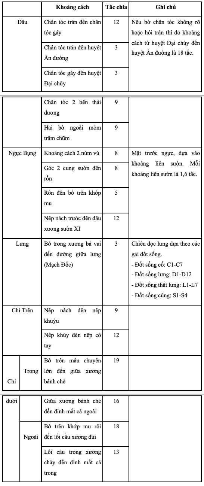
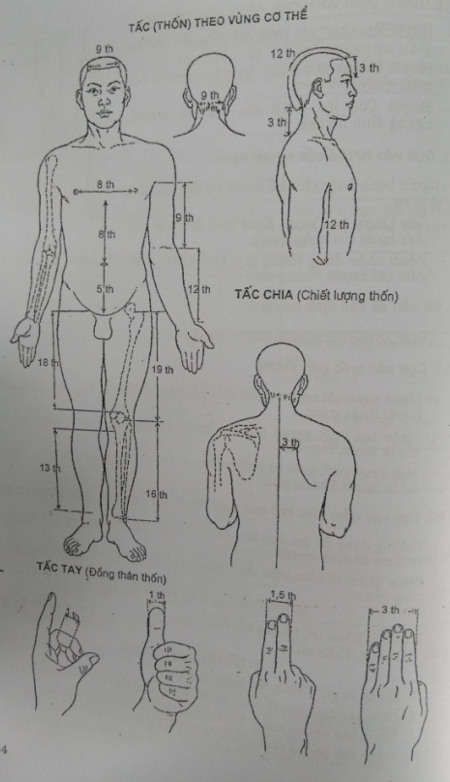

# 3 ĐẠI CƯƠNG HUYỆT CHÂM CỨU

**MỤC TIÊU**

_1. Trình bày được những tác dụng chung của huyệt và những tác dụng đặc hiệu của các loại huyệt._

_2. Trình bày những cách xác định vị trí huyệt._

## 1. ĐỊNH NGHĨA

Huyệt là một điểm trên da "nơi thần khí hoạt động vào ra", được phân bố khắp phần ngoài cơ thể nhưng không phải là hình thái tại chỗ của da, cơ, gân, xương.

## 2. TÁC DỤNG CỦA HUYỆT

### 2.1. Về sinh lý

Huyệt có quan hệ mật thiết với kinh mạch và tạng phủ mà nó phụ thuộc. Huyệt là nơi dinh khí, vệ khí vận hành qua lại, nơi tạng phủ, kinh lạc dựa vào đó mà thông suốt với phần ngoài cơ thể, góp phần giữ cho các hoạt động của cơ thể luôn ở trạng thái cân bằng.

### 2.2. Về bệnh lý

Huyệt là cửa ngõ xâm nhập của tà khí. Khi chính khí suy yếu, khí huyết không được điều hòa thì ngoại tà qua huyệt vào gây bệnh trong cơ thể.

Mặt khác, khi tạng phủ, kinh lạc có bệnh thì cũng phản ánh ra ở huyệt bằng cảm giác đau, thay đổi màu da và các thay đổi về diện sinh học tại huyệt.

### 2.3. Chẩn đoán bệnh

Dựa vào những biến đổi tại huyệt vị, ta có thêm những thông tin để chẩn đoán bệnh.

Ví dụ: Bệnh của tạng Phế, ấn huyệt Trung phủ đau. Viêm ruột thừa cấp, ấn huyệt Lan vĩ đau...

### 2.4. Phòng bệnh và chữa bệnh

Tác động vào huyệt một lượng kích thích thích hợp, ta có thể dự phòng hoặc điều chỉnh những rối loạn chức năng tạng phủ, thúc đẩy hoạt động của kinh lạc, duy trì sự cân bằng âm dương, bồi bổ chính khí.

Ví dụ về dự phòng: Thường xuyên day bấm huyệt Túc tam lý có tác dụng tăng cường sức khỏe.

Ví dụ chữa bệnh: Rức đầu do cảm mạo, tác động vào các huyệt Thái dương, Ấn đường, Đầu duy, Bách hội sẽ làm hết rức đầu…

## 3. CÁ LOẠI HUYỆT

Có 3 loại huyệt chính:

### 3.1. Huyệt A thị

Còn có tên là Thống điểm hay Thiên ứng. Huyệt A thị không có vị trí cố định, chỉ xuất hiện khi có bệnh. Lấy điểm đau làm huyệt. Tác dụng chữa chứng đau cấp rất tốt.

### 3.2. Huyệt ngoài kinh

Là những huyệt không thuộc 14 kinh mạch chính, thường nằm ngoài đường kinh, cũng có huyệt nằm trên kinh mạch nhưng không thuộc kinh mạch đó (huyệt Ấn đường).

Hiện nay có khoảng 200 huyệt ngoài kinh bao gồm cả các huyệt mới phát hiện (Tân Huyệt). Tổ chức Y tế Thế giới chỉ mới công nhận 40 huyệt ngoài kinh và không đề cập đến Tân huyệt.

### 3.3. Huyệt thuộc kinh mạch

Những huyệt này đều nằm trên 12 kinh chính và 2 mạch Nhâm, Đốc được xếp theo tác dụng thành những nhóm huyệt như sau:

#### 3.3.1. Huyệt Nguyên

Mỗi đường kinh chính có một huyệt Nguyên, thường nằm quanh cổ tay, cổ chân. Huyệt Nguyên là nơi tập trung khí huyết nhất của đường kinh như huyệt Thái uyên là huyệt nguyên của kinh Phế.

#### 3.3.2. Huyệt Lạc

Là một huyệt trên đường kinh có liên quan biểu lý với đường kinh đó, có tất cả 15 huyệt lạc. Mỗi kinh mạch chính đều có 1 huyệt lạc, tổng số 14 cộng thêm một tổng lạc ở kinh Tỳ (huyệt Đại bao). Như Công tôn là huyệt lạc của kinh Tỳ có liên quan với kinh Vị.

#### 3.3.3. Huyệt Du ở lưng (Bối du)

Là huyệt tương ứng với các tạng phủ, nằm trên kinh Bàng quang dọc 2 bên cột sống. Như Phế du là huyệt Du của Phế, Đại trường du là huyệt Du của Đại trường.

#### 3.3.4. Huyệt Mộ

Là huyệt nằm trên đường kinh đi qua vùng ngực, bụng, tương ứng với tạng phủ. Như Trung phủ (thuộc kinh Phế) là huyệt Mộ của Phế, Thiên khu (thuộc kinh Vị) là huyệt Mộ của Đại trường.

#### 3.3.5. Huyệt Khích

Mỗi kinh có một huyệt khích, thường dùng để chẩn đoán và chữa những chứng bệnh cấp tính của đường kinh và tạng phủ mà nó có quan hệ.

**Các huyệt: Nguyên, Lạc, Du, Mộ, Khích của 12 kinh chính**

| | **Nguyên**| **Lạc**| **Du**| **Mộ**| **Khích**|
| --- | --- | --- | --- | --- | --- |
| Kinh Phế | Thái uyên I.9 | Liệt khuyết I.7 | Phế du VII.13 | Trung phủ I.1 | Khổng tối I.6 |
| Kinh Đại trường | Hợp cốc II.4 | Thiên lịch II.6 | Đại trường du VI.25 | Thiên khu III.25 | Ôn lưu II.7 |
| Kinh Thận | Thái khê VIII.3 | Đại chung VIII.4 | Thận du VII.23 | Kinh môn XI.25 | Thủy tuyền VIII.5 |
| Kinh Bàng quang | Kinh cốt VII.64 | Phi dương VII.58 | Bàng quang du VII.28 | Trung cực XIV.3 | Kim môn VII.63 |
| Kinh Can | Thái xung XII. 3 | Lãi câu XII.5 | Can du VII.18 | Kỳ môn XII.14 | Trung đô XII.6 |
| Kinh Đởm | Khâu hư XI.40 | Quang minh XI.37 | Đởm du VII.19 | Nhật Nguyệt XI.14 | Ngoại khâu XI.36 |
| Kinh Tâm | Thần môn V.7 | Thông lý V.5 | Tâm du VII.15 | Cự khuyết XII.14 | Âm khích V.6 |
| Kinh Tiểu trường | Uyển cốt VI.4 | Chi chính VI.7 | Tiểu trường du VII.27 | Quan nguyên XIV.4 | Dưỡng lão VI.6 |
| Kinh Tâm bào | Đại lăng XI.7 | Nội quan IX.6 | Quyết âm du VII.14 | Đản trung XIV.14 | Khích môn IX.4 |
| Kinh Tam tiêu | Dương trì X.4 | Ngoại quan X.5 | Tam tiêu du VII.22 | Thạch môn XIV.5 | Hội tông X.7 |
| Kinh Tỳ | Thái bạch IV.3 | Công tôn IV.40 | Tỳ du VII.20 | Chương môn XII.3 | Địa cơ IV.8 |
| Kinh Vị | Xung dương III.42 | Phong long III.40 | Vị du VII.21 | Trung quản XIV.12 | Lương khâu III.34 |

#### 3.3.6. Huyệt Hội

Có 8 huyệt Hội đại diện cho 8 loại thể chất trong cơ thể. Khi loại thể chất nào bị bệnh thì dùng huyệt Hội của loại thể chất đó. Như chứng nôn, nấc là do khí nghịch, bệnh của khí nên dùng huyệt Đản trung là huyệt Hội của khí.

| **Loại thể chất**| **Huyệt Hội**| **Thuộc kinh**|
| --- | --- | --- |
| 1. Tạng | Chương môn | Can |
| 2. Phủ | Trung quản | Nhâm |
| 3. Khí | Đản trung | Nhâm |
| 4. Huyết | Cách du | Bàng quang |
| 5. Cân | Dương lăng tuyền | Đởm |
| 6. Mạch | Thái uyên | Phế |
| 7. Xương | Đại trữ | Bàng quang |
| 8. Tủy | Tuyệt cốt | Đởm |

#### 3.3.7. Huyệt Tổng

Là huyệt có tác dụng đặc hiệu với một vùng cơ thể:

- Vùng mặt: Hợp cốc

- Vùng cổ gáy: Liệt khuyết

- Vùng ngực: Nội quan

- Vùng thượng vị: Túc tam lý

- Vùng hạ vị: Tam âm giao

- Vùng thắt lưng: Ủy trung

#### 3.3.8. Huyệt Ngũ du

Là 5 huyệt của đường kinh nằm từ khuỷu tay và đầu gối đến đầu ngón tay hay ngón chân. Mỗi huyệt lại được xếp theo chức năng thành 5 nhóm, có tên gọi riêng:

- Huyện Tỉnh: Ở đầu ngón tay hoặc chân, có tác dụng cấp cứu hồi tỉnh và hạ sốt.

- Huyệt Huỳnh: Tác dụng chữa bệnh có sốt.

- Huyệt Du: Chữa chứng đau nặng mình mẩy, bệnh xương khớp.

- Huyệt Kinh: Chữa chứng hen suyễn, ho, bệnh hô hấp.

- Huyệt Hợp: Ở quanh khớp khuỷu tay hay khớp gối, chữa chứng khí nghịch, ỉa chảy, bệnh tiêu hóa.

### 3.4. Số lượng huyệt

Tổng cộng có 670 huyệt của đường kinh, gồm có 618 huyệt kép (đối xứng ở hai bên cơ thể) nằm trên 12 kinh chính và 52 huyệt đơn nằm trên hai mạch Nhâm, Đốc.

Đến nay có khoảng 200 huyệt ngoài kinh bao gồm cả các huyệt mới. Tổ chức Y tế Thế giới mới công nhận 40 huyệt.

### 3.5. Mã hóa tên huyệt

Người ta mã hóa tên huyệt bằng cách dùng mã số của đường kinh (số La Mã hoặc mã hóa theo tiếng Anh) thêm vào phía sau số Ả Rập (1,2,3,4,...) tính theo thứ tự của huyệt đó trên đường kinh.

Ví dụ:

- Huyệt Trung phủ thuộc kinh Phế (I hay Lu) và Trung phủ là huyệt đầu tiên của kinh Phế nên mã số của huyệt Trung phủ là I1 hay Lu1.

- Huyệt Hợp cốc thuộc kinh Đại trường (II hay LI) và là huyệt thứ tư của đường kinh nên mã số là II4 hay LI4.

## 4. XÁC ĐỊNH VỊ TRÍ HUYỆT

Muốn châm đạt hiệu quả cao, cần xác định đúng huyệt vị.

Có 3 cách xác định vị trí huyệt, trên thực tế thường kết hợp 2 hoặc 3 cách:

### 4.1. Đo để xác định huyệt

#### 4.1.1. Đơn vị đo

Đơn vị đo gọi là tấc (hay thốn)

Tấc có chiều dài thay đổi tùy người (lớn, nhỏ, béo, gầy) và tùy từng vùng cơ thể. Nói chung 1 tấc = 1/75 chiều dài cơ thể. Theo kết quả điều tra cơ bản của Viện Y học dân tộc Hà Nội năm 1967, tấc của người Việt Nam khoảng 2,0 đến 2,2 cm.

Có 2 loại tấc: Tấc tay và tấc chia

**4.1.1.1. Tấc tay (đồng thân thốn)**

- Tấc của đốt giữa ngón giữa: Người bệnh co ngón tay giữa vào ngón cái, áp 2 đầu ngón tay vào nhau thành một vòng kín, khoảng đo giữa 2 đầu nếp đốt giữa của ngón giữa là 1 tấc. Tấc này thường dùng để đo chiều ngang vùng lưng và chiều dài ở chi, chiều sâu khi châm.

- Chiều ngang 4 ngón tay. Người bệnh duỗi bàn tay, bốn ngón 2, 3, 4, 5 áp sát vào nhau, chiều dài đường ngang qua khớp đốt ngón giữa là 3 tấc.

- Chiều ngang ngón cái: Đoạn qua ngang chân móng ngón cái dài 1 tấc.

**4.1.1.2. Tấc chia (chiết lượng thốn)**

Căn cứ vào chiều dài của từng vùng cơ thể, chia thành những phân đoạn gọi là một tấc chia.

<table border="1" style="border-collapse: collapse; width: 100%;">
  <thead>
    <tr>
       <th></th>
      <th>Khoảng cách</th>
      <th>Tác chia</th>
      <th>Ghi chú</th>
    </tr>
  </thead>
  <tbody>
    <tr>
      <td rowspan="5">Đầu</td>
      <td>Chân tóc trán đến chân tóc gáy</td>
      <td>12</td>
      <td rowspan="5">Nếu bỏ chân tóc không rõ hoặc hói trán thì do khoảng cách từ huyệt Đại chuyển đến huyệt An đường là 18 tấc.</td>
    </tr>
    <tr>
      <td>Chân tóc trán đến huyệt An đường</td>
      <td>3</td>
    </tr>
    <tr>
      <td>Chân tóc gáy đến huyệt Đại chuy</td>
      <td>3</td>
    </tr>
    <tr>
      <td>Chân tóc 2 bên thái dương</td>
      <td>9</td>
    </tr>
    <tr>
      <td>Hai bờ ngoài môi trâm chùm</td>
      <td>9</td>
    </tr>
    <tr>
      <td rowspan="4">Ngực Bụng</td>
      <td>Khoảng cách 2 núm vú</td>
      <td>8</td>
      <td rowspan="4">Mặt trước ngực, dựa vào khoảng liên sườn. Mỗi khoảng liên sườn là 1,6 tấc.</td>
    </tr>
    <tr>
      <td>Góc 2 cung sườn đến rốn</td>
      <td>8</td>
    </tr>
    <tr>
      <td>Rốn đến bờ trên khớp mu</td>
      <td>5</td>
    </tr>
    <tr>
      <td>Nếp nách trước đến đầu xương sườn XI</td>
      <td>12</td>
    </tr>
    <tr>
      <td rowspan="1">Lưng</td>
      <td>Bờ trong xương bả vai đến đường giữa lưng (Mạch Đốc)</td>
      <td>3</td>
      <td rowspan="1">Chiều dọc lưng dựa theo các gai đốt sống. - Đốt sống cổ: C1-C7 - Đốt sống lưng: D1-D12 - Đốt sống thắt lưng: L1-L7 - Đốt sống cụng: S1-S4</td>
    </tr>
    <tr>
      <td rowspan="2">Chi Trên</td>
      <td>Nếp nách đến nếp khuyu</td>
      <td>9</td>
      <td rowspan="2"></td>
    </tr>
    <tr>
      <td>Nếp khuy đến nếp cổ tay</td>
      <td>12</td>
    </tr>
    <tr>
      <td rowspan="2">Chi dưới - Trong</td>
      <td>Bờ trên mẩu chuyển lớn đến giữa xương bánh chè</td>
    <td>19</td>
    <td rowspan="2"></td>
    </tr>
    <tr>
    <td>Giữa xương bánh chè đến đỉnh mắt cá ngoài</td>
    <td>16</td>
    </tr>
    <tr>
    <td rowspan="2">Chi dưới - Ngoài</td>
    <td>Bờ trên khớp mu rồi đến lồi cầu xương đùi</td>
    <td>18</td>
    <td rowspan="2"></td>
    </tr>
    <tr>
    <td>Lồi cầu trong xương chày đến đỉnh mắt cá trong</td>
    <td>13</td>
    </tr>

  </tbody>
</table>

### 4.2. Nhìn để xác định huyệt

#### 4.2.1. Dựa vào những mốc giải phẫu

Tương quan với mắt, mũi, tai, miệng như:

- Huyệt Nghinh hương ở ngang cánh mũi, trên rãnh mũi mác.

- Huyệt Thính cung ở điểm giữa chân bình tai.

- Huyệt Ấn đường ở điểm giữa đầu trong của hai lông mày.

Tương quan với xương, khớp, gân, cơ như:

- Huyệt Đại chùy sát dưới gai sống đốt xương cổ 7.

- Huyệt Dương khê ở đáy lõm vào dưới mỏm trâm quay.

- Huyệt Côn lôn ở bờ sau mắt cá ngoài, ngang đỉnh mắt cá.

#### 4.2.2. Dựa vào tư thế của người bệnh

Người bệnh hoặc chi thể ở một tư thế nào đó, mốc sẽ lộ ra.

- Gấp khuỷu tay, huyệt Khúc trì ở đầu nếp gấp phía ngoài của khớp khuỷu.

- Bệnh nhân đứng thõng tay, áp bàn tay vào mặt ngoài đùi, đỉnh ngón giữa chỉ huyệt Phong thị.

### 4.3. Sờ nắn để xác định huyệt

(Thầy thuốc dùng ngón tay ấn tìm huyệt).

#### 4.3.1. Dựa vào mốc gân xương

- Ngón tay vuốt ngược rãnh liên đốt bàn chân I, II đến chỗ vướng tắc là huyệt Thái xung.

- Ngón tay vuốt ngược theo bờ ngoài xương bàn tay II đến chỗ vướng tắc là huyệt Hợp cốc.

- Ngón tay vuốt xuôi từ phía xương chẩm xuống gáy, nơi ngón tay dừng lại là huyệt Phong phủ.

#### 4.3.2. Dựa vào cảm giác tay của thầy thuốc và cảm giác của bệnh nhân:

Thường dùng để tìm huyệt A thị hoặc xác định lại chính xác sau khi đã đo hoặc nhìn để định huyệt.

Bệnh nhân có cảm giác đau, tức, nặng, thầy thuốc thấy tổ chức ở đó cộm, căng rắn,...

### A. THỰC HÀNH XÁC ĐỊNH HUYỆT VỊ

Hợp cốc, Khúc trí, Khổng tối, Nội quan, Thần môn, Túc tam lý, Tam âm giao, Đại chùy, Thận du.

### B. CÂU HỎI ĐÁNH GIÁ

1. Huyệt là gì? Những tác dụng của huyệt?

2. Cách xác định huyệt A thị và tác dụng của nó.

3. Trình bày những nhóm huyệt của kinh và tác dụng của chúng.

4. Trình bày những cách xác định huyệt vị.

TẤC (THỐN) THEO VÙNG CƠ THỂ

**TỰ LƯỢNG GIÁ ĐẠI HUYỆT CHÂM CỨU**

**Mã số bài**: III

**Mã câu hỏi**: III1………………..III40

| **Mã câu**| **Nội dung câu hỏi**| **Đúng**| **Sai**|
| --- | --- | --- | --- |
| 1 | Huyệt châm cứu không phải là một điểm hình học mà là một khoảng nhỏ trên mặt da (đường kính khoảng 2 milimet) |
| 2 | Huyệt là hình thái tại chỗ của da, cơ, gân, xương |
| 3 | Huyệt là cửa ngõ giao lưu của cơ thể với môi trường bên ngoài |
| 4 | Huyệt là nơi bệnh tà bên ngoài xâm nhập vào cơ thể |
| 5 | Huyệt không biểu hiện những trục trặc bên trong cơ thể |
| 6 | Dựa vào biến đổi ở vùng huyệt (về cảm giác, về điện trở da…) ta có thể chẩn đoán rối loạn chức năng của tạng phủ tương quan |
| 7 | Tác động vào huyệt chỉ để chữa bệnh, không có tác dụng phòng bệnh |
| 8 | Huyệt A thị không có vị trí cố định |
| 9 | Huyệt ngoài kinh để chỉ những huyệt hoàn toàn nằm ngoài đường kinh |
| 10 | Huyệt kinh là huyệt nằm trên một đường kinh nhất định |
| 11 | Tân huyệt là những huyệt mới phát hiện trong những năm gần đây |
| 12 | Huyệt Nguyên là huyệt chủ của mỗi một đường kinh, thường nằm quanh khuỷu tay và khoeo chân |
| 13 | Huyệt Lạc là huyệt có nhánh nối với kinh có quan hệ biểu lý với kinh đó |
| 14 | Cơ thể có 14 kinh mạch chính và có 14 huyệt Lạc |
| 15 | Các huyệt Du ở lưng đều không nằm trên đường kinh thuộc tạng phủ mà nó mang tên. Ví dụ Tâm du không nằm trên kinh Tâm |
| 16 | Các huyệt Du ở lưng thường nằm trên tiết đoạn TK liên quan đến tạng phủ mà nó mang tên |
| 17 | Mỗi tạng phủ có một huyệt Mộ nằm trên tiết đoạn TK liên quan đến tạng phủ đó |
| 18 | Mỗi đường kinh có một huyệt Khích nằm trên đường kinh đó |
| 19 | Huyệt Hội đại diện cho một loại thể chất của cơ thể |
| 20 | Huyệt Đại trữ là huyệt Hội của xương |
| 21 | Huyệt Cách du là huyệt Hội của khí |
| 22 | Bệnh thuộc về cân thường phải tác động vào huyệt Dương lăng tuyền |
| 23 | Huyệt Tổng là huyệt có tác dụng đặc biệt tới một vùng nhất định |
| 24 | Các chứng bệnh ở vùng mặt thường phải tác động vào huyệt Nội quan |
| 25 | Đau vùng thắt lưng thường phải tác động vào huyệt Ủy trung |
| 26 | Các huyệt Tỉnh đều có tác dụng giảm đau mạnh |
| 27 | Xác định huyệt Ấn đường chủ yếu bằng cách nhìn |
| 28 | Xác định huyệt A thị bằng cách nhìn kết hợp cách đo |
| 29 | Chiều ngang A ngón tay áp sát nhau, chạy qua chân móng ngón út là 4 thốn (hay tấc) |
| 30 | Chiều ngang ngón cái đi qua khớp đốt I và II là 1 thốn (tấc) |
| 31 | Đỉnh góc tạo bởi hai cung sườn đến rốn là 8 thốn |
| 32 | Từ rốn đến bờ trên khớp mu chia thành 4 thốn (tấc) |
| 33 | Tấc tay (đồng thân thốn) và tấc chia (chiết lượng thốn) dài bằng nhau |
| 34 | Xác định huyệt khúc trì dựa vào tư thế cẳng tay - cánh tay |
| 35 | Thốn hoặc tấc có số đo cố định |
| 36 | Mã hóa tên huyệt dựa vào mã số đường kinh và số thứ tự của huyệt đó trên đường kinh |
| 37 | Khoảng cách từ đường gai sống tới bờ trong xương bả vai (tư thế tay buông xuôi) có số đo bằng 1,5 thốn |
| 38 | Mã số của huyệt Hợp cốc là II3 hoặc LI.3 |
| 39 | Mã số của huyệt Trung phủ là III.36 hoặc S.36 |
| 40 | Mã số của huyệt Nguyên của kinh Phế là I.9 hoặc L.1 |

**ĐÁP ÁN**

| 1.Đ | 2.S | 3.Đ | 4.Đ | 5.S | 6.Đ | 7.S | 8.Đ | 9.S | 10.Đ |
| --- | --- | --- | --- | --- | --- | --- | --- | --- | --- |
| 11.Đ | 12.S | 13.Đ | 14.S | 15.Đ | 16.Đ | 17.S | 18.Đ | 19.Đ | 20.Đ |
| 21.S | 22.Đ | 23.Đ | 24.S | 25.Đ | 26.S | 27.Đ | 28.S | 29.S | 30.S |
| 31.Đ | 32.S | 33.S | 34.Đ | 35.S | 36.Đ | 37.S | 38.S | 39.S | 40.Đ |