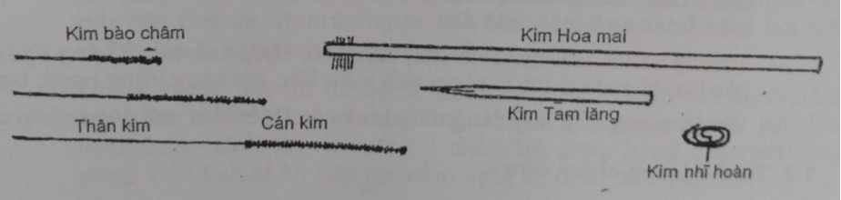
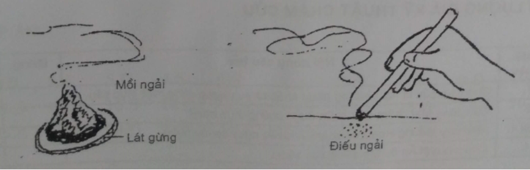

# 4 KỸ THUẬT CHÂM CỨU

**MỤC TIÊU**

_1. Thao tác thành thạo kỹ thuật châm_

_2. Làm mồi ngải, điếu ngải, thao tác cứu_

_3. Phát hiện và xử trí tốt những tai biến trong châm cứu_

## 1. KỸ THUẬT CHÂM

### 1.1. Những dụng cụ dùng trong châm

#### 1.1.1. Kim châm

- Kim Hào châm có nhiều loại dài, ngắn, to, nhỏ khác nhau, thường loại dài 3cm - 5cm - 10cm. Mỗi kim gồm 3 phần: Mũi kim, thân kim và cán kim hay đốc kim. Kim được làm bằng thép không gỉ.

- Kim tam lăng: Thân kim có đường kính 1-2 ly, mũi nhọn hình 3 cạnh, thường dùng để châm nặn máu.

- Kim châm loa tai (kim nhĩ hoàn): Thân kim xoắn tròn trôn ốc để châm gài vào loa tai.

- Kim hoa mai: Là một chùm 79 kim hào châm được bó lại và gắn vào một cán dài. Dùng để gõ nhẹ lên mặt da.

#### 1.1.2. Các dụng cụ khác

- Hộp đựng kim châm: Nên có hai hộp: 1 đựng kim đã tiệt khuẩn, 1 đựng kim đã châm.

Hiện nay để đảm bảo không lây truyền chéo, kim châm được dùng riêng cho từng người, được đựng trong ống thủy tinh có dán tên từng bệnh nhân.

- Kìm kẹp kim, bông cồn được đựng trong 1 hộp riêng.

- Dụng cụ đựng bông cồn đã dùng, ống tiêm đã dùng...

- Khay tráng men đựng các dụng cụ trên.

Ngoài ra thủy châm còn có tác dụng để tiêm như bơm tiêm; điện châm còn có máy phát xung điện.

### 1.2. Những quy định khi tiến hành châm

**1.2.1. Với những dụng cụ kim loại như kim châm…** phải luộc sôi 20 phút hoặc thấp theo quy định tiệt khuẩn. Trước khi luộc hay hấp phải kiểm tra lại kim; loại bỏ kim đã gỉ, đầu kim quằn,...

**1.2.2. Cốc thủy tinh, khay men** phải lau sạch bằng bông cồn

**1.2.3. Đối với kỹ thuật viên - thầy thuốc**

- Thái độ hòa nhã, ân cần động viên, chỉ dẫn người bệnh.

- Trang phục đúng quy định, gọn gàng sạch sẽ, móng tay được cắt ngắn, rửa tay trước khi châm.

- Thao tác nhẹ nhàng, chính xác, không gây đau đớn, sợ hãi cho người bệnh.

- Luôn có mặt gần bệnh nhân để theo dõi và xử trí kịp thời khi có tai biến.

**1.2.4. Không được châm**

- Những trường hợp cấp, cứu ngoại khoa hoặc các chuyên khoa khác cần theo dõi hoặc giải quyết bằng phẫu thuật.

- Những bệnh nhân quá yếu như thiếu máu nặng, nhiễm độc do mất nước hoặc đang trong trạng thái không bình thường như sợ hãi, tức giận hoặc quá mệt, quá đói...

- Không châm các huyệt ở rốn, núm vú, thóp trẻ em. Không châm sâu các huyện phía dưới có các mạch máu lớn, nội tạng vùng ngực, bụng.

- Người mang thai hay đang thấy kinh cần thiết lắm mới dùng phép châm.

### 1.3. Tư thế trong châm cứu

Thầy thuốc phải ở tư thế thuận tiện cho thao tác.

Bệnh nhân cần ở tư thế thoải mái, vừa bộc lộ được vùng châm vừa chịu đựng được thời gian lưu kim mà không động đậy.

- Tư thế ngồi để châm các huyệt ở đầu, mặt, cổ, vai, gáy, cánh tay.

- Tư thế nằm ngửa để châm cứu các huyệt ở mặt, cổ, ngực, bụng, mặt trước chân, tay.

- Tư thế nằm nghiêng để châm các huyệt ở ngực, bụng, lưng.

- Tư thế nằm sấp để châm các huyệt ở đầu, gáy, lưng, mông, mặt sau chi dưới.

Chú ý: Khi lập đơn huyệt không nên bắt bệnh nhân phải thay đổi nhiều tư thế để châm.

### 1.4. Góc độ của kim châm

- Châm kim ngang mặt da, góc 15 độ. Thường châm các huyệt vùng da sát xương như đầu, trán, mặt khớp... Thường phải véo da lên để châm.

- Châm nghiêng, góc 45 độ. Thường châm những vùng cơ mỏng.

- Châm thẳng góc 75 độ - 95 độ. Thường châm các huyệt vùng cơ dày.

### 1.5. Độ sâu, nông của kim

Tùy thuộc vùng cơ dày hay mỏng, người béo hay gầy, vùng có thần kinh mạch máu lớn, phía dưới có sát nội tạng không... ở vùng có cơ, độ sâu nông còn tùy thuộc cảm giác đắc khí.

### 1.6. Đề phòng và xử trí tai biến

#### 1.6.1. Choáng (vựng châm, say kim)

Là tình trạng hay gặp, nguyên nhân thường do sợ hãi, mới châm lần đầu, châm ở vùng nhạy cảm, châm đau. Cũng còn do trạng thái cơ thể không bình thường như đói, lạnh, mệt,...

+ Biểu hiện: ánh mắt kém hoạt, da mặt xanh tái, bệnh nhân có cảm giác bất thường như tức ngực, bồn chồn, nôn nao, toát mồ hôi trán và tay lạnh, nặng hơn sẽ bị ngất xỉu.

+ Xử trí: Ngay lập tức để bệnh nhân nằm đầu thấp, rút kim châm, day bấm huyệt Nhân trung, Thập tuyên, giật tóc mai lay gọi. Khi bệnh nhân tỉnh thì cho uống 1 chén trà gừng nóng hoặc mật ong gừng. Để bệnh nhân tiếp tục nằm nghỉ 30 phút mới được đi lại.

+ Đề phòng:

- Không châm những trường hợp bệnh nhân đang trong tình trạng bất thường.

- Động viên bệnh nhân đặc biệt đối với bệnh nhân sợ châm, buổi châm đầu không nên châm nhiều huyệt và phải châm ở tư thế nằm.

#### 1.6.2. Châm vào mạch máu

- Khi rút kim máu chảy ra theo lỗ châm. Dùng bông khô ấn day một lát máu sẽ thôi chảy.

- Có khi máu tiếp tục chảy và đọng lại bên trong gây đám bầm tím sưng. Chườm nóng, băng ép (nếu có thể) sau khoảng 7-10 ngày đám bầm tím máu tụ sẽ tan. Hay gặp khi châm những huyệt sâu vào ổ mắt, cung động mạch bàn tay (Hợp cốc xuyên Lao cung).

Đề phòng: Kim châm sắc, mũi không cần quằm. Không vê kim mạch ở những vùng tổ chức lỏng lẻo gần các mạch máu lớn.

#### 1.6.3. Châm vào nội tạng

Nói chung khó phát hiện sớm ngay.

Châm sâu vùng gáy (Phong phủ, Á môn) có thể vào hành tủy làm ngừng tim, ngừng thở.

Châm sâu vùng ngực có thể gây tràn khí màng phổi.

Châm vùng bụng có thể vào túi mật, vào Bàng quang khi căng đầy.

Đề phòng thận trọng là chủ yếu

#### 1.6.4. Cong gập kim

Khi châm vùng cơ to khỏe, sau khi châm bệnh nhân thay đổi tư thế hoặc khi sắp châm bệnh nhân co cơ phản ứng làm cho kim bị gấp khúc, khi rút kim rất khó.

Xử trí: Day làm mềm giãn cơ vùng châm, lựa rút theo trục của phần nằm trong khối cơ mà không cần đốc kim rút mạnh theo trục của đốc kim.

### 1.7. Thao tác châm

Châm kim là một động tác liên tục nhưng có thể chia ra 3 bước:

- Bước 1: Đẩy mũi kim qua da phải nhanh, dứt khoát, tránh gây đau cho bệnh nhân.

- Bước 2: Tiến kim sâu vào trong, thường vừa ấn vừa xoay kim. Mục đích là đạt được cảm giác đắc khí. Về phía kỹ thuật viên thấy kim bị mút chặt. Về phía bệnh nhân có cảm giác tức nặng ở nơi châm, có khi có cảm giác căng tức chạy dọc theo đường kinh. Nếu cảm giác đau buốt là không đắc khí mà có thể kim đã chạm vào mạch máu, thần kinh, cần lui kim một chút hoặc rút kim châm lại.

Đạt cảm giác "đắc khí" rất quan trọng, có đạt đắc khí hiệu quả châm mới cao.

Đắc khí nói lên kích thích đạt ngưỡng trị liệu.

- Bước 3: Vê kim thực hiện phép bổ hay tả.

Tả pháp: Vê kim nhanh mạnh, xoay kim đẩy đi, đẩy lại. Có thể vừa vê vừa lui kim và đẩy kim như "mổ cò", khoảng cách giữa 2 lần vê khoảng 5 phút.

Bổ pháp: Vê nhẹ nhàng theo một chiều nhất định, không vê đẩy "mổ cò". Khoảng cách vê kim cách nhau khoảng 10 phút hoặc để nguyên không vê kim.

- Bước 4: Rút kim. Cần đốc kim rút nhanh hoặc từ từ tùy theo muốn bổ hay tả.

### 1.8. Thủ thuật bổ tả trong châm

|
 | **Bổ**| **Tả**|
| --- | --- | --- |
| Cường độ kích thích | Đắc khí để nguyên kim, vê nhẹ hoặc không vê | Đắc khí, vê mạch, vê mổ cò, cách 5 phút vê 1 lần |
| Lưu kim | Lưu kim lâu 15-30 phút | Lưu kim ít 10-15 phút |
| Rút kim | Nhanh | Từ từ |
| Sau rút kim | Bịt ngay lỗ châm không cho chính khí thoát ra | Không bịt ngay lỗ châm để tà khí thoát ra ngoài |

## 2. KỸ THUẬT CỨU

Cứu là dùng sức nóng tác động vào huyệt châm cứu. Thường dùng lá ngải cứu khô làm thành mồi ngải hay điếu ngải để cứu.

### 2.1. Chỉ định dùng phương pháp cứu

Nói chung giống như phương pháp châm. Đối với chứng hư hàn thì cứu tốt hơn. Đối với chứng nhiệt thì không nên cứu. Không được cứu gây sẹo bỏng ở các vùng như đầu mặt, vùng da sát gân, mạch máu như cổ chân, cổ tay.

### 2.2. Chuẩn bị nguyên liệu để cứu

Làm ngải nhung: Dùng ngải cứu khô, nhặt bỏ các cuống cành, chỉ dùng lá ngải, giã hoặc vê nát nhỏ, sờ mịn tay gọi là ngải nhung.

Làm mồi ngải cứu trực tiếp trên huyệt: Dùng 3 ngón tay: cái, trỏ, và giữa nhúm chụm ngải nhung thành từng mồi ngải lên một khoanh gừng tươi.

### 2.3. Kỹ thuật cứu

#### 2.3.1 Cứu mồi ngải

Có 3 cách:

- Cứu trực tiếp: Dùng mồi ngải cứu nhỏ bằng ngón tay út đặt trực tiếp lên da vùng huyệt. Cứu trực tiếp thường gây bỏng vùng huyệt và để lại sẹo. Hiện nay không nên dùng.

- Cứu gián tiếp: Dùng mồi ngải to bằng đầu ngón cái. Đặt mồi ngải lên một lát gừng dài 1 ly, khi mồi ngải cháy gần hết gây nóng bỏng, ta thêm một lát gừng mới đệm cho lát gừng cũ. Cách cứu này hay dùng.

- Cứu điếu ngải: Đốt cháy đầu điếu ngải, hơ lên vùng huyệt, hoặc hơ nóng đốc kim châm gọi là ôn châm.

#### 2.3.2. Thao tác

Làm mồi ngải to khoảng đầu ngón cái, cắt một khoanh gừng dày khoảng 1-2 ly, đặt mồi ngải lên khoanh gừng rồi đặt lên huyệt, dùng cây hương cháy châm vào ngọn mồi ngải. Khi bệnh nhân thấy nóng rát thì lót thêm lát gừng khác. Khi hết mồi ngải, cầm cả lát gừng lên, gạt tàn vào chén đựng tàn. Chú ý không làm tàn đang còn đỏ hay bay vào quần áo, chăn màn gây cháy. Làm mồi ngải khác và cứu tiếp.

#### 2.3.3. Phối hợp cứu và châm

Căn cứ vào lý luận Đông y:Chữa bệnh có ngọn, có gốc; ngọn thì châm, gốc thì cứu.

Ví dụ: Chữa chứng đau đầu do huyết hư, châm những huyệt vùng đầu để chữa đau đầu (ngọn bệnh) đồng thời cứu huyệt Cách du, Cao hoang để bổ huyết (gốc bệnh).

Ôn châm là hình thức kết hợp châm và cứu trên ngay một huyệt. Có thể dùng điếu ngải hơ nóng đốc kim và vùng quanh chân kim; cũng có thể sau khi rút kim châm ta cứu huyệt đó bằng mồi ngải hay hơ bằng điếu ngải.

### TỰ LƯỢNG GIÁ KỸ THUẬT CHÂM CỨU

| **Mã câu**| **Nội dung câu hỏi**| **Đúng**| **Sai**|
| --- | --- | --- | --- |
| 1 | Châm và cứu là hai phương pháp khác nhau nhưng cùng một mục tiêu
| 2 | Cứu cũng như châm đều chữa được chứng thực nhiệt
| 3 | Hiện nay ít dùng Hoa mai châm vì nhiều nguy cơ lây chéo
| 4 | Châm huyệt Ấn đường dùng kim 10cm
| 5 | Châm nặn máu tốt nhất là dùng kim Hào châm
| 6 | Ôn châm là kết hợp Châm và Cứu ngay trên một huyệt
| 7 | Tiệt khuẩn kim châm dùng bông cồn lau cho nhanh
| 8 | Tiệt khuẩn kim châm dùng nước sôi trong phích cũng được
| 9 | Đôi bàn tay kỹ thuật viên châm cứu cũng phải vô khuẩn
| 10 | Bệnh nhân bị đau là do thao tác châm chưa tốt và do kim không sắc
| 11 | Đau thần kinh hông, để bệnh nhân ngồi trên ghế châm là tốt nhất
| 12 | Triệu chứng sớm nhất của vựng châm là mặt tái, mắt kém hoạt
| 13 | Cấp cứu vựng châm tốt nhất là tiêm một ống long não 0,20g dưới da
| 14 | Châm huyệt Đại chùy, mũi kim phải hướng lên phía đầu
| 15 | Châm huyệt Mệnh môn, kim hướng xuống chân
| 16 | Châm huyệt Phong trì, mũi kim hướng sang mắt phía đối diện
| 17 | Châm tả huyệt Tam âm giao để chữa nôn do nghén
| 18 | Châm tả là vê kinh mạch, xoay chiều hoặc châm "mổ cò"
| 19 | Bị cảm phong hàn, cứu mồi ngải qua gừng vào huyệt Ấn đường
| 20 | Châm tả huyệt Khổng tối, mũi kim hướng về ngón tay cái
| 21 | Làm ngải nhung cần giã hoặc xay thật nhỏ lá ngải cứu
| 22 | Châm huyệt Túc tam lý, kim phải thẳng góc với mặt da
| 23 | Châm sâu huyệt Á môn có thể chạm hành tủy làm ngừng tim, ngừng thở
| 24 | Châm sâu các huyệt trên kinh Bàng quang vùng lưng có thể gây tràn khí màng phổi
| 25 | Cảm giác đắc khí ở người bệnh là đau nhói
| 26 | Cảm giác đắc khí ở KTV, kim châm như bị giữ lại, không lỏng lẻo
| 27 | Không vê kim huyệt Tình minh
| 28 | Bệnh nhân nôn nhiều do viêm loét tá tràng đã hơn 10 năm, thể trạng suy kiệt. Không nhận chữa bằng châm cứu
| 29 | Bệnh nhân rất yếu, da xanh tái do rong huyết đã lâu. Nhận chữa bằng châm cứu một đợt 10 ngày
| 30 | Thái độ hòa nhã, ân cần của KTV châm cứu góp phần quan trọng vào kết quả châm cứu

**ĐÁP ÁN**

| 1.Đ | 2.S | 3.Đ | 4.S | 5.S | 6.Đ | 7.S | 8.S | 9.Đ | 10.Đ |
| --- | --- | --- | --- | --- | --- | --- | --- | --- | --- |
| 11.S | 12.Đ | 13.S | 14.Đ | 15.S | 16.Đ | 17.S | 18.Đ | 19.S | 20.S |
| 21.S | 22.Đ | 23.Đ | 24.Đ | 25.S | 26.Đ | 27.Đ | 28.Đ | 29.S | 30.Đ |

