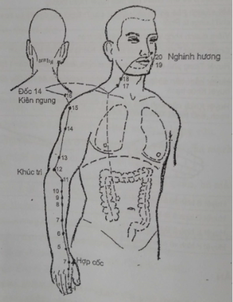
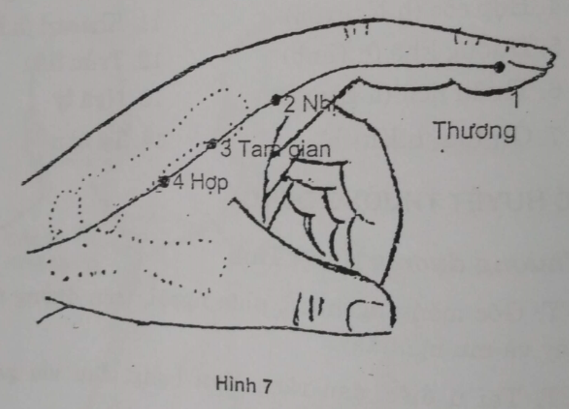
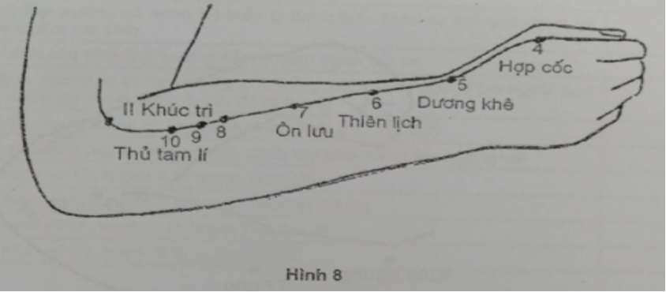
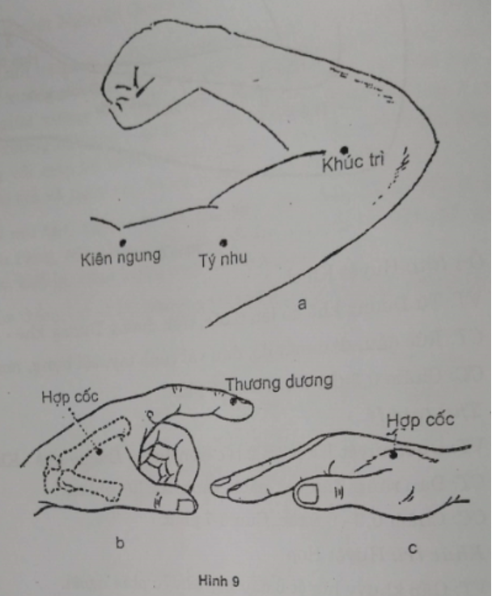
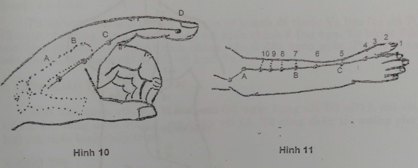

# 5.2 II. KINH ĐẠI TRƯỜNG - DƯƠNG MINH TAY (LI1 - LI20)

## 1. ĐƯỜNG ĐI

Từ góc móng ngón trỏ phía xương quay, lên mu tay giữa xương bàn tay I và II, qua hố lào dọc bờ ngoài cẳng tay, qua mép ngoài nếp khuỷu, dọc bờ ngoài cánh tay, qua mỏm vai, theo bờ vai giao hội với kinh Tiểu trường và với mạch Đốc, trở lại hố trên đòn xuống liên lạc với Phế qua cơ hoành xuống thuộc Đại trường. Từ hố trên đòn, một nhánh lên cổ mặt, vào hàm dưới, vòng môi trên, 2 kinh giao nhau rồi tận cùng ở bờ cánh mũi bên đối diện.

**Hình 6:** Kinh Đại Trường - Dương Minh tay

## 2. LIÊN QUAN TK

Bàn tay, cẳng tay, cánh tay: C6, cổ: C3.

## 3. CHỦ TRỊ

Đau các khớp bàn tay, khuỷu. Đau TK quay, liệt nửa người. Viêm họng, đau răng hàm dưới, máu cam, viêm kết mạc, liệt mặt.

## 4. CÁC HUYỆT

Gồm 20 huyệt mỗi bên (Hình 6):

| 1. Thương dương (h. Tỉnh) | 8. Hạ liêu | 15. Kiên ngung |
| --- | --- | --- |
| 2. Nhị gian (h. Huỳnh) | 9. Thượng liêu | 16. Cự cốt |
| 3. Tam gian (h. Du) | 10. Thủ tam lý | 17. Thiên tỉnh |
| 4. Hợp cốc (h. Nguyên) | 11. Khúc trì (h. Hợp) | 18. Phù đột |
| 5. Dương khê (h. Kinh) | 12. Trửu liêu | 19. Hòa liêu |
| 6. Thiên lịch (h. Lạc) | 13. Ngũ lý | 20. Nghinh hương |
| 7. Ôn lưu (h. Khích) | 14. Tý nhu |
 |

## 5. CÁC HUYỆT THƯỜNG DÙNG

_**GI1. Thương dương:**_ Huyệt Tỉnh

VT: Góc móng tay trỏ, phía ngoài, trên đường tiếp giáp da gan ngón tay và mu ngón tay.

CT: Tai ù điếc, đau răng, đau họng, đau vai gáy, đau ngón trỏ, sốt không mồ hôi, ngất, hôn mê.

_**GI2. Nhị gian:**_ Huyệt Huỳnh

VT: Lõm đầu trên đốt 1, cách khớp ngón trỏ bàn tay 0,3-0,4 tấc, trên đường tiếp giáp da gan tay và mu tay.

CT: Máu cam, đau răng, liệt thần kinh VII, đau họng, đau vai.

CC: Châm thẳng 0,2-0,3 tấc. Cứu 5 phút.

_**GI3. Tam gian:**_ Huyệt Du

VT: Từ Nhị gian đo lên 1 tấc, trên đường tiếp nối 2 màu da.

CT: Đau răng hàm, đau họng sốt, tức ngực, sôi bụng.

CC: Châm 0,5 tấc, cứu 5 phút.

_**GI4. Hợp cốc:**_ Huyệt Nguyên (Hình 7)

VT: Trên mu bàn tay, giữa hai xương bàn tay 1 và 2, gần điểm giữa bên quay của xương đốt bàn tay 2. Dang rộng ngón cái và ngón trỏ, huyệt ở chỗ lõm giữa xương bàn tay 1 và 2 hoặc lấy ngón cái bên kia đặt vào giữa hai xương bàn tay 1 và 2, sao cho nếp gấp giữa đốt 1 và 2 của ngón cái trùng với mép hổ khẩu, huyệt ở ngay dưới đầu ngón cái. Hoặc khép chặt ngón trỏ và ngón cái, huyệt ở chỗ cơ nổi cao nhất

CT: Đau mu tay, ngón trỏ, vai, rức đầu, liệt thần kinh VII, ù tai, máu cam, đau răng, sốt không mồ hôi, trẻ em sốt cao co giật, bế kinh, đau bụng, táo, kiết lỵ, viêm tuyến nước bọt mang tai.

CC: Châm thẳng 0,5 - 1 tấc. Đang có thai không được châm. Cứu 5-10 phút.

_**GI5. Dương khê:**_ Huyệt Kinh

VT: Đáy hõm lào (giữa 2 gân cơ duỗi dài và duỗi ngắn ngón cái).

CT: Rức đầu, tai ù điếc, đau răng, đau họng, đau cổ tay.

CC: Châm thẳng 0,5 tấc. Cứu 5-10 phút.

_**GI6. Thiên lịch:**_ Huyệt Lạc với kinh Phế (Hình 8)

VT: Từ Dương khê đo lên 3 tấc trên đường nối Dương khê - Khúc trì.

CT: Giảm thị lực, máu cam, tai ù điếc, đau khớp, đau cổ tay.

CC: Châm 0,3-0,4 tấc. Cứu 3-7 phút.

_**GI7. Ôn lưu:**_ Huyệt Khích

VT: Từ Dương khê đo lên 6 tấc, trên đường Dương khê - Khúc trì.

CT: Rức đầu, đau mắt đỏ, đau vai cánh tay, sôi bụng, mụn nhọt.

CC: Châm 0,3-0,5 tấc. Cứu 3-7 phút.

_**GI10. Thủ tam lý**_

VT: Dưới huyệt Khúc trì 2 tấc trên đường Dương khê - Khúc trì

CT: Đau răng; đau vai, nách, cánh tay; liệt chi tay.

CC: Châm 0,3-0,8 tấc. Cứu 3-7 phút.

_**GI11. Khúc trì:**_ Huyệt Hợp

VT: Gấp khuỷu huyệt ở đầu nếp khuỷu phía ngoài.

CT: Đau họng, đau liệt chi trên, kinh nguyệt không đều, nhọt; đau bụng do lỵ, ỉa chảy nhiễm khuẩn.

CC: Châm 0,8-1,5 tấc. Cứu 3-7 phút.

_**GI14. Tý nhu**_

VT: Khúc trì lên 7 tấc.

CT: Cổ gáy co cứng, đau cánh tay, tràng nhạc, bệnh mắt.

CC: Châm thẳng 1-2 tấc. Cứu 5-10 phút.

_**GI15. Kiên ngung**_ (Hình 9)

VT: Hõm dưới mỏm cùng vai và mấu động lớn xương cánh tay.

CT: Đau vai, cánh tay, liệt chi trên.

CC: Châm 0,6-1,2 tấc. Cứu 5-10 phút.

## TỰ LƯỢNG GIÁ KINH ĐẠI TRƯỜNG - DƯƠNG MINH TAY

| **TT**| **Nội dung câu hỏi**| **Đúng**| **Sai**|
| --- | --- | --- | --- |
| 1 | Hướng đi của kinh Đại trường từ mặt tới ngón tay trỏ |
| 2 | Mã số của kinh Đại trường là II hoặc LI |
| 3 | Muốn làm nổi rõ Hố lào thì phải gập ngón tay cái |
| 4 | Đau răng của hàm trên, chọn dùng huyệt của kinh Dương minh tay |
| 5 | Khuyết bồn là nơi kinh Đại trường đi vào bên trong để thuộc Đại trường và liên lạc với Phế |
| 6 | Kinh Đại trường đi dọc bờ ngoài cẳng tay (tư thế giải phẫu) |
| 7 | Kinh Đại trường đi qua mỏm vai |
| 8 | Kinh Đại trường tận cùng ở huyệt Nghinh hương cùng bên |
| 9 | Huyệt Nguyên của kinh Đại trường là huyệt Hợp cốc |
| 10 | Phế và Đại trường có quan hệ biểu lý được thể hiện cụ thể qua quan hệ trực tiếp giữa hai kinh |
| 11 | Huyệt tỉnh của kinh Đại trường nằm ở đỉnh ngón tay trỏ |
| 12 | Xác định nhanh vị trí huyệt Hợp cốc bằng cách vuốt ngược bờ ngoài bàn tay II, ngón tay dựng đứng ở đâu đó là huyệt |
| 13 | Muốn tìm huyệt Khúc trì, tay bệnh nhân phải ở tư thế duỗi |
| 14 | Muốn xác định huyệt Kiên ngung, cánh tay phải nâng lên ngang vai |
| 15 | Theo hình vẽ 10, huyệt A là huyệt Tam gian |
| 16 | Theo hình vẽ 10, huyệt D là huyệt Thương dương |
| 17 | Theo hình vẽ 11. huyệt A là huyệt Thủ tam lý |
| 18 | Theo hình vẽ 11, huyệt B là huyệt Ôn lưu |

**ĐÁP ÁN**

| 1.S | 2.Đ | 3.S | 4.S | 5.Đ | 6.Đ |
| --- | --- | --- | --- | --- | --- |
| 7.Đ | 8.S | 9.Đ | 10.Đ | 11.S | 12.Đ |
| 13.S | 14.Đ | 15.S | 16.Đ | 17.S | 18.Đ |