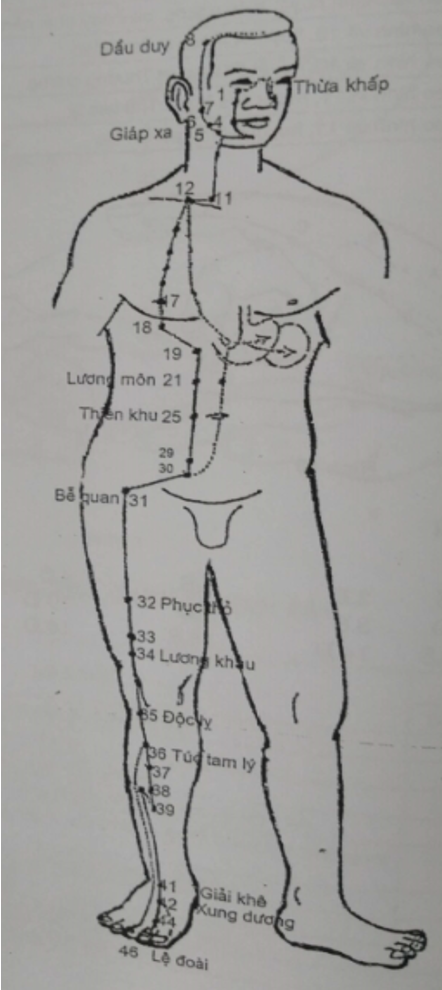
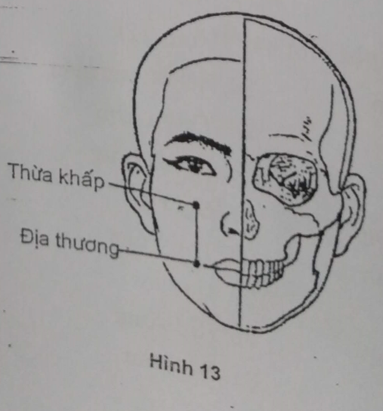
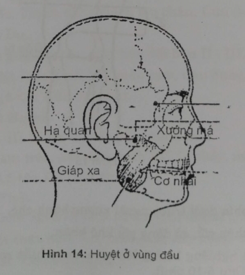
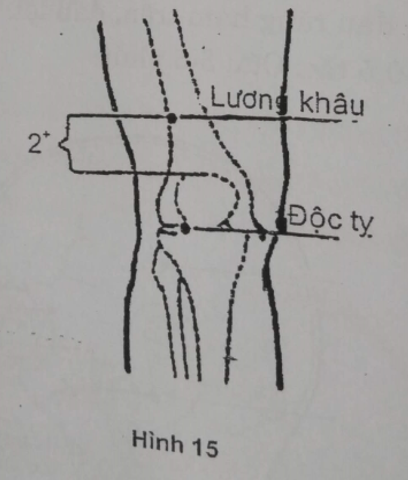
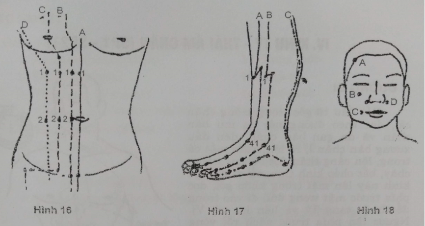

# 5.3 III. KINH VỊ - DƯƠNG MINH CHÂN (S1 - S45)

**Hình 12:**

Kinh Vị - Dương minh chân

## 1. ĐƯỜNG ĐI

Từ cạnh mũi đi lên, 2 kinh Vị gặp nhau ở hốc mũi, rẽ ra giao với kinh Bàng quang, xuống dọc bờ ngoài mũi, vào hàm trên rồi vòng quanh môi để giao với mạch Đốc và mạch Nhâm. Sau đó dọc bờ xương hàm dưới thì ngược lên trước tai, giao với kinh Đởm (huyệt Thượng quang và huyệt Hàm yến), đến góc trán trên (huyệt Đầu duy), ngang theo chân tóc ra gặp mạch Đốc (huyệt Thần đình).

Từ trước huyệt Đại nghinh, một nhánh xuống cổ, dọc thanh quản, qua hố trên đòn rồi thẳng qua vú xuống bụng, đi hai bên mạch Nhâm xuống ống bẹn, theo cơ thẳng trước ở đùi, đi qua bờ ngoài xương bánh chè, dọc theo phía ngoài xương chày, qua giữa cổ chân rồi tận ở bờ ngoài góc móng chân II (huyệt Lệ đoài).

Từ hố trên đòn một nhánh vào qua cơ hoành để thuộc Vị, liên lạc với Tỳ. Từ môn vị xuống bụng dưới để hợp với kinh chính ở ống bẹn. Từ huyệt Túc tam lý một nhánh đi ngoài kinh chính, tận ở đầu ngón giữa. Từ mu chân một nhánh đến ngón cái để nối với kinh Tỳ.

## 2. LIÊN QUAN TK

Mặt liên quan với dây VII, cổ với C4, ngực bụng với D2-D12, đùi với L1-L2-L3, cẳng chân với L5, mu chân với L5. Từ cẳng chân trở xuống phù hợp với thần kinh chày trước.

## 3. CHỦ TRỊ

- Tại chỗ, theo đường kinh: Liệt đau TK VII. Đau TK liên sườn, TK đùi, TK tọa, khớp gối, khớp háng, chảy máu cam, viêm tuyến vú, ít sữa.

- Toàn thân: Sốt, nôn mửa, đau bụng, ỉa chảy, lỵ, đau răng, viêm lợi.

## 4. CÁC HUYỆT

Gồm 45 huyệt mỗi bên (Hình 12):

| 1. Thừa khấp | 24. Hoạt nhục môn |
| --- | --- |
| 2. Tứ bạch | 25. Thiên khu |
| 3. Cự liêu | 26. Ngoại lăng |
| 4. Đại thương | 27. Đại cự |
| 5. Địa nghinh | 28. Thủy đạo |
| 6. Giáp xa | 29. Quy lai |
| 7. Hạ quan | 30. Khí sung |
| 8. Đầu duy | 31. Bể quan |
| 9. Nhân nghinh | 32. Phục thỏ |
| 10. Thủy đột | 33. Âm thị |
| 11. Khí xá | 34. Lương khâu (Khích) |
| 12. Khuyết hồn | 35. Độc tỵ |
| 13. Khí hộ | 36. Túc tam lý (Hợp) |
| 14. Khố phòng | 37. Thượng cự hư |
| 15. Ốc ế | 38. Điều khẩu |
| 16. Ưng song | 39. Hạ cự hư |
| 17. Nhũ trung | 40. Phong long (lạc với Tỳ) |
| 18. Nhũ căn | 41. Giải khê (Kinh) |
| 19. Bất dung | 42. Xung dương (Nguyên) |
| 20. Thừa mãn | 43. Hãm cốc (Du) |
| 21. Lương môn | 44. Nội đình (Huỳnh) |
| 22. Quan môn | 45. Lệ đoài (Tỉnh) |
| 23. Thái ất |
 |

## 5. CÁC HUYỆT THƯỜNG DÙNG

_**S1. Thừa khấp**_

VT: Điểm gặp nhau của bờ dưới hố mắt và đường thẳng từ con ngươi.

CT: Viêm màng tiếp hợp, viêm tuyến lệ, máy mi dưới, liệt TK VII.

CC: Châm thẳng 0,2-0,4 tấc. Không vê kim. Không cứu

_**S2. Tứ bạch**_

VT: Thẳng Thừa khấp xuống, lõm dưới khung xương má.

CT: Viêm màng kết hợp, viêm màng bồ đào, máy mi dưới, lác mắt, liệt thần kinh VII.

CC: Châm thẳng hoặc nghiêng 0,3-0,5 tấc. Cứu 5-10 phút.

_**S4. Địa thương**_

VT: Điểm gặp của rãnh mũi mép và đường ngang qua 2 mép.

CT: Liệt thần kinh VII, chảy rãi.

CC: Châm nghiêng hướng tới huyệt Giáp xa 0,5-1,0 tấc. Cứu 5-10 phút.

_**S6. Giáp xa**_

VT: Trước góc hàm dưới khoảng chiều ngang ngón tay. Cắn chặt răng chỗ cơ cắn nổi cao nhất.

CT: Liệt thần kinh VII, co cứng cơ nhai, đau răng hàm dưới, đau thần kinh V.

CC: Châm 0,3-0,5 tấc. Cứu 5-10 phút.

_**S7. Hạ quan**_

VT: Lõm xương bình tai, giữa bờ dưới xương gò má và bờ trước lồi cầu xương hàm dưới. Khi há miệng lõm đó lại nổi cao.

CT: Tai ù điếc, đau răng hàm trên, đau lợi.

CC: Châm 0,3-0,5 tấc. Cứu 3-5 phút.

_**S8. Đầu duy**_

VT: Bờ trên xương sườn 6, trên đường vú.

CT: Ho, hen suyễn, tắc tia sữa, thiếu sữa.

CC: Châm nghiêng 0,5-1 tấc. Cứu 7-10 phút.

_**S25. Thiên khu**_

VT: Từ rốn ngang ra 2 tấc.

CT: Đau bụng, rối loạn tiêu hóa, ỉa chảy, trướng đầy bụng.

CC: Châm thẳng 0,5-1 tấc. Cứu 10-20 phút.

_**S29. Quy lai**_

VT: Từ huyệt Trung cực ngang ra 2 tấc.

CT: Đau bụng dưới, viêm phần phụ, thống kinh, viêm tinh hoàn.

CC: Châm 0,5-1 tấc. Cứu 5-10 phút.

_**S34. Lương khâu:**_ Huyệt Khích

VT: Co đầu gối, từ bờ trên xương bánh chè đo lên 2 tấc rồi đo ra 1 tấc.

CT: Đau dạ dày, viêm tuyến vú, đau khớp gối.

CC: Châm 0,5-0,7 tấc. Cứu 3-7 phút.

_**S35. Độc tỵ**_

VT: Lõm phía dưới trước ngoài xương bánh chè.

CT: Đau khớp gối, cử động gối khó khăn.

CC: Châm nghiêng hướng lên trên trong luồn mặt sau xương bánh chè 0,5-1 tấc. Cứu 5-10 phút.

_**S36. Túc tam lý:**_ Huyệt Hợp

VT: Thẳng dưới Độc tỵ 3 tấc, cách mào chày 1 khoát ngón tay.

CT: Đau dạ dày, đầy bụng, nôn mửa, ỉa chảy, táo bón, ốm nghén, viêm tuyến vú, tắc tia sữa, đau gối, viêm họng, sốt.

Là huyệt quan trọng để bồi bổ thể lực (lấy huyệt co chân 90 độ).

CC: Châm thẳng 1-1,5 tấc. Cứu 10-20 phút.

_**S40. Phong long:**_ Huyệt Lạc với kinh Tỳ

VT: Từ Túc tam lý xuống 5 tấc (huyệt Điều khẩu) ngang ra ngoài 1 khoát ngón tay.

CT: Suyễn thở, đờm nhiều, rức đầu chóng mặt, đau thượng vị.

CC: Châm nghiêng hơi hướng vào trong 1-1,5 tấc. Cứu 5-15 phút.

_**S41. Giải khê:**_ Huyệt Kinh

VT: Giữa nếp gấp cổ chân, lõm giữa gân ruỗi chung và ruỗi riêng ngón cái.

CT: Rức đầu, hoa mắt, đầu bụng, táo bón, co giật, đau thần kinh tọa, đau gối.

CC: Châm 0,4-0,5 tấc. Cứu 5-10 phút.

_**S42. Xung dương:**_ Huyệt nguyên

VT: Từ Giải khê xuống 1,5 tấc, trong liên đốt xương bàn chân II - III, chỗ xương nối cao nhất trên mu bàn chân, sờ thấy mạch đập.

CT: Liệt TK VII, đau răng, đau bụng, đau cổ chân.

CC: Châm 0,3 tấc. Tránh động mạch mu chân. Cứu 3-5 phút.

_**S43. Hãm cốc:**_ Huyệt Du

VT: Từ Giải khê xuống 3 tấc, giữa liên đốt bàn II - III.

CT: Đau răng, liệt thần kinh VII, máu cam, đau bụng, ỉa chảy, sốt cao.

CC: Châm 0,3-0,5 tấc. Cứu 3-5 phút.

_**S44. Nội đình:**_ Huyệt Huỳnh

VT: Kẽ ngón II - III đo lên 0,5 tấc phía mu chân.

CT: Đau răng hàm trên, liệt thần kinh VII, ỉa chảy, máu cam, sốt cao.

CC: Châm 0,3-0,5 tấc. Cứu 3-5 phút.

_**S45. Lệ đoài:**_ Huyệt Tỉnh

VT: Góc móng chân ngón II, phía ngoài, trên đường tiếp giáp 2 màu da.

CT: Rức đầu, liệt thần kinh VII, máu cam, đầy bụng, thao cuồng.

CC: Châm 0,1 tấc. Cứu 5-15 phút.

## TỰ LƯỢNG GIÁ KINH VỊ - DƯƠNG MINH CHÂN

| **TT**| **Nội dung câu hỏi**| **Đúng**| **Sai**|
| --- | --- | --- | --- |
| 1 | Hướng đi của kinh Vị từ mặt xuống chân |
| 2 | Kinh Vị bắt đầu từ huyệt Tứ bạch |
| 3 | Kinh Vị có 3 nhánh phụ |
| 4 | Kinh Vị đi vào hàm dưới để giao với mạch Đốc |
| 5 | Kinh Vị có nhánh vào tạng Tỳ |
| 6 | Kinh Vị là kinh dài nhất và nhiều huyệt nhất |
| 7 | Mã số của kinh Vị là IV hoặc Sp |
| 8 | Kinh Vị tận cùng ở 2 huyệt |
| 9 | Tắc tia sữa chọn huyệt trên kinh Vị |
| 10 | Trong vùng bụng kinh Vị đi song song và ở phía ngoài kinh số VIII |
| 11 | Huyệt cấm châm của kinh Vị là huyệt Nhũ căn |
| 12 | Huyệt Nội đình là huyệt tận cùng của kinh Vị (nhánh chính) |
| 13 | Đau răng hàm trên châm huyệt Nội đình |
| 14 | Đau răng hàm trên châm huyệt Hạ quan |
| 15 | Đau răng hàm trên châm huyệt Giáp xa |
| 16 | Hình vẽ 16, kinh B là kinh Vị |
| 17 | Hình vẽ 16, huyệt C2 là huyệt Thiên khu |
| 18 | Huyệt có mã số III 36 là huyệt tổng vùng thượng vị và bổ toàn thân |
| 19 | Hình vẽ 17, kinh B là kinh Dương minh chân |
| 20 | Hình vẽ 17, huyệt số 1 trên kinh B là huyệt Hạ cự hư |
| 21 | Hình vẽ 18, huyệt A là huyệt Đầu duy |
| 22 | Hình vẽ 18, huyệt B là huyệt Địa thương |
 

**ĐÁP ÁN**

| 1.Đ | 2.S | 3.Đ | 4.S | 5.Đ | 6.S |
| --- | --- | --- | --- | --- | --- |
| 7.S | 8.Đ | 9.Đ | 10.Đ | 11.S | 12.S |
| 13.Đ | 14.Đ | 15.Đ | 16.S | 17.Đ | 18.Đ |
| 19.S | 20.S | 21.Đ | 22.S |
 |
 |