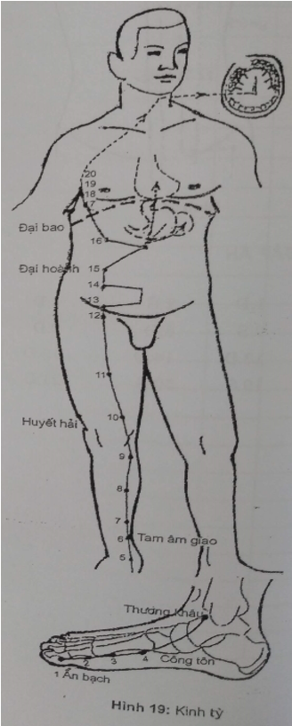
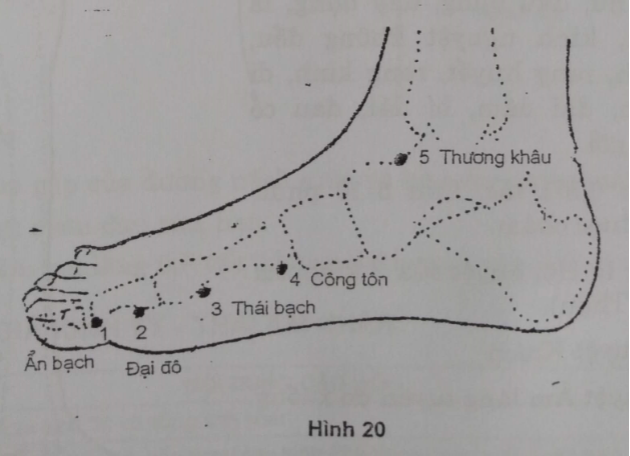
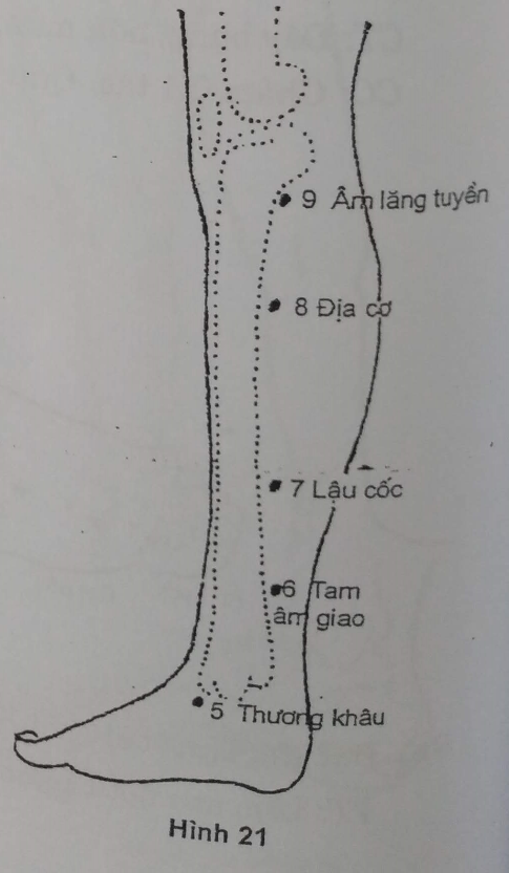
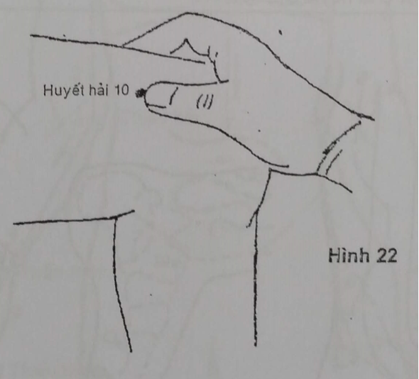
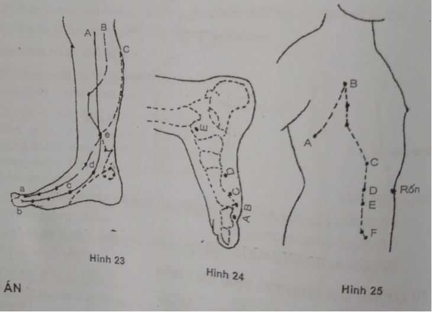

# 5.4 IV. KINH TỲ - THÁI ÂM CHÂN (SP1 - SP21)

## 1. ĐƯỜNG ĐI

Bắt đầu từ góc trong móng chân cái, dọc theo đường nối da mu bàn chân và da gan bàn chân, đến đầu xương bàn chân I, rẽ lên trước mắt cá trong, lên cẳng chân dọc bờ sau xương chày, bắt chéo kinh Can, rồi đi ở trước kinh này lên mặt trong khớp gối, dọc phía trước mặt trong đùi, đi vào trong để thuộc tạng Tỳ và liên lạc với Vị. Ngược lên phía trước nách rồi vòng xuống tận ở huyệt Đại bao. Từ đó đi dọc lên hai bên thanh quản, vào phân bố ở dưới lưới.

Một nhánh từ Vị qua cơ hoành đi vào tạng Tâm để nối tiếp kinh Tâm.

## 2. LIÊN QUAN TK

Bàn chân: L4, L5. Cẳng chân, đùi: L4. Bụng: L1, L2, D12 đến D3.

## 3. CHỦ TRỊ

_a. Tại chỗ và theo đường kinh:_

Đau TK đùi, đau TK tọa, đau TK liên sườn, đau khớp cổ, gối, cổ chân, bàn chân.

_b. Toàn thân_

- Bệnh về tiêu hóa: đau dạ dày, nôn mửa, đầy hơi, ỉa chảy, táo bón.
- Bệnh về tiết niệu, sinh dục: di tinh, đái rắt, đái buốt, rối loạn kinh nguyệt.
- Một số huyệt (thường ở cẳng chân) chữa thiếu máu, suy nhược TK, rức đầu,...

## 4. CÁC HUYỆT

Gồm 21 huyệt mỗi bên (Hình 19):

| 1. Ẩn bạch (h. Tỉnh) | 12. Xung môn |
| --- | --- |
| 2. Đại đô (Huỳnh) | 13. Phủ xá |
| 3. Thái bạch (Nguyên) | 14. Phúc kết |
| 4. Công tôn (h. Lạc với Vị) | 15. Đại hoành |
| 5. Thương khâu (Kinh) | 16. Phúc ai |
| 6. Tam âm giao | 17. Thực đậu |
| 7. Lâu cốc | 18. Thiên khê |
| 8. Địa Cơ (huyệt Khích) | 19. Hung hương |
| 9. Âm lăng tuyền (h. Hợp) | 20. Chu vinh |
| 10. Huyết hải | 21. Đại bao (Tổng lạc) |
| 11. Cơ môn |
 |

## 5. CÁC HUYỆT THƯỜNG DÙNG

_**Sp1. Ẩn bạch:**_ Huyệt Tỉnh (Hình 20)

VT: Góc trong chân móng ngón cái, trên đường tiếp giáp 2 màu da.

CT: Đầy bụng, nôn mửa, ỉa chảy, kinh ra nhiều, rong kinh, co giật, ít ngủ.

CC: Châm 0,1 tấc. Cứu 5-15 phút.

_**Sp2. Đại đô:**_ Huyệt Huỳnh

VT: Lõm sau đốt I ngón cái, trên đường tiếp giáp 2 màu da.

CT: Đầy bụng, đau thượng vị, táo, ỉa lỏng, sốt cao không mồ hôi.

CC: Châm 0,2-0,3 tấc. Cứu 3-5 phút.

_**Sp3. Thái bạch:**_ Huyệt Du - Nguyên

VT: Mép dưới đầu trước xương bàn chân I, trên đường tiếp giáp 2 màu da.

CT: Đầy bụng, nôn mửa, đau thượng vị, ỉa chảy, tê phù do thiếu B1, cước.

CC: Châm 0,3 tấc. Cứu 3-5 phút.

_**Sp4. Công tôn:**_ Huyệt Lạc

VT: Bờ dưới xương xương bàn chân I, sau huyệt Thái bạch 1 tấc, trên đường tiếp giáp 2 màu da.

CT: Nôn mửa, ỉa chảy, kiết lỵ đau thượng vị, ăn kém.

CC: Châm 0,5 tấc. Cứu 3-5 phút.

_**Sp5. Thương khâu:**_ Huyệt Kinh

VT: Lõm đầu dưới phía trước mắt cá trong.

CT: Đầy bụng, sôi bụng, táo, trĩ, đau lưỡi, đau hạ vị, đau cổ chân.

CC: Châm thẳng 0,3-0,5 tấc. Cứu 5-7 phút. 

_**Sp6. Tam âm giao**_ (Hình 21)

VT: Đỉnh mắt cá trong lên 3 tấc, cách bờ sau xương chày 1 khoát ngón tay.

CT: Tỳ vị hư, đau bụng, đầy bụng, ỉa chảy, nôn, kinh nguyệt không đều, thống kinh, rong huyết, rong kinh, di mộng tinh, đái dầm, bí đái, đau cổ chân, đau gối.

CC: Châm 0,5-1 tấc. Cứu 5-10 phút. Có thai không được châm.

Chú thích: là Hội huyệt của 3 kinh Âm chân (Tỳ, Can, Thận).

_**Sp8. Địa cơ:**_ Huyệt Khích

VT: Từ huyệt Âm lăng tuyền đo xuống 3 tấc.

CT: Tức ngực, ỉa chảy, kinh không đều, bí đái, di tinh, đau bụng.

CC: Châm 0,5-0,8 tấc. Cứu 3-7 phút.

_**Sp9. Âm lăng tuyền:**_ Huyệt Hợp

VT: Vuốt dọc theo bờ sau trong xương chày đến ngành ngang là huyệt.

CT: Đầy bụng, ỉa chảy, bí đái, thống kinh, phù, hoàng đản, đau gối.

CC: Châm 0,5-0,8 tấc. Cứu 3-5 phút.

_**Sp10. Huyết hải**_ (Hình 22)

VT: Co đầu gối, từ bờ trên xương bánh chè đo lên 1 tấc, đo vào trong 2 tấc.

CT: Kinh không đều, rong huyết, ban dị ứng, đau gối.

CC: Châm 0,5-1 tấc. Cứu 3-5 phút.

_**Sp15. Đại hoành**_

VT: Từ rốn ngang ra ngoài 4 tấc, ngoài cơ thẳng bụng.

CT: Lỵ, táo, trướng bụng, đau hạ vị.

CC: Châm thẳng 0,5-1 tấc. Có thai không châm. Cứu 5-7 phút.

_**Sp21: Đại bao**_

VT: Điểm gặp của đường nách giữa và bờ trên xương sườn 7.

CT: Ngực sườn đau tức, hen.

CC: Châm nghiêng 0,5 tấc, không châm quá sâu. Cứu 5 phút.

## TỰ LƯỢNG GIÁ KINH TỲ - THÁI ÂM CHÂN

| **TT**| **Nội dung câu hỏi**| **Đúng**| **Sai**|
| --- | --- | --- | --- |
| 1 | Kinh Phế và kinh Tỳ có cùng tính chất |
| 2 | Kinh Tỳ là kinh thứ hai, tiếp ngay sau kinh Phế trong vòng tuần hoàn kinh khí |
| 3 | Kinh Tỳ có nhánh lên tỏa ra ở lưỡi |
| 4 | Hướng đi của kinh Tỳ từ tạng Tỳ xuống chân |
| 5 | Mỗi kinh chỉ có 1 huyệt Lạc, riêng kinh Tỳ có 2 |
| 6 | Kinh Tỳ có nhánh đi vào tạng Tâm |
| 7 | Mã số IV.5 là huyệt Thương khâu |
| 8 | Kinh Tỳ đi dọc mặt trước ngoài cẳng chân |
| 9 | Ẩn bạch là huyệt Tỉnh của kinh Tỳ |
| 10 | Huyệt Nguyên của kinh Tỳ là Công tôn |
| 11 | Huyệt có mã số IV.6 là huyệt Giao hội của ba kinh âm chân |
| 12 | Huyệt nhiệt, huyết hư đều dùng huyệt IV.10 |
| 13 | Bổ thận dương dùng huyệt Tam âm giao |
| 14 | Có thai không châm huyệt IV.6 |
| 15 | Hình vẽ 22, kinh A là kinh Tỳ |
| 16 | Hình vẽ 23, huyệt D là huyệt Công tôn |
| 17 | Hình vẽ 24, huyệt E là huyệt Thương khâu |
| 18 | Hình vẽ 24, huyệt B là huyệt Nguyên của kinh Tỳ |
| 19 | Hình vẽ 25, huyệt B là huyệt Chu vinh |
| 20 | Hình vẽ 25, huyệt C là huyệt Đại hoành |

**ĐÁP ÁN**

| 1.Đ | 2.S | 3.Đ | 4.S | 5.Đ | 6.Đ | 7.Đ |
| --- | --- | --- | --- | --- | --- | --- |
| 8.S | 9.Đ | 10.S | 11.Đ | 2.Đ | 13.S | 14.Đ |
| 15.Đ | 16.S | 17.Đ | 18.S | 19.Đ | 20.S |
