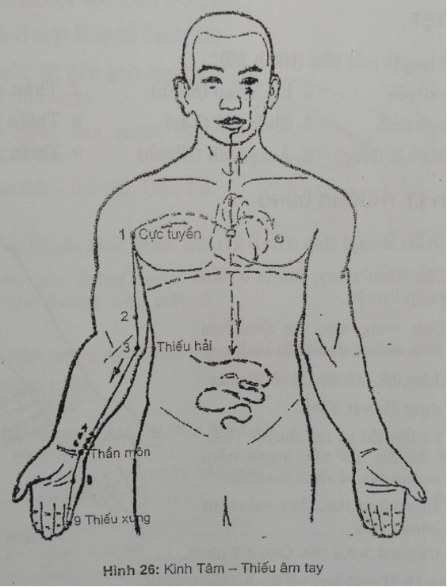
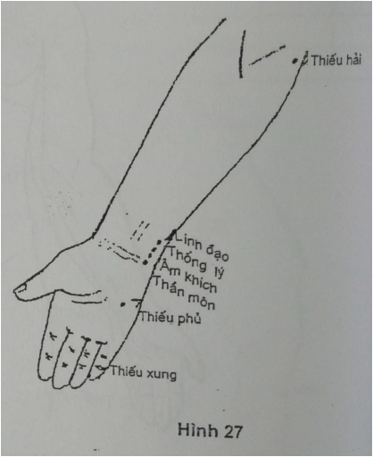
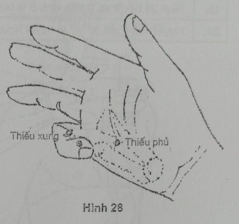
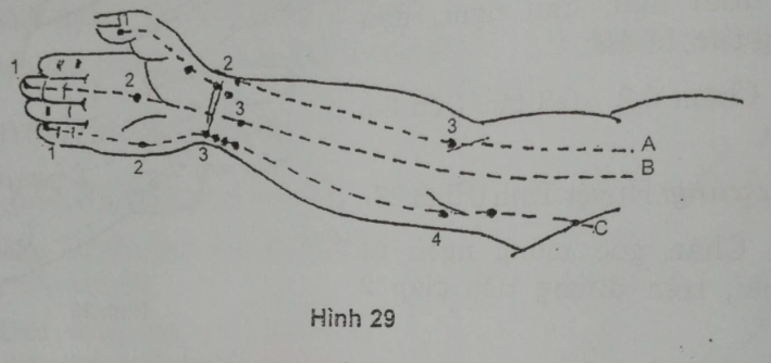

# 5.5 V. KINH TÂM - THIẾU ÂM TAY (H1 - H9)

## 1. ĐƯỜNG ĐI

Bắt đầu từ Tâm, thuộc Tâm hệ, qua cơ hoành liên lạc với Tiểu trường. Một nhánh lên cổ họng, chạy theo thực quản, liên hệ với mắt. Một nhánh từ Tâm qua Phế ra hõm nách dọc theo bờ trước trong cánh tay, cẳng tay, đi phía trong kinh Tâm bào đến mỏm trâm trụ, qua mô út của bàn tay, tận ở chân móng ngón út (huyệt Thiếu xung).

## 2. LIÊN QUAN TK

Nách, cánh tay, cẳng tay, bàn tay: C8 - D1. Từ khuỷu trở ra đường kinh trùng với TK trụ.

## 3. CHỦ TRỊ

Đau các khớp khuỷu, cổ tay, bàn tay, đám rối cánh tay, TK trụ, liệt tay. Rối loạn TK tim: hồi hộp, tim nhanh, tim chậm, ngoại tâm thu cơ năng. Mất ngủ, hạ sốt.

## 4. CÁC HUYỆT

Gồm 9 huyệt mỗi bên (Hình 26):

| 1. Cực tuyền | 4. Linh đạo (Kinh) | 7. Thần môn (Nguyên) |
| --- | --- | --- |
| 2. Thanh linh | 5. Thống lý (Lạc) | 8. Thiếu phủ (Huỳnh) |
| 3. Thiếu hải (Hợp) | 6. Âm khích (Khích) | 9. Thiếu xung (Tỉnh) |

## 5. CÁC HUYỆT THƯỜNG DÙNG

_**H3. Thiếu hải:**_ Huyệt Hợp (Hình 27) 

VT: Gấp khuỷu tay, huyệt ở đầu trong nếp khuỷu.

CT: Đau vùng tim, rức đầu, hoa mắt, điên cuồng, đau thần kinh trụ.

CC: Châm 0,5-0,8 tấc. Cứu 5-10 phút.

_**H4. Linh đạo:**_ Huyệt Kinh

VT: Từ lằn chỉ cổ tay (huyệt Thần môn) đo lên 1,5 tấc, huyệt nằm giữa cơ gan tay bé và cơ trụ trước.

CT: Đau vùng tim, đau vai cánh tay, hoảng hốt.

CC: Châm 0,3-0,4 tấc. Cứu 3-7 phút.

_**H5. Thống lý:**_ Huyệt Lạc với kinh Tiểu trường

VT: Từ lằn chỉ cổ tay đo lên 1 tấc, dưới Linh dạo 0,5 tấc.

CT: Mất tiếng, câm, đau vùng trước tim, đau vai, sốt không mồ hôi.

CC: Châm 0,3-0,4 tấc. Cứu 3-5 phút.

_**H6. Âm khích:**_ Huyệt Khích

VT: Từ lằn cổ tay (huyệt Thần môn) đo lên 0,5 tấc.

CT: Đau vùng tim, mất ngủ, mồ hôi trộm, máu cam, nôn máu.

CC: Châm 0,3-0,4 tấc. Cứu 3-5 phút.

_**H7. Thần môn:**_ Huyệt Du - Nguyên

VT: Điểm gặp bờ ngoài gân cơ trụ trước và bờ trên xương đậu ở lằn chỉ cổ tay.

CT: Đau vùng tim, vật vã, cuồng, hồi hộp, mất ngủ, đau liên sườn, đau thần kinh trụ, đau cổ tay.

CC: Châm 0,3-0,4 tấc. Cứu 3-5 phút.

_**H8. Thiếu phủ:**_ Huyệt Huỳnh (Hình 28) 

VT: Co ngón út đến gan tay bé, đầu ngón chỉ huyệt.

CT: Mất ngủ, đau ngực, đau vùng tim, bí đái.

CC: Châm 0,2-0,3 tấc. Cứu 3-5 phút.

_**H9. Thiếu xung:**_ Huyệt Tỉnh (Hình 28)

VT: Chân góc móng ngón út phía ngoài, trên đường tiếp giáp 2 màu da.

CT: Hồi hộp, trống ngực, đau vùng tim, sốt cao, hôn mê.

CC: Châm 0,1 tấc.

## TỰ LƯỢNG GIÁ KINH TÂM - THIẾU ÂM TAY

| **TT**| **Nội dung câu hỏi**| **Đúng**| **Sai**|
| --- | --- | --- | --- |
| 1 | Kinh Tâm đi từ ngón tay út vào tạng Tâm |
| 2 | Tâm khai khiếu ra lưỡi nên có nhánh đi vào lưỡi |
| 3 | Kinh Tâm có nhánh đi tới mắt |
| 4 | Kinh Tâm có nhánh đi xuống liên lạc Đại trường |
| 5 | Ở cẳng tay kinh Tâm đi dọc bờ trước trong, bên trong kinh Phế |
| 6 | Từ khuỷu tay đường đi kinh Tâm cùng với TK quay |
| 7 | Kinh Tâm bắt đầu từ đỉnh hố nách |
| 8 | Kinh Tâm tận cùng ở huyệt V9 |
| 9 | Huyệt Thần môn là huyệt Nguyên của kinh Tâm |
| 10 | Huyệt Thần môn dễ nhầm với huyệt Dương cốc của kinh Tiểu trường |
| 11 | Cơn đau thắt ngực thường châm tả huyệt V7 |
| 12 | Lấy huyệt Thiếu hải chi trên ở tư thế duỗi |
| 13 | Gấp cánh tay vào ngực, đầu mép gấp nách trước là huyệt Cực tuyền |
| 14 | Cơn tim kịch phát chọn huyệt Thiếu hải, Âm khích |
| 15 | Huyệt số 1 của kinh Tâm là huyệt Tỉnh |
| 16 | Hình 29 kinh Tâm là K.B |
| 17 | Hình 29 huyệt Thần môn là huyệt số 3 trên kinh B |
| 18 | Hình 29 huyệt số 1 trên kinh C là huyệt Thiếu xung |
| 19 | Hình 29 huyệt số 2 trên kinh B là huyệt Thống lý |
| 20 | Huyệt mang mã số V7 là huyệt Nguyên của kinh Tâm |

**ĐÁP ÁN**

| 1.S | 2.S | 3.Đ | 4.S | 5.Đ | 6.S | 7.Đ |
| --- | --- | --- | --- | --- | --- | --- |
| 8.Đ | 9.Đ | 10.Đ | 11.Đ | 12.S | 13.S | 14.Đ |
| 15.S | 16.S | 17.S | 18.S | 19.S | 20.Đ |
 |
