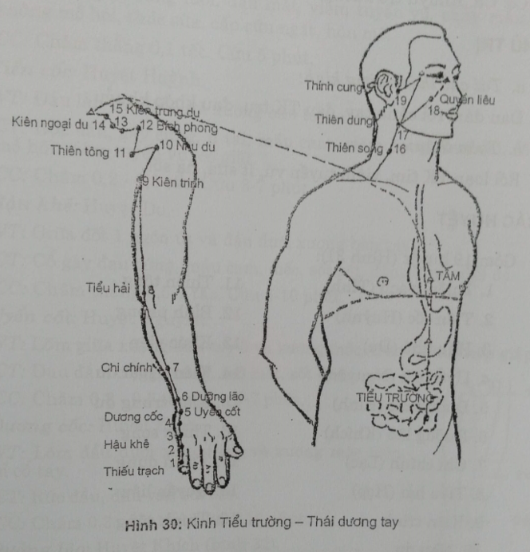
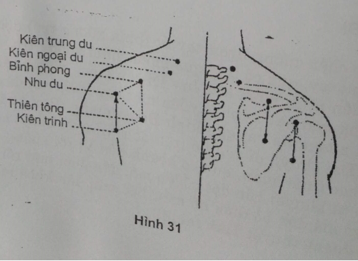
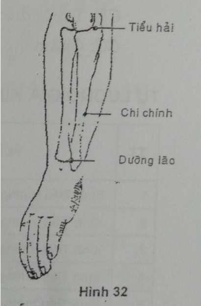
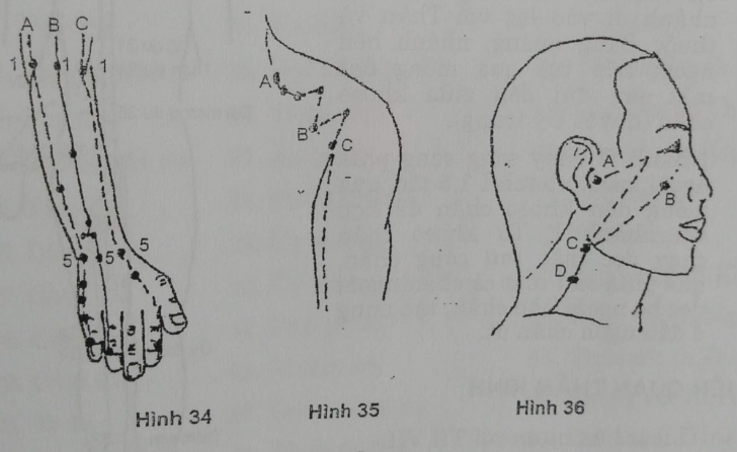

# 5.6 VI. KINH TIỂU TRƯỜNG - THÁI DƯƠNG TAY (SI1 - SI19)

## 1. ĐƯỜNG ĐI

Từ góc chân móng ngón tay út (phía xương trụ) dọc đường nối da gan tay và da mu tay, qua cổ tay, qua mỏm châm xương trụ, dọc bờ phía ngón út xương trụ đến rãnh mỏm khuỷu - lồi cầu trong xương cánh tay. Tiếp tục đi theo bờ trong mặt sau cánh tay lên mặt sau khớp vai đi ngoằn ngoèo ở trên và dưới gai xương bả vai gặp kinh Bàng quang (Phụ phân, Đại trữ) và gặp mạch Đốc (Đại chùy), đi vào hố trên đòn (Khuyết bồn) vào trong liên lạc với Tâm, dọc theo thực quản, qua cơ hoành đến Vị rồi xuống thuộc Tiểu trường. Một nhánh từ khuyết bồn dọc cổ lên má, đến đuôi mắt rồi vào trong tai. Một nhánh từ gò má đến bờ dưới hố mắt, hốc mũi, lên khóe mắt trong để nối với kinh Bàng quang (huyệt Tình minh).

## 2. LIÊN QUAN TK

Ngón tay, bàn tay, cẳng tay, cánh tay: C7 - D1. Vai: D2 - D4. Cổ: C3. Khuỷu trở xuống với TK trụ.

## 3. CHỦ TRỊ

_a. Tại chỗ theo đường kinh:_

Đau đám rối cánh tay, đau TK trụ, đau khớp khuỷu.

_b. Toàn thân:_

Rối loạn TK tim, viêm tuyến vú, ít sữa, hạ sốt.

## 4. CÁC HUYỆT

Gồm 19 huyệt (Hình 31):

| 1. Thiếu trạch (Tỉnh) | 11. Thiên tông |
| --- | --- |
| 2. Tiền cốc (Huỳnh) | 12. Bỉnh phong |
| 3. Hậu khê (Du) | 13. Khúc viên |
| 4. Uyển cốt (Nguyên) | 14. Kiên ngoại du |
| 5. Dương cốc (Kinh) | 15. Kiên trung du |
| 6. Dưỡng lão (Khích) | 16. Thiên song |
| 7. Chi chính (Lạc) | 17. Thiên dung |
| 8. Tiểu hải (Hợp) | 18. Quyền liêu |
| 9. Kiên trinh | 19. Thính dũng |
| 10. Nhu du |
 |

## 5. CÁC HUYỆT THƯỜNG DÙNG

_**SI1. Thiếu trạch:**_ Huyệt Tỉnh

VT: Góc trong chân móng ngón út, trên đường tiếp giáp 2 màu da.

CT: Cứng gáy, cứng lưỡi, đau mắt, viêm tuyến vú, chảy máu cam, sốt không mồ hôi, thúc sữa, cấp cứu ngất, hôn mê.

CC: Châm thẳng 0,1 tấc. Cứu 5 phút.

_**SI2. Tiền cốc:**_ Huyệt Huỳnh

VT: Đầu lằn chỉ đốt 1 và xương bàn tay.

CT: Rức đầu, gáy cứng, ù tai, máu cam, viêm họng, đau vai, sốt không mồ hôi, viêm tuyến vú, co giật.

CC: Châm 0,2-0,3 tấc. Cứu 3-7 phút.

_**SI3. Hậu khê:**_ Huyệt Du

VT: Giữa đốt 1 ngón út và đầu dưới xương bàn tay 5.

CT: Cổ gáy đau cứng, máu cam, điếc, sốt rét, động kinh, đái đỏ.

CC: Châm thẳng 0,5-1 tấc. Cứu 5-10 phút.

_**SI4. Uyển cốt:**_ Huyệt Nguyên

VT: Lõm giữa xương bàn tay 5 và xương móc, trên đường tiếp giáp 2 da.

CT: Đau đầu, cổ gáy cứng, mờ mắt, sốt cao.

CC: Châm 0,3-0,5 tấc. Cứu 3-7 phút.

_**SI5. Dương cốc:**_ Huyệt Kinh

VT: Lõm đầu dưới xương trụ và xương móc trên lằn chỉ cổ tay. )

CT: Rức đầu, đau vai, sốt cao.

CC: Châm 0,3-0,4 tấc. Cứu 5-10 phút.

_**SI6. Dưỡng lão:**_ Huyệt Khích (Hình 32)

VT: Trên Dương cốc 1 tấc, lõm phía ngoài khớp quay trụ.

CT: Thị lực giảm, đau mỏi vai, cánh tay.

CC: Châm 0,3 tấc. Cứu 5-10 phút.

_**SI7. Chi chính:**_ Huyệt Lạc với kinh Tâm

VT: Dương cốc đo lên 5 tấc, trên đường nối Dương cốc - Tiểu hải.

CT: Đau cứng vai gáy, điên giản, rức đầu, ù tai, đau thần kinh trụ, sốt cao chóng mặt.

CC: Châm 0,3-0,5 tấc. Cứu 5-10 phút.

_**SI8. Tiểu hải:**_ Huyệt Hợp

VT: Rãnh trụ sau khuỷu tay, phía dưới có thần kinh trụ.

CT: Đau cứng vai, gáy, điếc, điên, rức đầu, ù tai, đau thần kinh trụ.

CC: Châm 0,5-1 tấc. Cứu 5-10 phút.

_**SI11. Thiên tông**_ (Hình 33)

VT: Lõm giữa xương bả vai, ngang D4.

CT: Đau mỏi bả vai, đau khuỷu tay, hen suyễn.

CC: Châm thẳng 0,5-1 tấc. Cứu 5-15 phút.

_**SI18. Quyền liên**_

VT: Lõm dưới xương gò má.

CT: Liệt thần kinh VII, đau răng, viêm xoang hàm, giật mí mắt dưới.

CC: Châm 0,2-0,3 tấc.

_**SI19. Thính cung**_

VT: Lõm ngang trước giữa nhĩ bình (nắp tai).

CT: Tai ù, điếc, đau răng, liệt thần kinh VII.

CC: Châm 0,30-0,5 tấc. Cứu 3-5 phút.

## TỰ LƯỢNG GIÁ KINH TIỂU TRƯỜNG - THÁI DƯƠNG TAY

| **TT**| **Nội dung câu hỏi**| **Đúng**| **Sai**|
| --- | --- | --- | --- |
| 1 | Kinh Tiểu trường và kinh Đại trường có chung tính chất |
| 2 | Kinh Tiểu trường bắt đầu từ huyệt Thiếu trạch, đầu ngón tay út |
| 3 | Kinh Tiểu trường đi dọc bờ trong mặt sau cánh tay, cẳng tay |
| 4 | Kinh Tiểu trường tận cùng ở huyệt Quyền liêu |
| 5 | Kinh Tiểu trường đi qua rãnh mỏm khuỷu - lồi cầu trong xương cánh tay |
| 6 | Vùng cẳng tay, kinh Tiểu trường ở phía ngoài kinh Tam tiêu |
| 7 | Đau vai gáy, chọn dùng các huyệt trên kinh Tiểu trường |
| 8 | Tai ù, giảm thính chọn dùng huyệt trên kinh Tiểu trường |
| 9 | Từ huyệt Thính cung có nhánh lên nối với kinh Bàng quang |
| 10 | Huyệt có mã số VI.3 là huyệt Nguyên của kinh Tiểu trường |
| 11 | Nhánh đi vào trong để thuộc Tiểu trường đi qua hố trên đòn |
| 12 | Phía dưới huyệt Tiểu hải là TK trụ |
| 13 | Kinh Tiểu trường giao hội với kinh Bàng quang và mạch Đốc |
| 14 | Lấy huyệt Kiên trinh cánh tay phải nâng lên ngang vai |
| 15 | Hình 34, kinh B là kinh Tiểu trường |
| 16 | Hình 34, huyệt A5 là huyệt Dương cốc |
| 17 | Hình 34, huyệt B1 là huyệt Tiểu hải |
| 18 | Hình 35, huyệt C là huyệt Kiên trinh |
| 19 | Hình 35, huyệt A là huyệt Kiên trung du |
| 20 | Hình 36, huyệt C là huyệt Thiên dung |
| 21 | Hình 36, huyệt A là huyệt Nhĩ môn |
 

**ĐÁP ÁN**

| 1.S | 2.Đ | 3.Đ | 4.S | 5.Đ | 6.S | 7.Đ |
| --- | --- | --- | --- | --- | --- | --- |
| 8.Đ | 9.S | 10.S | 11.Đ | 12.Đ | 13.Đ | 14.S |
| 15.S | 16.Đ | 17.S | 18.Đ | 19.Đ | 20.Đ | 21.S |
