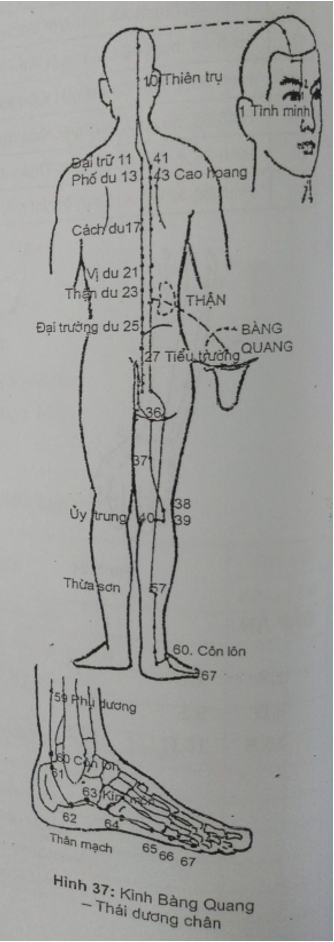
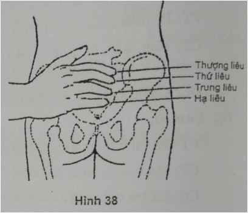
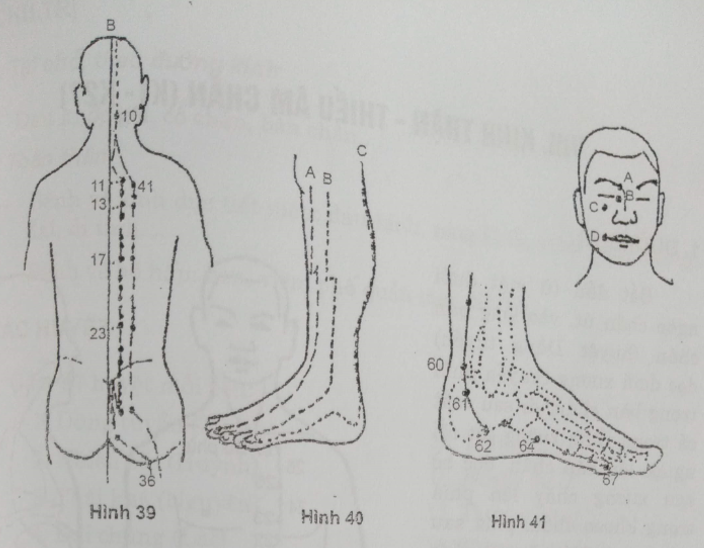

# 5.7 VII. KINH BÀNG QUANG - THÁI DƯƠNG CHÂN (B1 - B67)

## 1. ĐƯỜNG ĐI

Từ khóe mắt trong (huyệt Tình minh) lên trán, hội với mạch Đốc ở đỉnh đầu, nhánh xuống tai, nhánh đi vào trong não rồi quặt ra sau gáy (huyệt Thiên trụ) phân ra 2 nhánh chạy dọc 2 bên cột sống.

- Nhánh I cách đường gai sống 1,5 tấc; đến thắt lưng tách ra 1 nhánh đi vào lạc với Thận và thuộc Bàng quang, nhánh bên ngoài tiếp tục qua mông dọc mặt sau đùi đến giữa khoeo chân (huyệt Ủy trung).

- Nhánh II chạy song song phía ngoài, cách nhánh I 1,5 tấc, qua mông đến khoeo chân để hợp với nhánh I. Từ khoeo chân chạy dọc mặt sau cẳng chân, qua phía sau mắt cá chân ngoài dọc bờ ngoài bàn chân, tận cùng ở đầu ngón chân út.

## 2. LIÊN QUAN TK

- Ở mặt liên quan với TK VII.

- Cổ với C4.

- Lưng với D2, D11.

- Mông với S1, S2.

- Cẳng chân, bàn chân với S1.

## 3. CHỦ TRỊ

- Bệnh ở mắt, mũi, đầu gáy, não, thắt lưng.

- Bệnh của tạng phủ có huyệt Du ở lưng tương quan tiết đoạn TK.

## 4. CÁC HUYỆT

Gồm 67 huyệt mỗi bên:

| 1. Tình minh | 24. Khí hải du | 47. Hồn môn |
| --- | --- | --- |
| 2. Toản trúc | 25. Đại trường du | 48. Dương cương |
| 3. Mi sung | 26. Quan nguyên du | 49. Ý xá |
| 4. Khúc sai | 27. Tiểu trường du | 50. Vị thương |
| 5. Ngũ xứ | 28. Bàng quang du | 51. Hoang môn |
| 6. Thừa quang | 29. Trung lữ du | 52. Chí thất |
| 7. Thông thiên | 30. Bạch hoàn du | 53. Bào hoang |
| 8. Lạc khước | 31. Thượng liêu | 54. Trật biên |
| 9. Ngọc chẩm | 32. Thứ liêu | 55. Hợp dương |
| 10. Thiên trụ | 33. Trung liêu | 56. Thừa cân |
| 11. Đại trữ | 34. Hạ liêu | 57. Thừa sơn |
| 12. Phong môn | 35. Hội dương | 58. Phi dương (h. Lạc) |
| 13. Phế du | 36. Thừa phù | 59. Phụ dương (h. Kinh) |
| 14. Quyết âm du | 37. Ân môn | 60. Côn lôn (h. Kinh) |
| 15. Tâm du | 38. Phù khích | 61. Bộc tham |
| 16. Đốc du | 39. Ủy dương | 62. Thân mạch |
| 17. Cách du | 40. Ủy trung (h. Hợp) | 63. Kim môn (h. Khích) |
| 18. Can du | 41. Phụ phân | 64. Kinh cốt (h. Nguyên) |
| 19. Đởm du | 42. Phách hộ | 65. Thúc cốt (h. Du) |
| 20. Tì du | 43. Cao hoang du | 66. Thông cốc (h. Huỳnh) |
| 21. Vị du | 44. Thần đường | 67. Chí âm (h. Tỉnh) |
| 22. Tam tiêu du | 45. Y hi |
| 23. Thận du | 46. Cách quan |

## 5. CÁC HUYỆT THƯỜNG DÙNG

_**B1. Tình minh**_

VT: Trong khoang hố mắt, khóe mắt trông lên 0,1 tấc.

CT: Viêm màng tiếp hợp, viêm tuyến lệ, liệt thần kinh VII, chắp lẹo, thị lực giảm.

CC: Nằm ngửa hoặc gối thẳng, ngón tay đẩy nhãn cầu ra phía ngoài. Châm kim men theo bờ trong hốc mắt 0,1-0,5 tấc. Không vê kim, không lưu kim lâu. Sau khi rút kim, lấy ngón tay ấn vào lỗ châm 1-2 phút để tránh chảy máu. Không cứu.

_**B2. Toàn trúc**_

VT: Đầu trong lông mày, lõm thẳng huyệt Tình minh lên.

CT: Rức đầu, hoa mắt, đau xoang trán, viêm tuyến lệ, viêm kết mạc, sụp mi, giật mi mắt, đục nhân mắt.

CC: Châm thẳng 0,3-0,5 tấc hoặc xuyên Tình minh. Không cứu.

_**B10. Thiên trụ**_

VT: Từ C1 - C2 (huyệt Á môn) ngang ra 1,3 tấc, bờ ngoài cơ thang.

CT: Rức đầu, đau cứng cổ gáy, đau vai nách.

CC: Châm 0,3 tấc.

_**B11. Đại trữ:**_ Huyệt Hội của Cốt

VT: Bờ dưới mỏm gai D1 ngang ra 1,5 tấc.

CT: Ho, cảm phong hàn, đau cứng cổ gáy, đau nhức xương toàn thân.

CC: Châm 0,5-1 tấc. Cứu 5-10 phút.

_**B12. Phong môn**_

VT: Dưới mỏm gai D2 ngang ra 1,5 tấc.

CT: Ho, cảm mạo, đau cổ gáy, đau lưng.

CC: Châm nghiêng 0,5-1 tấc. Cứu 5-10 phút.

_**B13. Phế du**_

VT: Bờ dưới mỏm gai D3 ngang ra 1,5 tấc.

CT: Lao phổi, ho máu, viêm phế quản, hen , viêm mũi, mồ hôi trộm, đau lưng, đau cứng cột sống, vẹo cổ, chắp lẹo (chích máu).

CC: Châm nghiêng 0,5-1 tấc. Cứu 5-10 phút.

_**B15. Tâm du**_

VT: Bờ dưới mỏm gai D5 ngang ra 1,5 tấc.

CT: Mất ngủ, hay quên, hồi hộp, vật vã, ho, mộng tinh, di tinh, rối loạn nhịp tim.

CC: Châm 0,5-1 tấc. Cứu 5-10 phút.

_**B16. Đốc du**_

VT: Bờ dưới mỏm gai D6 ngang ra 1,5 tấc.

CT: Sốt cao, đau lưng, đau vùng tim, khó thở, tức ngực.

CC: Châm 0,5-1 tấc. Cứu 5-10 phút.

_**B17. Cách du:**_ Huyệt Hội của Huyết

VT: Bờ dưới mỏm gai D7 ngang ra 1,5 tấc.

CT: Nôn, nấc, ăn không tiêu, khó thở, triều nhiệt, mồ hôi trộm, thiếu máu (kết hợp 2 huyệt Đởm du gọi là huyệt Tứ hoa).

CC: Châm nghiêng hướng xuống dưới 0,5 tấc. Cứu 5-10 phút.

_**B18. Can du**_

VT: Bờ dưới mỏm gai D9 ngang ra 1,5 tấc.

CT: Máu cam, viêm kết mạc, đau mạng sườn, cao huyết áp, đau dạ dày.

CC: Châm nghiêng hướng xuống dưới 0,5 tấc. Cứu 5-10 phút.

_**B19. Đởm du**_

VT: Bờ dưới mỏm gai D10 ngang ra 1,5 tấc.

CT: Đau dạ dày, ợ chua, hoàng đản, ỉa chảy, đau lưng, chứng đàm thấp.

CC: Châm nghiêng 0,5-1 tấc. Cứu 5-10 phút.

_**B23. Thận du**_

VT: Bời dưới mỏm gai L2 ngang ra 1,5 tấc.

CT: Di tinh, liệt dương, kinh không đều, đau lưng, ù tai, điếc, đái dầm.

CC: Châm thẳng 1-1,5 tấc. Cứu 5-10 phút.

_**B25. Đại trường du**_

VT: Bờ dưới mỏm gai L4 ngang ra 1,5 tấc.

CT: Đau lưng, đau thần kinh tọa, đày bụng, ỉa chảy, áo.

CC: Châm thẳng 1-1,5 tấc. Cứu 5-10 phút.

_**B27. Tiểu trường du**_

VT: Mỏm gai S1 ngang ra 1,5 tấc.

CT: Di tinh, đái máu, đái dầm, khí hư, lỵ.

CC: Châm thẳng 0,5-1 tấc. Cứu 5-10 phút.

_**B28. Bàng quang du**_

VT: Mỏm gai S2 ngang ra 1,5 tấc.

CT: Bí đái, đái dầm, đau bụng, đau lưng, đau cột sống.

CC: Châm thẳng 0,5-1 tấc. Cứu 5-10 phút.

_**B31-35. Bát liêu:**_ Gồm mỗi bên 4 huyệt (Hình 38):

VT:

- Thượng liêu: Lỗ xương cùng 1. Điểm giữa S1 - Tiểu trường du.

- Thứ liêu: Lỗ xương cùng 2.

- Trung liêu: Lỗ xương cùng 3.

- Hạ liêu: Lỗ xương cùng 4.

CT: Kinh không đều, đau lưng, bí đái, đau TK tọa, đau hạ vị.

CC: Châm đúng lỗ xương cùng 1-1,5 tấc. Cứu 5-10 phút.

_**B36. Thừa phù**_

VT: Giữa nếp lằn mông, giáp bắp đùi.

CT: Trĩ, đau mông, đau thần kinh tọa.

CC: Châm thẳng 0,7-1,5 tấc. Cứu 5-10 phút.

_**B40. Ủy trung:**_ Huyệt Hợp, Huyệt tổng vùng thắt lưng

VT: Giữa nếp lằn khoeo.

CT: Đau khớp gối, đau vùng thắt lưng.

CC: Châm 0,5 tấc, châm nặn máu. Không cứu.

_**B43. Cao hoang**_

VT: Bờ dưới mỏm gai D4 ngang ra 3 tấc.

CT: Lao phổi, mồ hôi trộm, ho máu, tỳ vị hư nhược.

CC: Châm nghiêng 0,5-1 tấc. Cứu 5-10 phút.

_**B52. Chí thất**_

VT: Bờ dưới mỏm gai L2 ngang ra 3 tấc.

CT: Liệt dương, di tinh, bí đái, phù, đau lưng.

CC: Châm thằng 0,5. Cứu 5-10 phút.

_**B54. Trật biên**_

VT: Mỏm gai S4 ngang ra 3 tấc.

CT: Đau lưng, đái đỏ đậm, trĩ, liệt chi dưới.

CC: Châm thẳng 1-2 tấc. Cứu 5-10 phút (phía dưới là thần kinh tọa).

_**B57. Thừa sơn**_

VT: Giữa bắp chân (khu cẳng chân sau, góc hợp bởi 2 cơ sinh đôi).

CT: Đau thần kinh tọa, chuột rút bắp chân, trĩ, táo.

CC: Châm 0,5-1 tấc. Cứu 5-10 phút.

_**B60. Côn lôn:**_ Huyệt Kinh

VT: Điểm giữa đoạn nối đỉnh mắt cá ngoài và bờ sau gân gót.

CT: Rức đầu, đau cổ gáy, đau lưng, hoa mắt, máu cam, co giật.

CC: Châm thẳng 0,5 tấc. Cứu 5-10 phút. Có thai không châm.

_**B62. Thân mạch**_

VT: Dưới mắt cá ngoài, trong rãnh cơ mác, dưới đỉnh mắt cá 0,5 tấc.

CT: Rức đầu, choáng váng, lưng đùi đau mỏi, kinh giản.

CC: Châm 0,3-0,5 tấc. Cứu 5-10 phút.

_**B64. Kinh cốt:**_ Huyệt Nguyên

VT: Bờ ngoài bàn chân, đầu sau xương bàn chân 5, đường tiếp giáp da gan bàn chân và mu chân.

CT: Động kinh, rức đầu, đau gáy, đau lưng, đau gót.

CC: Châm 0,3-0,5 tấc. Cứu 3-5 phút.

_**B65. Thúc cốt:**_ Huyệt Du

VT: Đầu trước xương bàn chân 5, trên đường tiếp giáp 2 màu da.

CT: Rức đầu, hoa mắt, cứng gáy, điếc, đau vai lưng.

CC: Châm thẳng 0,3-0,5 tấc. Cứu 5-10 phút.

_**B66. Thông cốc:**_ Huyệt Huỳnh

VT: Đầu sau đốt 1 ngón chân út.

CT: Đau đầu, đau cứng cổ gáy, mắt hoa, máu cam.

CC: Châm 0,2-0,3 tấc. Cứu 3-7 phút.

_**B67. Chí âm:**_ Huyệt Tỉnh

VT: Cách gốc móng chân ít về phía ngoài 0,2 tấc.

CT: Đau đầu, ngạt mũi, viêm mũi dị ứng, khó đẻ, bí đái.

CC: Châm 0,1 tấc. Cứu 5-7 phút.

## TỰ LƯỢNG GIÁ KINH BÀNG QUANG - THÁI DƯƠNG CHÂN

| **TT**| **Nội dung câu hỏi**| **Đúng**| **Sai**|
| --- | --- | --- | --- |
| 1 | Kinh Bàng quang là kinh dài nhất và nhiều huyệt nhất |
| 2 | Mã số của kinh Bàng quang là B hoặc VII |
| 3 | Kinh Bàng quang bắt đầu từ huyệt chí âm B67 |
| 4 | Kinh Bàng quang có cùng tính chất với kinh Thận |
| 5 | Kinh Bàng quang có nhánh đi vào trong qua Khuyết bồn để phủ Bàng quang |
| 6 | Ở vùng lưng, nhánh I đi song song và cách đường gai sống 2 thốn |
| 7 | Kinh Bàng quang tiếp nối kinh Tiểu trường từ huyệt Quyền tiêu |
| 8 | Kinh Bàng quang có nhánh tách từ đỉnh đầu đi vào não và vào tai |
| 9 | Hai nhánh chính của kinh Bàng quang tách ra từ huyệt Thiên trụ |
| 10 | Huyệt B40 là huyệt Tổng của vùng thắt lưng |
| 11 | Huyệt B60 là huyệt Nguyên của kinh Bàng quang |
| 12 | Các huyệt Du ở lưng (Bối du) đều nằm trên nhánh II của kinh Bàng quang |
| 13 | Kinh Bàng quang chữa bệnh của hầu hết các tạng phủ có huyệt Bối du |
| 14 | Hình vẽ 39, huyệt B10 là huyệt Thiên trụ |
| 15 | Hình vẽ 39, huyệt B41 là huyệt Đại trữ |
| 16 | Hình vẽ 39, huyệt B13 là huyệt Phế du |
| 17 | Hình vẽ 39, huyệt B17 là huyệt Thận du |
| 18 | Hình vẽ 40, kinh B là kinh Bàng quang |
| 19 | Hình vẽ 41, huyệt A là huyệt Toàn trúc |
| 20 | Hình vẽ 41, huyệt C là huyệt Tình minh |

**ĐÁP ÁN**

| 1.Đ | 2.Đ | 3.S | 4.S | 5.S | 6.S | 7.Đ |
| --- | --- | --- | --- | --- | --- | --- |
| 8.Đ | 9.Đ | 10.Đ | 11.S | 12.S | 13.Đ | 14.Đ |
| 15.S | 16.Đ | 17.S | 18.S | 19.Đ | 20.S |
 |