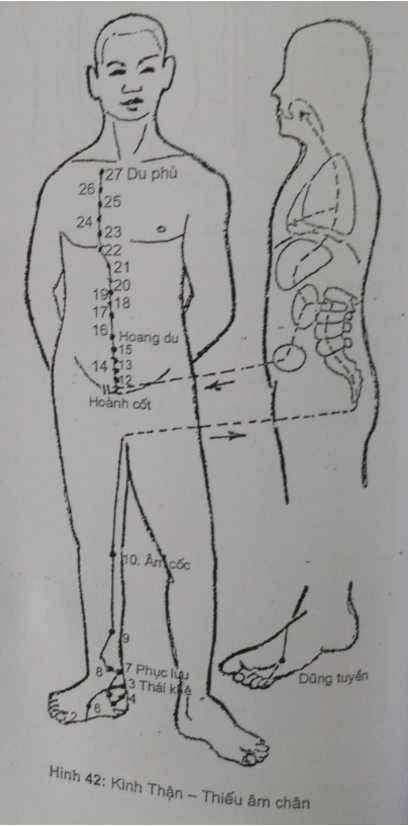

# 5.8 VIII. KINH THẬN - THIẾU ÂM CHÂN (K1 - K27)

## 1. ĐƯỜNG ĐI 

Bắt đầu từ mặt dưới ngón chân út, vào lòng bàn chân (huyệt Dũng tuyền) dọc dưới xương thuyền phía trong bàn chân, đi sau mắt cá trong vòng xuống gót rồi ngược lên bắp chân, dọc bờ sau xương chày lên phía trong khoeo chân, phía sau mặt trong đùi, vào cột sống thuộc Thận, liên lạc với Bàng quang.

Từ Thận qua Gan, qua cơ hoành, vào Phế, đi cạnh thanh quản, họng, rồi vào lưỡi.

Phân nhánh: Từ Phế, một nhánh ra liên hệ với Tâm rồi phân bổ ở ngực và tiếp nối với kinh Tâm bào

## 2. LIÊN QUAN TK

- Cẳng chân: liên quan với L4.

- Đùi: liên quan với L4-L3.

-Bụng: liên quan với L2-L1-D12-D10-D9.

- Ngực: liên quan với D8 đến D3.

## CHỦ TRỊ

  1. Tại chỗ, theo đường kinh

Đau khớp gối, cổ chân, bàn chân...

  1. Toàn thân

- Bệnh về sinh dục tiết niệu: đau kinh, rong kinh, viêm bàng quang, bí

đái, di tinh...

- Bệnh về hô hấp: hen, viêm phế quản mạn, SNTK.

## CÁC HUYỆT

Gồm 27 huyệt mỗi bên:

1. Dũng tuyền (Tỉnh)
2. Nhiên cốc (Huỳnh)
3. Thái khê (Nguyên)
4. Đại chung (Lạc)
5. Thuỷ tuyền (Khích)
6. Chiếu hải
7. Phục lưu (Kinh)
8. Giao tín
9. Trúc tân
10. Âm cốc (Hợp)
11. Hoành cốt
12. Đại hách
13. Khí huyệt
14. Tứ mãn
15. Trung chú
16. Hoang du
17. Thương khúc
18. Thạch quan
19. Âm đô
20. Thông cốc
21. U môn
22. Bộ lang
23. Thần phong
24. Linh khư
25. Thần tàng
26. Hoắc trung
27. Du phủ

## CÁC HUYỆT THƯỜNG DÙNG

_**. Dũng tuyền:** _Huyệt Tỉnh (Hình 42).

VT: Lõm giữa 2 khối cơ gan chân trong và ngoài.

CT: Rức đầu, hoa mắt, đau họng, bí đái.

CC: Châm 0,2 tấc. Cứu 3-5 phút.

_**. Nhiên cốc:**_ Huyệt Huỳnh.

VT: Giữa bờ dưới xương thuyền, trên đường tiếp giáp 2 màu da.

CT: Kinh không đều, ho máu, di tinh, đau cổ chân, co giật trẻ em.

CC: Châm 0,3 tấc. Cứu 3-7 phút.

_**. Thái khê:** _Huyệt Du, Nguyên.

VT: Đỉnh mắt cá trong đo ngang ra sau 0,5 tấc (tương ứng huyệt Côn lôn phía ngoài).

CT: Đau họng, đau răng, ù tai, ho máu, hen suyễn, kinh không đều, mất ngủ, di tinh, liệt dương, đau lưng.

CC: Châm thẳng 0,5 tấc. Cứu 5-10 phút.

_**. Đại chung:**_ Huyệt Lạc.

VT: Dưới Thái khê 0,5 tấc, bờ trước gân gót với bờ trên xương gót.

CT: Đần độn, ho, hen, đái dầm, đau lưng, táo bón.

CC: Châm 0,3 tấc. Cứu 3-5 phút.

_**. Chiếu hải**_

VT: Thẳng đỉnh mắt cá trong xuống 1 tấc.

CT: Rối loạn kinh nguyệt, đau bụng dưới, họng khô, ngứa sinh dục ngoài.

CC: Châm 0,2-0,3. Cứu 5-10 phút.

_**. Thuỷ tuyền:**_ Huyệt Khích.

VT: Dưới Thái khế 1 tấc.

CT: Rối loạn kinh nguyệt, thống kinh, bí đái, hoa mắt.

CC: Châm 0,2 - 0,3. Cứu 5-10 phút.

_**Phục lưu:**_ Huyệt Kinh.

VT: Thẳng trên huyệt Thái khê 2 tấc.

CT: Ỉa chảy, đầy bụng, liệt chi dưới, mồ hôi trộm, bí đái, phù thũng.

CC: Châm 0,3-0,5 tấc. Cứu 5-10 phút.

_**. Âm cốc:**_ Huyệt Hợp.

VT: Lõm sau gân cơ bán mạc, đầu trong nếp khoeo chân.

CT: Liệt dương, đái máu, động kinh, đau gối.

CC: Châm 0,5-0,8 tấc. Cứu 5-10 phút.

_**. Hoang du**_

VT: Từ rốn ngang ra 0,5 tấc.

CT: Đau bụng, nôn mửa, táo, ỉa chảy, đầy trướng bụng.

CC: Châm 0,5 - 1 tấc. Cứu 5-10 phút.

_**Du phủ**_

VT. Bờ dưới đầu trong xương đòn, cách đường giữa 2 tấc.

CT: Ho, suyễn, đau lồng ngực.

CC: Châm 0,3 - 0,5. Cứu 5-7 phút.

## TỰ LƯỢNG GIÁ KINH THẬN - THIẾU ÂM CHÂN

| **TT**| **NỘI DUNG CÂU HỎI**|**Đúng/Sai**|
| --- | --- | --- | 
| 1. | Kinh Thận tiếp nối kinh Bàng quang ở mặt dưới ngón chân út |
| 2. | Kinh Thận còn gọi là kinh Thiếu âm chân | 
| 3. | Kinh Tâm và kinh Thận có cùng tính chất |
| 4. | Kinh Thận tận cùng ở bờ dưới đầu trong xương đòn |
| 5. | Ở vùng bụng, kinh Thận đi song song và ở phía ngoài kinh Vị |
| 6. | Kinh Thận không có nhánh liên hệ tạng Phế |
| 7. | Kinh Thận có nhánh đi ra tai, vì Thận khai khiếu ra tai |
| 8. | Kinh Tâm bào nối tiếp kinh Thận ở đầu ngón tay giữa |
| 9. | Kinh Thận có nhánh đi vào tạng Tâm và tạng Phế |
| 10. | Kinh Thận có nhánh đi vào cột sống cùng và thắt lưng |
| 11. | Huyệt Du phủ là huyệt Tỉnh của kinh Thận |
| 12. | Huyệt Tỉnh của kinh Thận không ở đầu ngón chân như các huyệt Tỉnh khác |
| 13. | Mã số của kinh Thận là IX hoặc P |
| 14. | Huyệt có mã số K1 là huyệt Tỉnh của kinh Thận |
| 15. | Hình 43, kinh B là kinh Thận |
| 16. | Hình 44, kinh D là kinh Thận |
| 17. | Hình 44, huyệt D 1 là huyệt Hoang du |
| 18. | Hình 45, kinh B là kinh Thận |
| 19. | Hình 45, huyệt CC:7 là huyệt Du phủ |
| 20. | Hình 46, huyệt B là huyệt Dũng tuyền |
 

**ĐÁP ÁN**

1. Đ
2. Đ
3. Đ
4. Đ
5. S
6. S
7. S
8. S
9. Đ
10. Đ
11. S
12. Đ
13. S
14. Đ
15. S
16. Đ
17. Đ
18. S
19. Đ
20. S