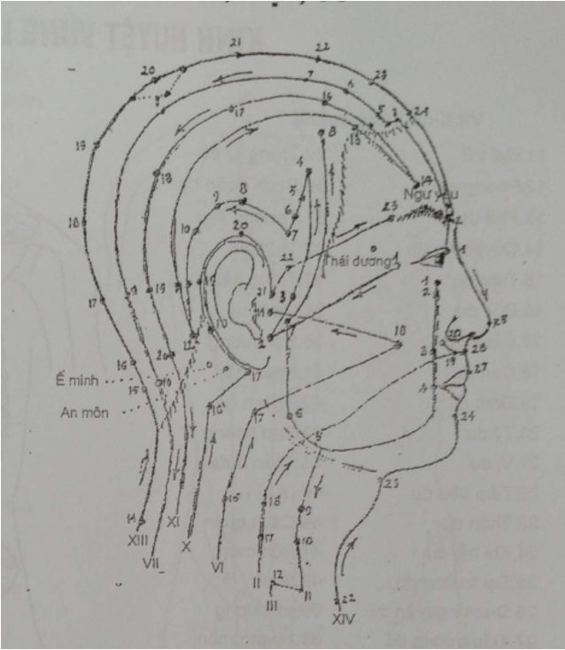
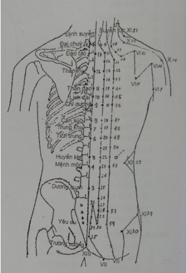
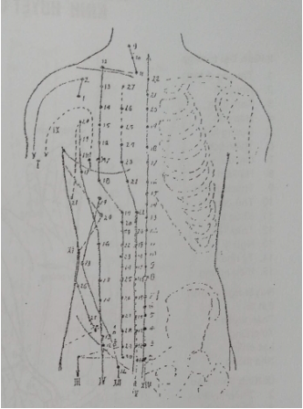
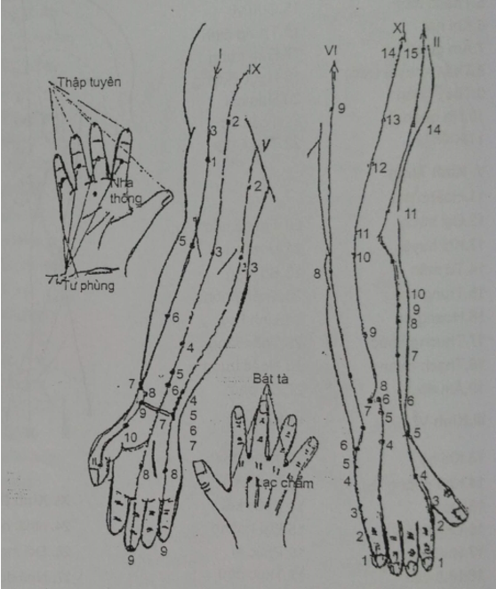
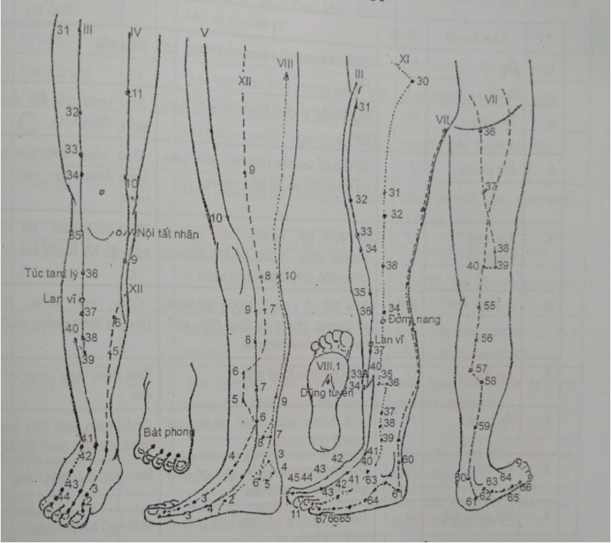

# Bài 6 CÁCH XÂY DỰNG ĐƠN HUYỆT

_(Chọn huyệt và phối huyệt)_

MỤC TIÊU

_Viết được đơn huyệt tốt nhất chữa một chứng bệnh hoặc một người bệnh cụ thể._

## ĐẠI CƯƠNG

- Đơn huyệt tốt kết quả chữa bệnh sẽ cao
- Muốn viết được một đơn huyệt tốt cần có chẩn đoán chính xác và có hiểu biết về kinh lạc và huyệt vị.

## Chẩn đoán tốt

    1. **Chẩn đoán theo Đông y để biết**

- Bệnh chứng thuộc tạng phủ, kinh lạc nào.
- Tính hàn nhiệt và trạng thái hư hay thực của bệnh.
- Nguyên nhân nào gây bệnh.
- Cơ chế gây bệnh theo thuyết Âm dương, Ngũ hành

    1. **Chẩn đoán theo Tây y để biết**

- Chứng bệnh do rối loạn chức năng hay tổn thương thực thể.
- Nguyên nhân gây bệnh.
- Những chứng bệnh có chống chỉ định châm cứu không.

## Đường đi và tác dụng đặc hiệu của 14 kinh mạch chính

| **ĐƯỜNG KINH**| **TÁC DỤNG THEO ĐƯỜNG KINH**| **TÁC DỤNG TOÀN THÂN**|
| --- | --- | --- |
| Kinh phế | Bệnh về lồng ngực, về phổi, hầu họng, chi trên | Hạ sốt |
| Kinh Tâm bào | Bệnh về lồng ngực, tim, dạ dày, chi trên | Rối loạn ý thức, T thần |
| Kinh Tâm | Bệnh về lồng ngực, tim, chi trên | Rối loạn hoạt động tinh thần, thần kinh |
| Kinh Đại trường | Bệnh ở vùng đầu, mặt, mắt, mũi, miệng, răng, hàm, họng và chi trên | Hạ sốt cao |
| Kinh Tam tiêu | Mặt bên vùng đầu, mắt, tai, họng và chi trên | Hạ sốt - Rối loạn tâm thần |
| Kinh Tiểu trường | Vùng đầu cổ, mắt, tai, họng và chi trên | Hạ sốt - Rối loạn tâm thần |
| Kinh Tỳ | Vùng bụng bệnh tiết niệu, sinh dục, dạ dày, tiểu trường, đại trường và chi dưới | Chứng hư hàn |
| Kinh Can | Vùng bụng, bệnh tiết niệu - sinh dục chi dưới | Rối loạn tâm thần |
| Kinh Thận | Bệnh phổi, họng tiết niệu - sinh dục vùng bụng và chi dưới | Hạ sốt |
| Kinh Vị | Vùng đầu, mặt,răng miệng, họng, dạ dày, ruột và chi dưới | Hạ sốt - Rối loạn tâm thần |
| Kinh Đởm | Mặt bên vùng đầu, mắt, tai, vùng bên ngực bụng và chi dưới | Hạ sốt |
| Kinh Bàng quang | Vùng đầu, cổ, gáy, mắt, lưng, mông và chi dưới| Mạch Đốc và Giáp tích | Vùng đầu, dọc 2 bên cột sống | Bệnh tạng phủ |
| D 1 - D7 | Bệnh vùng ngực, lưng, phổi, tim | Hạ sốt - Rối loạn tâm thần |
| D8 - L2 | Vùng thượng vị, lưng, gan, mật, dạ dày, ruột| L3-S4 | Vùng hạ vị, thắt lưng, bệnh tiết niệu - sinh dục, ruột, bổ dương |
 |

Mỗi đường kinh đều có hai tác dụng chữa bệnh là:

- Tác dụng theo đường đi của kinh (Kinh lạc sở quá chủ trị sở tại).
- Tác dụng điều hoà chức năng tạng phủ mà nó mang tên (Tác dụng đặc hiệu và toàn thân của đường kinh).

## CÁC CÁCH CHỌN HUYỆT, PHỐI HUYỆT

## Theo vị trí bệnh

Cách này đơn giản, thường áp dụng chữa chứng đau hoặc bệnh của một phủ tạng, một bộ phận cơ thế nhất định.

    1. **Lấy huyệt tại chỗ và vùng lân cận**

Lấy huyệt ngay tại nơi đau, điềm đau nhất (Huyệt A thị) và những huyệt ở gần nơi bệnh. Thí dụ:

- Đau răng hàm: Giáp xạ, Hạ quan.
- Máy mắt: Tình minh, Ngư yêu, Thừa khấp...
- Đau vùng thượng vị: Trung quản, Lương môn.
- Đau phần phụ, Buồng trứng: Quy lại...

    1. **Lấy huyệt ở xa nơi bệnh**

Huyệt ở xa nhưng ở trên đường kinh đi qua nơi bệnh, thường là những huyệt từ khuỷu tay và khoeo chân ra đến các ngón. Có thể là huyệt Tổng, huyệt Nguyên, huyệt Khích, huyệt Hội... Thí dụ:

- Đau vùng mặt: Hợp cốc (huyệt Tổng vùng mặt).
- Đau vùng Thái dương: Ngoại quan (thuộc kinh Tam tiêu đi qua vùng Thái dương).
- Đau thượng vị: Túc tam lý (huyệt Tổng vùng Thượng vị).
- Đau mạng sườn: Dương lăng tuyền (kinh Đởm đi qua mạng sườn).

    1. **Phối hợp huyệt**

Trong mỗi đơn huyệt thường kết hợp một vài huyệt tại chỗ và lân cận với một vài huyệt ở xa. Thí dụ:

- Cơn đau dạ dày: + Tại chỗ, Trung quản, Lương môn.

+ Ở xa: Nội quan, Lương khâu.

- Khái huyết do Lao: + Tại chỗ, Phế du, Trung phủ.

+ Ở xa: Nội đình, Hợp cốc.

**Bảng phối huyệt tại chỗ và ở xa**

| **VÙNG BỆNH**| **HUYỆT TẠI CHỖ VÀ LÂN CẬN**| **HUYỆT Ở XA THEO ĐƯỜNG KINH**|
| --- | --- | --- |
| Trán | Ấn đường, Dương bạch | Hợp Cốc |
| Mặt, má | Địa thương, Giáp xa | Hợp Cốc, Nội đình |
| Mắt | Tình minh, Thừa khắp | Dưỡng lão, Quang minh |
| Mūi | Nghinh hương, Ấn đường | Hợp Cốc |
| Cổ họng | Liêm tuyền, Thiên đột | Liệt khuyết, Chiếu hải |
| Ngực | Đản trung, Giáp tích D 1 - D7 | Khổng tối, Phong long |
| Bụng trên | Trung quản, Giáp tích D9-L12 | Nội quan, Túc tam lý |
| Bụng dưới | Quan nguyên, Giáp tích L2 - S4 | Ngoại quan, Hiệp khê |
| Chẩm, gáy | Phong trí, Thiên trụ | Hậu khê, Thúc Cốt |
| Lưng D1 - D7 | Đại chuỳ, Phế du | Côn lôn |
| Lưng D8 - L2 | Đốc du, Đại trữ | Ủy trung |
| Lưng L2 - S4 | Thận du, Đại trường du | Ân môn |
| Hậu môn | Trường cường, Bạch hoàn du | Thừa Sơn |
| Khớp vai | Kiên ngang, Kiên trinh | Khúc trì |
| Khớp khuỷu | Khúc trì, Thủ tam lý | Ngoại quan |
| Khớp cổ tay | Hợp Cốc, Hậu khê | Khúc trì |
| Khớp háng | Hoàn khiêu, Giáp tích L4 - L5 | Dương lăng tuyền |
| Khớp gối | Độc tỵ, Dương lăng tuyền | Âm cốc |
| Khớp cổ chân | Giải khê, Khâu khư, Thái khê | Độc ty, Dương lăng tuyển |

## Theo biện chứng luận trị

    1. **Lấy huyệt theo kinh mạch, tạng phủ bị bệnh**

Qua tứ chấn ta xác định kinh lạc, tạng phủ bị bệnh ta chọn huyệt trên kinh bệnh hoặc liên quan tạng phủ bị bệnh.

Thí dụ 1: Chứng đau đầu nếu đau nhiều phía trước, ta dùng kinh Dương minh (Đại trường, Vị). Nếu đau nhiều hai bên đầu, ta dùng kinh Thiếu dương (Tam tiêu, Đởm). Nếu đau nhiều đỉnh đầu, ta dùng Quyết âm Can.

Thí dụ 2: Chứng mờ mắt, ngoài những huyệt tại chỗ như Tình minh, Thừa khấp, Đồng tử liêu, còn phải kết hợp những huyệt có liên quan đến Can và Đởm như huyệt Can du, Quang minh vì tạng Can khai khiếu ra mắt.

    1. **Lấy huyệt theo cơ chế bệnh sinh**

Bệnh chứng tuy thể hiện ra ở ruột tạng phủ nhưng xuất phát lại từ một tạng phủ khác. Dựa vào thuyết Âm dương Ngũ hành ta tìm cơ chế sinh bệnh, từ đó mà chọn kinh phối huyệt.

Thí dụ 1: Chứng đau dạ dày:

- Nếu do Tỳ vị hư hàn cần phối hợp cứu các huyệt Quan nguyên, Khí

hải, Tỳ du, Vi dụ.

- Nếu do Can khí phạm vị thì tả huyệt Thái xung (huyệt Nguyên của

kinh Can) bổ Túc tam lý để hoà Vị.

Thí dụ 2: Chứng trĩ hoặc sa tử cung... là do Tỳ khí hư không cố giữ được do vậy phải kiện tỳ thăng đề dương khí, dùng huyệt Bách hội, Túc tam lý, Tam âm giao, cứu huyệt Quan nguyên, Khí hải.

    1. **Lấy huyệt theo nguyên nhân gây bệnh**
      1. **Huyệt chữa về phong**

Ngoại phong (Khu phong giải biểu): Phong trì, Phong môn.

Nội phong (Tức phong trấn kinh): Thái xung, Dương lăng tuyền.

      1. **Huyệt chữa về nhiệt .**

- Thực nhiệt (Thanh nhiệt tả hoá): Đại chùy, Khúc trì, Hợp cốc, Nội đình, Đại nhiệt thì chích máu Thập tuyên, Thiếu dương,
- Hư nhiệt (Tư âm giáng hóa): Thái khế, Dũng tuyền, Bách hội, Nội quan.

      1. **Huyệt chữa về hàn**

- Thực hàn: Cứu điếu ngải Thái uyên (không cứu trực tiếp).
- Hư hàn: Cứu Quan nguyên, Khí hải. Châm bổ Mệnh môn, Thận du.

      1. **Huyệt chữa đàm thấp**

- Kiện Tỳ hoá đàm: Phong long, Túc tam lý, Tam âm giao.
- Thẩm thấp: Thuỷ phân, Khí hải.

    1. **Dùng huyệt Ngũ du**
      1. **Sử dụng huyệt Ngũ du theo tính chất của từng loại huyệt**

- Huyệt Tỉnh: Cấp cứu ngất, hạ sốt tỉnh thần.
- Huyệt Huỳnh: Chữa những bệnh có sốt, nhiệt chứng.
- Huyệt Du: Chữa phong thấp, đau nặng mình, bệnh xương cơ khoép.
- Huyệt Kinh: Chữa ho suyễn, bệnh hô hấp.
- Huyệt Hợp: Chữa khí nghịch, ỉa chảy, bệnh tiêu hoá.

Trên lâm sàng còn dùng huyệt Tỉnh, Huỳnh để tả, huyệt Du, Kinh chữa bệnh của kinh mạch, huyệt Hợp chữa bệnh của tạng phủ.

      1. **Sử dụng huyệt Ngũ du theo thuyết Ngũ hành**

Dựa trên nguyên tắc "Con hư bổ mẹ - Mẹ thực tả con".

- Áp dụng trên cùng một đường kinh:

Thí dụ: Bệnh của tạng Phế nếu Phế thực (như viêm phế quản cấp) thì và huyệt Xích trạch vì Xích trạch thuộc hành Thuỷ, là con của hành Kim. Nếu Phế hư (Viêm phế quản mạn) thì châm bổ Thái uyên. Thái uyên thuộc hành Thổ, hành Thổ là mẹ của hành Kim.

- Áp dụng trên nhiều đường kinh

Nếu phế hư bổ kinh mẹ của kinh phế là kinh Tỳ. Trong kinh Tỳ thì huyệt Thái bạch là huyệt Du (Thổ) là mẹ của hành Kim. Vậy châm bổ Thái bạch. Nếu Phế thực, tả kinh con của kinh Phế là kinh Thận, huyệt Âm cốc là Thuỷ con của Kim nên tả Âm cốc.

## Theo các huyệt đặc biệt

    1. **Bảng các huyệt đặc biệt**

| Tạng phủ bị bệnh | Lấy huyệt Ngũ du |
 |
 | Huyệt khích |
| --- | --- | --- | --- | --- |
| Cùng kinh | Khác kinh | Nguyên (Chủ) | Lạc (Khách) | Du (Dương) | Mộ (Âm) |
| Phế | Bổ | Tả | Bổ kinh mẹ | Tả kinh con | Thái Uyên | Thiên lịch | Phế du | Trung phủ | Khổng tối |
| Đại trường | Thái uyên | Xích trạch | Thái bạch | Âm cốc | Hợp cốc | Liệt khuyết | Đại trường du | Thiên khu | Ôn lưu |
| Thận | Khúc trì | Nhị gian | Túc tam ly | Thông cốc | Thái khê | Phi dương | Thận du | Kinh môn | Thủy tuyền |
| Bàng quang | Phục lưu | Dũng tuyền | Kinh cừ | Đại đôn | Kinh cốt | Đại chung | Bàng quang | Trung cực | Kinh môn |
| Can | Chí âm | Thúc cốt | Thương dương | Túc lâm khấp | Thái xung | Quang minh | Can du | Kỳ môn | Trung đô |
| Đởm | Khúc tuyền | Hành gian | Âm cốc | Thiếu phủ | Khâu khư | Lãi câu | Đởm du | Nhật nguyệt | Ngoại khâu |
| Tâm | Hiệp khê | Dương phụ | Thông cốc | Dương cốc | Thần môn | Chi chính | Tâm du | Cự khuyết | Âm khích |
| Tiểu đường | Thiếu xung | Thần môn | Đại đôn | Thái bạch | Uyển cốt | Thông lý | Tiểu trường du | Quan nguyên | Dưỡng lão |
| Tâm bào | Hậu khê | Tiểu hải | Túc lâm khấp | Túc tam lý | Đại lăng | Ngoại quan | Quyết ẩm du | Đản trung | Khích môn |
| Tam tiêu | Trung xung | Đại lăng | Đại đôn | Thái bạch | Dương trì | Nội quan | Tam tiêu du | Thạch môn | Hội tông |
| Tỳ | Trung chữ | Thiên tỉnh | Túc lâm khấp | Túc tam lý | Thái bạch | Phong long | Tỳ du | Chương môn | Địa cơ |
| Vị | Đại đô | Thương khâu | Thiếu phủ | Kinh cừ | Xung dương | Công tôn | Vị du | Trung quản | Lương khâu |
|
 | Giải khê | Lệ đoài | Dương cốc | Thương dương |

    1. **Cách sử dụng bảng trên**

Sau khi đã xác định được kinh lạc hoặc tạng phủ nào bị bệnh và trạng thái hư thực của bệnh, ta sử dụng cách chọn huyệt và phối huyệt theo bảng trên:

- Lấy huyệt Ngũ du theo nguyên tắc "Con hư bổ mẹ, mẹ thực tả con" trên cùng đường kinh hoặc kinh có quan hệ tương sinh với kinh bệnh. Thí dụ: Phế hư thì bổ Thái uyên cùng kinh hoặc bổ Thái bạch trên kinh mẹ. Con thực thì tả Hành gian cùng kinh hoặc tả Thiếu phủ trên kinh mẹ theo quan hệ Ngũ hành.
- Phối hợp huyệt Nguyên của kinh bệnh và huyệt Lạc của kinh biểu lý. Thí dụ: Bệnh của phế chọn Thái uyên (kinh bệnh) và Thiên lịch (huyệt của kinh Đại trường biểu lý với kinh Phê).
- Phối hợp huyệt Du và huyệt Mộ. Thí dụ: Bệnh của Đại trường chọn Thiên khu và Đại trường du.
- Bệnh đang phát triển cấp thì dùng huyệt Nguyên hoặc huyệt tại chỗ kết hợp với huyệt Khích. Thí dụ: Cơn đau dạ dày chọn Trung quản với Lương khâu.

## ĐƠN HUYỆT CHÂM CỨU ÁP DỤNG CHỮ TUYẾN Y TẾ GỰ SỬ

_(Trích "Hướng dẫn thuốc Nam, châm cứu" - Bộ Y tế)_

| **Bệnh chứng**| **Huyệt dùng chính**| **Huyệt dùng phụ**|
| --- | --- | --- |
|
1. Cảm mạo

 | Phong trì, Hợp cốc
 | Đại chùy, Khúc trì, Ngoại quanSốt cao thêm: Thiếu thương (nặn máu) |
|
1. Viêm họng

Viêm Amidan cấp | Thiếu thương, Hợp cốc, Nội đìnhViêm amidan: Giáp xaViêm họng: Thiên đột | Ngạt mũi: Nghinh hương (chếch lên sóng mũi)
Khúc trì, Liệt khuyết, Đại chuỳ |
|
1. Viêm phế quản
 | Thiếu thương, Đại chuỳ, Phế du | Liệt khuyết, Phong long, Hợp Cốc |
|
1. Hen suyễn
 | Suyễn tức, Đản trung | Thiên đột, Phong long |
|
1. Đau răng
 | Giáp xa (đau hàm dưới), Hạ quan (hàm trên) | Hợp cốc (hàm dưới), Nội đình (hàm trên) |
|
1. Đau bụng ỉa chảy
 | Túc tam lí, Thiên khu, Trung quản | Hạ cự hư, Quan nguyên, Khí hải (cứu) |
|
1. Hội chứng lị
 | Túc tam lí, Thiên khu | Quan nguyên, Thượng cự hư, Hợp cốc |
|
1. Lòi dom
 | Bách hội, Trường cường | Túc tam lí, Thừa sơn |
|
1. Hội chứng dạ dày
 | Túc tam lí, Trung quản | Thái xung, Nội quan |
|
1. Đái dầm
 | Trung cực, Tâm âm giao | Quan nguyên, Bàng quang du |
|
1. Bí đái
 | Tam âm giap, Trung đô | Quan nguyên, Bàng quang du |
|
1. Quai bị
 | Ế phong, Giáp xa, Hợp cốc | Sốt: Khúc trì, Đột bấc đèn vào Giác tôn |
|
1. Đau đầu

- Nửa đầu

- Vùng trán

- Vùng chẩm
 |
Phong trì: Thái dương, Dương phụẤn đường (nặn máu), Hợp cốcPhong trì, Hậu khê |
Thái xung, Đầu duy

Đầu duy, Giải khê
 Bách hội, Côn lôn |
|
1. Vẹo cổ
 | Huyền chung, A thị | Kiên tỉnh, Đốc du |
|
1. Liệt mặt ngoại biên
 | Toản trúc – Tình minh, Giáp xa, Địa (bên liệt) | Hợp cốc (ôn châm bên không liệt) |
|
1. Đau TK toạ
 | Hoàn khiêu, Ủy trung, Côn lôn | Phong thị, Thừa sơn, Dương lăng tuyền |
|
1. Đau nhức, bại liệt
 | - Chi trên: Dương cốc, Dương trì, Dương khê- Chi dưới: Dương phụ, Giải khê, Côn lôn, A thị | Kiên ngang, Khúc trì
 Hoàn khiêu, Ủy trung, Cự liêu |
|
1. Đau lưng
 | Thận du, Yêu du | Ủy trung, Hậu khế |
|
1. Ho gà
 | Ngư tế, Xích trạch | Phong long, Thiên đột |
|
1. Sốt cao Co giật TE
 | Nhân trung, Thập tuyên | Bách hội, Hành gian |
|
1. Mầy đay, Mẩn ngứa
 | Khúc trì, Huyết hải, Túc tam lí | Tam âm giao, Hợp cốc |
|
1. Phụ nữ khí hư
 | Đới mạch, Quan nguyên | Trung cực, Tam âm giao |
|
1. Phụ nữ viêm tuyến vú
Mới tắc tia sữa

Đã sưng tấy đỏ

Đã thành áp xe |

 Kiên tỉnh, đồng thời hút sữa raThêm Phế du, Túc tam lí, Thái xungChuyển ngoại khoa |

Đản trung, Nhũ căn, A thị |

## TỰ LƯỢNG GIÁ XÂY DỰNG ĐƠN HUYỆT

| **TT**| **NỘI DUNG CÂU HỎI**| **TRẢ LỜI**|
| --- | --- | --- |
| **Đúng**| **Sai**|
| 1. | Muốn xây dựng được một đơn huyệt tốt, phù hợp người bệnh phải qua khâu biện chứng và luận trị |
| 2. | Xây dựng đơn huyệt châm cứu tốt, không gây hậu quả xấu cho bệnh nhân, cũng cần có chẩn đoán y học hiện đại |
| 3. | Xây dựng một đơn huyệt tốt chỉ cần biết nhiều huyệt vị mà không cần hiếu biết kinh lạc |
| 4. | Châm cứu tốt chỉ cần biết huyệt ở các vùng cơ thể, đau vùng nào châm vùng đó |
| 5. | Tác dụng chủ yếu của kinh Đại trường là chữa các bệnh về tiêu hoá |
| 6. | Muốn bổ dương khí nên dùng các kinh dương, đặc biệt là kinh Dương minh và mạch Đốc |
| 7. | Bệnh về tiết niệu, sinh dục thường dùng huyệt của kinh Can, kinh Tỳ |
| 8. | Các huyệt của kinh Bàng quang và Giáp tích chữa bệnh của các tạng phủ theo tiết đoạn thần kinh |
| 9. | Đau răng hàm trên chấm huyệt Hợp cốc bên đau là huyệt ở xa nhưng trên đường kinh qua nơi đau |
| 10. | Đau cột sống vùng lưng, dùng huyệt ủy trung là huyệt ở xa |
| 11. | Viêm họng cấp dùng huyệt Hợp cốc là huyệt ở xa theo đường kinh |
| 12. | Đau vùng chẩm gáy dùng huyệt tại chỗ là huyệt Phong trì, Thiên trụ |
| 13. | Giảm thị lực, ngoài các huyệt quanh mắt, cần kết hợp các huyệt có liên quan đến Can, Đởm như Can du, Quang minh |
| 14. | Chứng đau thượng vị do Can vị bất hoà phải tả huyệt Thái xung (tả can) và bổ huyệt Túc tam lí (hoà vị) |
| 15. | Chống lão suy phải bổ tuyệt Tam âm giao |
| 16. | Chứng Tỳ hu hàn tả huyệt Tỳ du, Âm lăng tuyền |
| 17. | Nháy giật mi mắt dùng huyệt trừ phong là Dương lăng tuyền. Thái xung |
| 18. | Ngất xỉu, mất ý thức dùng các huyệt Tỉnh |
| 19. | Sốt về chiều, miệng khô khát, mồ hôi trộm, dùng huyệt Đại chuỳ Hợp cốc |
| 20. | Viêm phế quản cấp, tả huyệt Xích trạch là ứng dụng nguyên tắc "Con hư bổ mẹ" trên cùng đường kinh |
| 21. | Dùng huyệt A thị chủ yếu chữa đau có vị trí nhất định |

**ĐÁP ÁN**

1. Đ
2. Đ
3. S
4. S
5. S
6. Đ
7. Đ
8. Đ
9. S
10. S
11. Đ
12. Đ
13. Đ
14. Đ
15. S
16. S
17. Đ
18. Đ
19. S
20. Đ
21. Đ

**TƯ LƯỢNG GIÁ KINH + HUYỆT THEO VÙNG**

Nêu tên huyệt...... thuộc kinh mạch.......

Hình 1

1A. Huyệt........ thuộc kinh mạch........

1.B. Huyệt........ thuộc kinh mạch........

1.C. Huyệt........ thuộc kinh mạch.......

1.D. Huyệt........ thuộc kinh mạch.......

1.E. Huyệt...... thuộc kinh mạch.......

1.F. Huyệt...... thuộc kinh mạch.......

1.I. Huyệt......... thuộc kinh mạch.......

1.K. Huyệt......... thuộc kinh mạch........

1.L. Huyệt....... thuộc kinh mạch.........

Hình 2:

2.A. Huyệt......... thuộc kinh mạch........

2.B. Huyệt......... thuộc kinh mạch........

2.C. Huyệt......... thuộc kinh mạch.........

2.D. Huyệt......... thuộc kinh mạch.......

2.E. Huyệt......... thuộc kinh mạch.......

2.F. Huyệt......... thuộc kinh mạch.......

Hình 3:

3.A. Huyệt......... thuộc kinh mạch.......

3.B. Huyệt......... thuộc kinh mạch........

3.C. Huyệt......... thuộc kinh mạch.........

3.D. Huyệt......... thuộc kinh mạch.......

3.E. Huyệt......... thuộc kinh mạch........

3.F. Huyệt........ thuộc kinh mạch........

3.I. Huyệt......... thuộc kinh mạch........

Hình 4:

4.A. Huyệt......... thuộc kinh mạch........

4.B. Huyệt......... thuộc kinh mạch.......

4.C. Huyệt......... thuộc kinh mạch.......

4.D. Huyệt...........thuộc kinh mạch......

4.E. Huyệt......... thuộc kinh mạch..........

**ĐÁP ÁN**

1.A.Dương bạch - K.Đởm

1.B.Ty trúc không - K.Tam tiêu

1.C.Ngư yêu - Ngoài kinh

1.D.Toản trúc - K.Bàng quang

1.E.Thái dương - Ngoài kinh

1.F.Đồng tử liêu - K.Đởm.

1.L.Cầu hậu - Ngoài kinh

1.K. Tình minh - K. Bàng quang

1.L. Thừa khấp - K.Vị

2.A. Tỵ thông - Ngoài kinh

2.B.Nhân trung - Mạch Đốc

2.D.Nghinh tương - K.Đại trường

2.C. Hoà liêu - K. Đại trường

2.E. Địa thương - K.Vị

2.F.Thừa tương - M.Nhâm

3.A. Giác tôn - K.Tam tiêu

3.B.Thương quản - K.Tam tiêu

3.C. Nhĩ môn - K. Tam tiêu

3.D.Thính cung - K.Tiểu trường

3.E. Thính hội - K.Đởm

3.F.Hạ quan -K.Vị

3.I. Ế phong - K.Tam tiêu

4.A. Phong trì - K.Đởm.

4.B.An miên 1 - Ngoài kinh

4.C. E minh - Ngoài kinh

4.D.An miên 2 - Ngoài kinh

4.E. Ế phong - K. Tam tiêu

## KINH HUYỆT VÙNG ĐẦU, MẶT, CỔ

**X I. Kinh Đởm**

1. Đồng tử liêu

2. Thính hột.

3. Thượng Quan

4. Hàm yến

5. Huyền lư

6. Huyền li

7. Khúc tân

8. Suất sốc

9. Thiên sung

10. Phù bạch

11. Khiếu âm

12. Hoàn cốt

13. Bản thần

14. Dương bạch

15. Lâm khấp

16. Mục song

17. Chính doanh

18. Thừa linh

19. Não không

20. Phong trì

| **VII.K.Bàng quang** 1. Tỉnh minh2. Toản trúc3. Mi xung4. Khúc sai5. Ngũ xứ6.Thừa quang7. Thông thiên8. Lạc khước9. Ngọc chẩm10. Thiên trụ | **X. Kinh Tam tiêu** 16. Thiên dũ17.Ế phong18.Khế mạch19.Lư tức20. Giác tôn21.Nhĩ môn22.Hoà liêu23.Ty trúc không | **III. Kinh Vị** 1. Thừa khấp2. Cự liêu3. Tứ bạch4. Địa thương5. Đại nghỉnh6. Giáp xa7. Hạ quan8. Đầu duy9. Nhân nghinh10. Thủy đột11. Khí xá12. Khuyết bồn | **XIII. Mạch Đốc** 14. Đại chuỳ15. Á môn16. Phong phủ17. Não bộ18. Cường gian19. Hậu đỉnh20.Bách hội21. Tiền đình22. Tin hội23. Thượng tinh24. Thần đình25. Tố liêu26. Nhân trung27. Đài đoan |
| --- | --- | --- | --- |
| **VI.K.Tiểu trường** 16. Thiên song17. Thiên dung18.. Quyền liêu19. Thính cung` | **XIV. Mạch Nhâm** 22. Thiên đột23. Liêm tuyển24. Thừa tương | **Ngoài kinh:** Ấn đườngThái đươngNgư yêuTứ thần thôngAn miênẾ mìnhSuyễn tứcĐịnh suyễn |
 |

## KINH HUYỆT VÙNG LƯNG

**II.Kinh bàng quang**

| 11. Đại trữ12. Phong môn13. Phế du14. Quyết âm du15. Tâm du16. Đốc du17. Cách du18. Can du19. Đởm du20. Tỳ du21. Vị du22. Tam tiêu du23. Thận du `24. Khí hải dụ25. Đại trường du26. Quan nguyên du27.Tiểu trường du28.Bàng quang | 29.Trung lữ du30.Bạch hoàn du31.Thượng liêu32. Thứ liêu33.Trung liêu34.Hạ liêu35.Hội dương41.Phụ phân42.Phách hội43.Cao hoang44.Thần đường45. Y hỉ46.Cách quan47.Hồn môn49.Ý xá50.VỊ thương51.Hoang môn52.Chí thất53. Bào hoang54.Trật biên |
| --- | --- |

| **XIII. Mạch Đốc** 1. Trường Cường2. Yêu du3. Dương quan4. Mệnh môn5. Huyền khu6. Tích trung7, Trung khu8. Cân súc9. Chí dương10. Linh đài11. Thần đạo12. Thân trụ13. Đào tạo14. Đại chuỳ | **Ngoài kinh** Định SuyễnKhí SuyễnSuyễn tứcHoa Đà giáp tíchBĩ căn | **XI. Kinh Đởm** 21. Kiên tỉnh22. Kinh môn -29. Cự liêu30. Hoàn khiêu |
| --- | --- | --- |
| **X. Kinh Tam tiêu** 14. Kiên liêu15. Thiêu liêu | **VI. Kinh tiểu trường** 9. Kiên trinh10. Nhu du11. Thiên tông12. Bỉnh phongT3. Khúc viên14. Kiên ngoại du15. Kiên trung du |
 |

## KINH NGUYỆT VÙNG BỤNG, NGỰC

| **XIV. Mạch Nhâm** 2.Khúc cốt3.Trung cực4 Quan nguyên5.Thạch môn6.Khí hai7.Âm giao8.Thần khuyết (rốn)9.Thuỷ phân10.Hạ quản11.Kiến lý12.Trung quản13. Thương quản14.Cự khuyết15.Cưu vĩ16.Trung đình17.Đản trung18.Ngọc đường20.Hoa cái21.Toàn cơ22.Thiên đột | **V. Kinh Thận** 11.Hoành cốt12.Đại hách13.Khí huyệt14.Tứ mãn15.Trụng chú16.Hoang du17.Thương khúc ˆ18.Thạch quan19.Âm đô20. Thông cốc21. U môn22. Bô lang23. Thần phong24. Linh khu25. Thần tàng26. Hoắc trung27. Du phù |
| --- | --- |

| **III. Kinh Vị** 13. Khí hộ14. Khố phòng15. Ốc ế16. Ưng song17. Nhũ trung18. Nhũ căn19. Bất dụng20. Thừa mãn21. Lương môn22. Quan môn23. Thái ất24. Hoạt nhục môn25. Thiên khu26. Ngoại lăng ˆ27. Đại cự28. Thuỷ đạo29. Quy lai30, Khí xung | **IV.Kinh Tỷ** 12.Xung môn13.Phú xá14.Phúc kết15.Đại hoành16.Phúc ai17.Thực đậu18.Thiên khê19.Hưng hương20.Chu vinh21.Đại bao | **XI. Kinh Đởm** 24. Nhật nguyệt26. Đới mạch27. Ngũ du28. Duy đạo |
| --- | --- | --- |
| I. **Kinh phế** 1. Trung phủ2. Vân môn | **XII. Kinh can** 12. Cấp mạch13. Chương môn14. Kỳ môn | **Ngoài kinh** 01 Khí môn02 Tử cung |
| **IX. Kinh tâm bào** 1. Thiên trì |
 |
 |

## KINH HUYỆT CHI TRÊN

**1I. Kinh Đại trường**

1. Thượng dương

2. Nhị gian

3. Tam gian

4. Hợp cốc

4. Dương khê

5. Thiên lịch

6. Ôn lưu

7. Hạ liêm

8. Thượng liêm

9.  Thủ tam lý

10. Khúc trì

11. Trửu liêu

12. Ngũ lý

13. Tý nhu

14. Kiên ngung

**Huyệt ngoài kinh**

Bát tà

Thập tuyên

Tứ phủng

Lạc chẩm

Nha thống

**IX. Kinh Tâm bảo**

2. Thiên tuyển

3. Khúc trạch

4. Khích môn

5. Giản sử

6. Nội quan,

7. Đại lăng

8. Lao cung

9. Trung xung

| **I. Kinh Phế** 1. Trung phủ2. Vân môn3. Thiên phủ4. Hiệp bạch5. Xích trạch6. Khổng tối7. Liệt khuyết8. Kình cự9. Thái uyên10. Ngư tế11. Thiếu thương. | **VI.K. Tiểu trường** 1. Thiếu trạch2. Tiền cốc3. Hậu khê4. Uyển cốt5. Dương cốc6. Dưỡng lão7. Chỉ chính8. Tiểu hải9. Kiên trinh | **V. Kinh tâm** 1. Cực tuyển2. Thanh linh3. Thiếu hải4. Linh đạo9. Thống lý6. Âm khích7. Thần môn8. Thiếu phủ9. Thiếu xung | **X. Kinh Tam tiêu** 1. Quan xung2. Dịch môn3. Trung chữ4. Dương trì5. Ngoại quan6. Chỉ câu7. Hội tông .8. Tam dương lạc9. Tứ độc10. Thiên tỉnh11. Thanh lãnh uyên12. Tiêu lạc13. Nhu hội14. Kiên liêu |
| --- | --- | --- | --- |

## KINH HUYỆT CHI DƯỚI

| **III. Kinh Vị** 31. Bễ quan32. Phục thỏ33. Âm thị34. Lương khâu35. Độc tỵ36. Túc tam lý37. Thượng cự hư38. Điều khẩu39. Hạ cự hư40. Phong long41. Giải khê42. Xung dương43. Hăm cốc44. Nội đình45 Lệ đoài | **IV. Kinh Tỷ** 4. Ẩn bạch2. Đại đô3. Thái bạch4. Công tôn5. Thương khâu6. Tam âm giao7. Lâu cốc8. Địa cơ9. Âm lăng tuyển10. Huyết hải11. Cơ môn | **XII. Kinh can** 1.Đại đôn2. Hành gian4. Thái xung4. Trung phong5, Lãi câu6. Trung đồ7. Tất quan8. Khúc tuyển9. Âm bao10. Ngũ lý41. Âm liêm |
| --- | --- | --- |
| **VIlI. Kinh Thận** 1.Dũng tuyển2. Nhiên cốc3.Thái khê4.Đại chung5. Thủy tuyền6. Chiếu hải7. Phục lu8, Giao tín9. Trúc tân10.Âm cốc | **XI. Kinh Đởm** 30. Hoàn khiêu31. Phong thị32. Trung độc33. Dương quan34. Dương lăng tuyền35. Dương giao36. Ngoại khâu37. Quang minh38. Dương phụ39. Huyền chung40. Khâu kh41. Túc lâm khấp42. Địa ngũ hội43. Hiệp khê44. Khiếu âm | **VI.K. Bàng quang** 36. Thừa phủ37. Ân môn38. Phù khích39. Ủy dương40. Ủy trung55. Hợp dương56. Thừa căn57. Thừa sơn58. Phi dương59. Phụ dương60. Côn lôn61. Bộc tham62. Thân mạch63. Kim môn64. Kinh cốt65.Thúc cốt66.Thông cốc67. Chí âm |
| **Ngoài kinh** Hạc đỉnhBát phongLan vĩĐởm nangNội tất nhãn |
 |
 |

## HUYỆT VỊ

| **Stt**| **Tên huyệt**| **Kinh**| **Vị trí**| **Chủ trị**|
| --- | --- | --- | --- | --- |
|
1.
 | **A** A Thị | 0 | Điểm đau là huyệt vị trí không cố định | Đau cấp |
|
1.
 | Âm cốc | VIII | Ngay nếp kheo, bên trong cơ bán gân | Đau khớp gối, liệt dương, đái máu, động kinh |
|
1.
 | Âm khích | V | Từ lằn cổ tay lên nửa tấc, giữa gân cơ trụ trước và cơ gấp chung | Đau vùng tim, tim hồi hộp. Máu cam, nôn máu, mồ hôi trộm |
|
1.
 | Âm lăng tuyền IV | IV | Mé dưới gối, ngang mấu ngang xương chày. Vuốt ngược xương chày đến mấu ngang | Tiêu hóa kém, rối loạn kinh nguyệt, khí huyết hư |
|
1.
 | Á môn | XIII | Khe đốt cổ 1 và 2, ngón tay vuốt từ xương chẩm xuống đến chỗ lõm, ngón tay dừng lại | Câm, mất tiếng, đau gáy, (không được châm sâu) |
|
1.
 | Ấn đường | 0 | Giữa 2 đầu lông mày | Đau đầu, máu cam, co giật trẻ em |
|
1.
 | Ẩn bạch | IV | Mé trong góc ngón chân cái ngang góc móng | Chân lạnh, liệt, đầy bụng, nôn mửa, ỉa chảy, điên cuồng |
|
1.
 | Ân môn | VII | Dưới nếp mông 6 tấc, giữa có bán gân và cơ nhị đầu đùi | Đau đùi, đau thắt lưng |
|
1.
 | An miên 1,2 | 0 | Giữa Ế phong-Ế minh và giữa Ế minh-Phong trì | Mất ngủ, tim hồi hộp |
|
1.
 | **B** Bách hội | XIII | Từ đỉnh vành tai thẳng lên gặp mạch Đốc, điểm lõm | Đau đầu, mất ngủ, lòi dom, sa sinh dục |
|
1.
 | Bách lao | 0 | Từ Đại chùy thẳng lên 2 tấc ngang ra 1 tấc | Lao phổi, tràng nhạc |
|
1.
 | Bạch hoàn du | VII | Gai đốt sống cùng 4 ngang ra 1,5 tấc | Trĩ, châm tê mổ trĩ, viêm phần phụ, đau thần kinh hông |
|
1.
 | Bàng quang du | VII | Gai đốt sống cùng 2 ngang ra 1,5 tấc | Viêm bàng quang, đau lưng, hông |
|
1.
 | Bát phong | 0 | Mỗi bàn chân 4 huyệt, điểm đầu kẽ chân, nơi tiếp giáp 2 vùng da chân | Đau đầu, liệt chân, đau răng,rối loạn kinh nguyệt |
|
1.
 | Bát tà | 0 | Nắm bàn tay, huyệt ở đầu kẽ các ngón, nơi tiếp giáp 2 mầu da | Tê đau, bại liệt tay |

| 16. | Bát liêu | VII | Gổm 4 huyệt mỗi bên, tương ứng 4 lỗ của xương cùng. Từ trên xuống là Thượng liêu, Thứ liêu, Trung liêu và Hạ liêụ | Đau thát lưng, đau TK hông, rối loạn kính nguyệt, liệt dương |
| --- | --- | --- | --- | --- |
| 17. | Bĩ căn | 0 | Dưới mỏm gai L1 ngang ra 3,5 tấc | Gan lách to, đau thắt lung |
| 18. | Bách trùng hoa | 0 | Góc trong bờ trên xương bánh chè thẳng lên 3 tấc trêh. huyết hải 1 tấc | Mụn nhọt hạ bộ, mẩn ngứa. |
| 19. | **C** Cách du | VII | Dưới mỏm gal D7 ngang ra 1,5 tấc | Huyết nhiệt, huyết hư, nấc |
| 20. | Can du | VlI | Dưới mỏm gai D9 ngang ra 1,5 tấc | Bệnh về mắt, đau ngực suờn, vàng da |
| 21. | Cao hoang | VlI | Mỏm gai D4 ngang ra 3 tấc | Suy nhược, thiếu máu, lao |
| 22. | Cần hậu | 0 | H.Thừa khấp ngang ra 0,4 tấc | Cận thị, teo TK thị, khỉ châm mắt nhìn lên trên. |
| 23. | Côn lôn | VII | Bờ sau mắt cá ngoài, ngang đỉnh mắt cá | Đau thắt lưng, TK hông, đàu cổ gáy, bong rau chậm |
| 24. | Công tôn | IV | Nơi tiếp nối thân và đầu sau xương bàn chân I.Nơi tiếp giáp 2 màu da | Đau bụng dưới, đau dạ dày, chán ăn, động kinh |
| 25. | Chi câu | X | Từ h.Dương trì giữa lằn cổ tay phía mu tay lên 3 tấc | Cảm sôt, ù tai, điéc, châm tê cắt amidan |
| 26. | Chí âm | VII | Chân góc ngoài móng ngón út, bàn chân nơi giáp 2 màu da | Đau đầu ngạt mũi, máu cam, dì tinh, đẻ khó, đái khó. |
| 27. | Chí thất | VII | Mỏm gai L2 ngang ra 3 tấc | Bệnh tiết niệu, sinh dục |
| 28. | Chi chinh | VI | Trên đường Dương cốc - Tiểu hải, cách Dương cốc 5 tấc | Cổ gáy sưng đau, hoa mắt, sốt không mồ hôi |
| 29. | Chiên trung (Đản trung) | XIV | Đường nối 2 đầu vú, ngang khớp ức sườn V. huyệt ỏ đường giữa điểm nối | Đau ngực hen suyễn, nấc. ít sữa |
| 30. | Chiếu hải | VIII | Bờ dưới mắt cá trong xuống 1 tấc | .Rối loạn kình nguyệt, đau bộ phận sinh dục |
| 31. | Chơng môn | XII | Đầu xương sườn cụt 11 | Đau mạng sườn, châm tê mổ bụng |
| 32. | Cu vĩ | XIV | Sát đầu dưới mũi xương ức | Nấc, nôn đau vùng tim |
| 33. | Cực tuyền | V | Tay giơ ngang huyệt ở đỉnh hố nách | Tay không giơ lên được đau vùng tím |
| 34.' | Cự khuyết | XIV | Dưới mỏm x.ức 1 tấc | Nấc, nôn, đau vùng tim |
| 35. | **D** Dịch môn | X | Nắm bàn tay, chỗ lõm khe ngón nhẫn và ít | Đau tay, sưng họng,'đau mắt, điếc |
| 36. | Du phủ | VIII | Bà dưới xương đòn cách đường giữa 2 tấc | Ho, suyễn, đau tức ngực |
| 37. | Dũng tuyền | VIII | Đình ngón 2 đến gót chia 5, h.ở 2.5 từ đầu ngón | Đau đầu, hoa mắt, hôn mê, bí đái sau đẻ |
| 38. | Dương bạch | XI | Thẳng đồng tử lên, trên lông mày 1 tấc | Sụp mi, loạn thị, quáng gà. |
| 39. | Dương lăng tuyền | XI | Chỗ trũng giữa đầu xương mác và xương chày | Co giật, run chân tay, đau thẩn kinh hông |
| 40. | Dương lão | VI | Lằn cổ tay lên 1t, lõm trên đẩu xương trụ | Đau gáy, mắt mờ |
| 41. | Dương cốc | VI | Chỗ lõm giữa đầu xương trụ + xương móc | Đau cổ gáy, ù điếc |
| 42. | Dương quan lưng | XIII | Dưới mỏm gai L4 | Đau thắt lưng, đau TK hông, di mộng tinh, rối loạn K.nguyệt |
| 43. | Dương khê | II | Điểm giữa đáy hõm lào | Rức đẩu, ù tai, đau răng, viêm họng, viêm kết mạc |
| 44. | Dương trì | X | Điểm giữa trên nếp lằn mu cổ tay | ù tai, điếc, miệng họng khô |
| 45. | Dương phụ | XI | -Đỉnh mắt cá ngoài lên 4 tấc | Đau nửa đẩu, đau vai gày, Đau sườn |
| 46. | **Đ** Đại chuỳ | XIII | Ngay dưới mỏm gai C7 | Sốt cao, bổ dưỡng cơ thể |
| 47. | Đào đạo | XIII | Ngay dưới mỏm gai D1 | Sốt âm, mồ hôl trộm |
| 48. | Đại lăng | XI | Trên lằn chi cổ bàn tay giữa hai gân cơ gai tay | Đau dạ dày, sốt, HA cao |
| 49. | Đại trữ | VII | Mỏm gai D1 ngang ra 1,5 tấc | Ho sốt, đau người, đau vai gáy |
| 50. | Đại nghinh | III | Bờ trước ngoài cơ nhai, trên bở xương hàm dưới 1 lằn ngón tay | Đau răng, cứng hàm, liệt mặt |
| 51. | Đại trường du | VII | Mỏm gai L4 ngang ra 1,5 tấc | Đau thắt lưng. TK hông, ĩa chảy, táo bón |
| 52. | Đại bao | IV | Điểm gặp của đường nách giữa và bờ trên xương sưòn 7 | Tức ngực, khó thở, đau mỏi khắp người. |
| 53. | Đại chung | VIII | Bờ trong gân gót, sát chỗ bám vào xương gót | Đau lưng, đái rắt, đần độn |
| 54. | Đầu duy | III | Phía sau, trên góc trán, sau bờ tóc, khi nhai chỗ động nhất là huyệt | Đau nửa đầu, đau mắt, nước mắt chảy nhiều |
| 55. | Địa cơ | VI | Sát bà trong xương chày, dưới h.Âm lăng tuyền 3 tấc | Chán ăn, đau lưng, đái khó, di mông tinh, rối loạn kinh nguyệtnguyệt |
| 56. | Đại đôn | XII | Trên lưng ngón chân cái, cách chân móng 2 ly | Đái máu, đái dầm, táo, đau tinh hoàn. |
| 57. | Đại đô | IV | Đầu xương đốt 1 ngón chân cái, nơi tiếp giáp 2 màu da | Đầy bụng, nôn mửa, táo bón, cảm giác nặng nề |
| 58. | Đại hoành | IV | Giao điểm đường dọc qua núm vú và đường ngang qua rốn | Đau bụng dưới, rối loạn tiêu hoá, táo bón, kiết lị |
| 59. | Đái mạch | XI | Đầu chót xương sườn XI thẳng xuống gặp đường ngang qua rốn | Viêm BQ, tử cung, rối loạn kinh nguyệt, châm tê, mổ vùng bụng |
| 60. | Đồng tử liêu | XI | Cách khoé mắt ngoài nửa tấc | Viêm kết mạc, chắp, lẹo, liệtmặt

 |
| 61. | Đởm du | VII | Mỏm gai D 11 ngang ra 1,5 tấc | Đau ngực sưởn, đắng miệng |
| 62. | Đốc du | VII | Mỏm gai D6 ngang ra 1,5 tấc | Cứng gáy, ngẹo cổ, nấc, đau vùng tim |
| 63. | Độc tỵ | III | Lõm góc dưới ngoài xương bánh chè (chân co định nguyệt) | Đầu gối, châm luồn kim dưới chân bánh chè |
| 64. | Địa thương | III | Từ khoé môi ra 0,4 tấc trên cơ vòng môi, trên nếp mũi môi | Liệt mặt chảy rãi, kìm h.Giáp xa |
| 65. | Đởm nang | 0 | Thẳng dưới huyệt Dương lăng tuyển 1 thốn | Viêm túi mật (huyệt mới) |
| 66. | Đoạn hồng | 0 | Giữa đầu trên đốt 1 ngón trỏ và ngón giữa. | Rong kinh, rong huyết, kim hướng vào lòng bàn tay |
| 67. | EÊ phong | X | Lõm giữa xương chũm và ngành lên xương hàm dưới, ấn dái tai vào chỗ lõm, đỉnh dái tại chỉ huyệt | Liệt mặt, bệnh về tải |
| 68. | Ể minh | 0 | Điểm giữa huyệt Ế phong - Phong trì | Mất ngủ, bệnh về tai |
| 69. | GGiải khê | III | Giữa lằn ngang cổ chân, giữa hai gân cơ duỗi | Nhức đầu, hoa mắt, đầy bụng, táo bón, đau thẩn kinh hông |
| 70. | Giáp xa . | III | Góc xương hàm dưới, cắn răng đỉnh cơ nhai nổi cứng | Đau răng, liệt mặt, cứng hàm |
| 71. | Giản sử | IX | Thẳng trên huyệt Nội quan 1 tấc | Hồi hộp, đau vùng tim |
| 72. | Giáp tíchHoa Đà | 0 | Gồm 17 huyệt hai bên cột sống từ D1 - L5, mỏm gai ngang ra 0,5 tấc | Bệnh của những tạng phủ tương ứng theo tiết đoạn thần kinh |
| 73. | HHạ quan | III | Hõm khớp thái dương - hàm, khi há mồm, chỗ lồi lên là huyệt | Đau răng hàm trên, ù tai,điếc |
| 74. | Hạ quản | XIV | Trên rốn 2 tấc | Trống bụng, cổ trướng. |
| 75. | Hạc đỉnh | 0 | Chính giữa bờ trên bánh chè | Đau gối, liệt yếu chân |
| 76. | Hàm yến | XI | Dưới đầu duy 1 tấc. Khi cắn răng thấy động dưới ngón tay | Đau nửa đẩu, hoa mắt. |
| 77. | Hành gian | XII | Kẽ ngón chân 1-2 đo lên 0,5 tấc nơi tiếp giáp 2 màu da | Nhức đầu, mất ngủ, kinh nhiều, đau mắt đỏ |
| 78. | Hậu đỉnh | XIII | Phía duới huyệt Bách hội 1,5 tấc | Đau đẩu, kinh giật, điên cuồng |
| 79. | Hậu khê | VI | Đầu nếp vân tim bàn tay, nơi tiếp giáp hai màu da | Đau đầu, cứng gáy, ù tai, máu cam, động kinh |
| 80. | Hiệp khê | XI | Kẽ chân 4-5 đo lên 0,5 tấc, nơitiếp giáp 2 màu da | Đau mắt đỏ, hoa mắt, đau ngực sườn, viêm vú |
| 81. | Hoàn khiêu | XI | Nằm nghiêng, chân hơi cơ, huyệt ở lõm phía trên mấu chuyển lớn xương đùi. Nối mấu chuyển xương đùi với gai S4, huyệt ở 1/3 ngoài và 2/3 trong | Đau khớp háng, đau thần kinh hông, liệt chi dưới |
| 82. | Hãm cốc | III | Khe x.bàn chân 2-3 ngang chỗ nối thân và cổ xương bàn chân | Đau bụng, sôi bụng, đau mắt |
| 83. | Hoà liêuĐại trường | II | Huyệt Nhân trung ngang ra 0,5 tấc | Máu câm, ngạt mũi, méo mồm |
| 84. | Hoà liêuTam tiên | X | Bờ sau chân tóc mai, bò trên mỏm xương thái dương, trước bình tai 1 khoát ngón tay. | Ù tai, đau nặng đầu, cứng hàm |
| 85. | Hoang du | VIII | Rốn ngang ra 0,5 tấc | Đau bụng, đẩy bụng, nôn mửa, táo bón |
| 86. | Hợp cốc | II | Khép ngón trỏ với ngón cái huyệt là đĩnh mô cơ vùng hổ khẩu. Dang rộng ngón cái, ngón trỏ áp nếp gấp 1 -2 ngón cái bàn tay kia vào rìa da, đĩnh ngón cái là huyệt | Các chứng bệnh vùng mặt, trúng phong, sốt cao không mổ hôi, đau đầu, đế kinh. Làm co tử cung nên có mang không châm |
| 87. | Hội âm | XIV | Điểm giữa đáy chậu | Bệnh vể trực tràng, sính dục, cấp cứu chết đuối |
| 88. | Huyết hải | IV | Co đầu gối từ bờ trên xương bánh chè đo lên 1 tấc rổi đo vào trong 2 thốn lả huyệt | Dị ứng, mẩn ngứa, rối loạn kinh nguyệt, đau khớp gối, thẩn kỉnh đùi |
| 89. | Huyền chung(Tuyệt cốt) | XI | Đỉnh mắt cá ngoải lên 3 tấc, bờ trước x.mác | Vẹo cổ, cứng gáy, đau sườn |
| 90. | KKiên ngùng | II | Giơ ngang cánh tay, lõm đỉnh vai là huyệt | Đau vai tê liệt chi trên |
| 91. | Kiên tỉnh | XI | Điểm giữa đường nối huyệt Đại truỳ - Kiên ngung | Đau vai, gáy, tắc tia sữa. |
| 92. | Kiên liêu |
X | Giơ ngang cánh tay, lõm phía sau Kiẽn ngung là huyệt | Đau vai, đau liệt chí trên |
| 93. | Kinh cự | I | Từ lằn cổ tay lên 1 tấc, ngang mỏm châm xương quay | Viêm họng, ho hen, sốt cao không mổ hôi |
| 94. | Khâu kh | XI | Lõm phía trước dưới mắt cá ngoài, giữa huyệt Giải khê và Thân mạch | Vẹo cổ, đau ngực sưởn, mắt có màng, chuột rút cẳng chân, bàn chân |
| 95. | Khí hải | XIV | Dưới rốn 1,5 tấc
 | Trụy tim mạch (vong dương), hạ huyết áp, thường cứu ngải |
| 96. | Khí xá | Ill | Sát bờ trên xương đòn giữa bó ức và bó đòn của cơ ức đòn chũm | Hen xuyễn, đau họng, bướu cổ |
| 97. | Khổng tối | I | Từ lằn cổ tay 7 tấc trên đường nối Thái uyên - Xích trạch | Khái huyết, ho, mất tiếng |
| 98. | Khúc trạch | IX | Trên nếp khuỷu, bờ trong cơ gân nhị đầu | Nôn mửa, sốt, đau vùng tim |
| 99. | Khúc trì | II | Tay gấp huyệt ở đẩu, nếp khuỷu tay về phía ngoài | Sốt cao, viêm họng, mụn nhọt, đau liệt cánh tay |
| 100 | Khúc tuyến | XII | Đầu trong nếp gấp kheo chân | Vùng hạ vị, bí đái, di tinh |
| 111 | Khích môn | IX | Thẳng lằn cổ tay lên 5 tấc giữa hai gân cơ gan tay | Tim hồi hộp, tinh thần mệt mỏi |
| 112 | Khúc cốt | XIV | Giữa bờ trên khớp xương mu | Đái khó, bế kinh, di mộng tinh |
| 103 | Khiếu âmchân | XI | Cách 2 ly góc ngoài, chân móng chân, ngón 4 c | Dau nửa đầu, đau mắt, ù tai, đau liên sườn, sốt cao |
| 104 | Kinh cốt | VII | Lõm nơi tếp giáp hai màu da, ngang chỗ tiếp nối thân và đầu xương bàn chân 4 | Đau cứng gáy, màng mắt, máu cam, tim hổi hộp. |
| 105 | Kinh môn | VII | Sau lồi củ phía dưới đốt xương bàn chân 4 |
Đau đầu, đau gáy, đau khớp cổ chân, động kinh, co giật trẻ em |
| 106 | Khí suyễn | o | Mỏm gai C7 ngang ra 2 tấc | Hen suyễn |
| 107 | Kị trúc mã | o | Mỏm gai D 10 ngang ra 0,5 tấc | Mụn nhọt |
| 108 | **L** Lãi câu | XII | Trên mắt cá trong 5 tấc, khoảng 1.3 sau trong xương chày | Đái khó, đau tinh hoàn, rối loạn kinh nguyệt, băng huyết. |
| 109 | Lao cung | IX | Chính giữa lòng bàn tay, nắm bàn tay, huyệt ở giữa đẩu ngón 3-4 | Điên cuồng, co giật, hôi miệng |
| 110 | Lệ đoài | III | Góc ngoài chân móng, ngón 2 bàn chân | Đau đẩu, máu cam, sốt |
| 111 | Liêm tuyền | XIV | Chính giữa bờ trên sụn giáp | Đau loét lợi, mất tiếng, kim hướng lên cuống lưỡi |
| 122 | Liệt khuyết | I | Trên lằn cổ tay 1,5 tấc bở ngoài xương quay | Ho hen, viêm họng, đau răng, liệt mặt |
| 113 | Linh đạo | V | Trên huyệt Thần môm 1,5 tấc | Mất tiếng đột ngột |
| 114 | Long môn | III | Huyệt Trung quản ngang ra 2 tấc | Đau thượng vị, nôn mửa |
| 115 | Long khâu | III | Từ gốc trên ngoài xương bánh chè lên 2 tấc | Đau dạ dày, tắc tia sữa |
| 116 | Lan vĩ | o | Dưới huyệt Túc tam lú 2 tấc | Viêm ruột thừa ấn đau |
| 117 | **N** Nội đinh | III | Kẽ ngón chân 2-3 lên 0,5 tấc | Đau răng liệt mặt, máu cam, ỉa chảy, sốt cao |
| 118 | Nội quan | IX | Lẳn cổ tay lên 2 tấc, giữa 2 gân cơ tay | Mất ngủ, rối loạn nhịp tim, đau dạ dày |
| 119 | Ngoại quan | XI | Lằn cổ tay mặt ngoài lên 2 tấc, đối diện huyệt Nội quan | Sốt cao, ù điếc, viêm tuyến màng tai |
| 120 | Ng tế | I | Điểm giữa mô ngón cái, trên đường tiếp giáp 2 màu da | Sốt cao, viêm họng, ho máu, co giật |
| 121 | Ng yêu | o | Giữa lông mày, thẳng đổng tử lên | Bệnh về mắt |
| 122 | Nghinh hơng | II | Ngang cánh mũi, trên nếp mũi miệng | Ngạt mũi, máu cam, liệt mặt, đau răng |
| 123 | Nhân trung | XIII | Điểm nối 1/3 trên của rãnh nhân trung | Ngất, hôn mê, co giật |
| 124 | Nhật nguyệt | XI | Liên sườn 7, trên đường vú, dưới huyệt Kì mồn 1,5 tấc | Nấc, đau xườn, vàng da |
| 125 | Nhĩ môn | X | Lõm phía trên, rãnh bình tai | 1Bênh vể tai |
| 126 | Nhiên cốc | XIII | Lõm phía trước xương sên, trên huyệt Công tôn 1 tấc | Rối loạn kinh nguyệt, co giật trẻ em |
| 127 | Nhũ căn | III | Liên sườn 4, trên đường vú | Tắc tia sữa, ít sữa |
| 128 | Ngoại khâu | XI | Trên mắt cá ngoài 7 tấc, sau bờ xương mác | Đau viêm túi mật |
| 129 | **O** Ôn lu | II | Nối huyệt Dương khê - Khúc trì, trên Dương khê 5 tấc | Đau họng, sưng mặt, đau mũi |
| 130 | PPhế du | VII | Mỏm gai D3 ngang ra 1,5 tấc | Ho, ho máu, khó thở, lẹo mắt |
| 131 | Phong long | III | Dưới huyệt Túc tam lý 5 tấc, ra phía ngoài 1 khoát ngón tay | Trừ đàm thấp, ho đởm |
| 132 | Phong môn | VII | Mỏm gai D2 ngang ra 1,5 tấc | Ho sốt, đau vai gáy |
| 133 | Phong phủ | XIII | Lõm dưới lồi xương chẩm - rãnh chẩm - C1 | Nhức đẩu, cứng gáy, máu cam |
| 134 | Phong thị | XI | Đứng thẳng buông xuôi tay áp vào đùi, đầu ngón giữa chỉ huyệt | Trúng phong, mẩn ngứa 1/2 người |
| 135 | Phong tri | XI | Huyệt Phong phủ ngang ra 2 tấc, hõm giữa 2 cơ ức đòn chũm - cơ thang | Cảm cúm, đau nửa đầu, trúng phong |
| 136 | Phi dương | VII | Trên huyệt Côn lôn 7 tấc, phía ngoài và dưới huyệt Thừa sơn 1 tấc | Chân lưng yếu, huyễn vựng ngạt mũi, máu cam |
| 137 | Phụ dương | VII | Trên côn lôn 3 tấc | Đau đầu, đau thắt lưng, chuột rút |
| 138 | Phục lu | VIII | Trên huyệt Thái khê 2 tấc | Phù thũng, mổ hôi trộm |
| 139 | Phục thỏ | III | Thẳng trên đẩu gối 6 tấc, nơi khối cơ nổi cao | Liệt tê chi dưới |
| 140 | **Q** Quan nguyên | XIV | Dưới rốn 3 tấc | Bổ hoả, đái dầm, bí đái, di tinh |
| 141 | Quang minh | XI | Đỉnh mắt cá ngoài thẳng lên 5 tấc | Bệnh về mắt, trẻ khóc dạ đề |
| 142 | Quy lai | III. | Huyệt Trung cực ngang ra 2 tấc | Đau kinh, đau tinh hoàn, buổng trứng |
| 143 | Quyển liêu | VI | Lõm xương gò má | Liệt mặt, đau răng, viêm xoang hàm |
| 144 | Quan xung | X | Cách góc móng ngón nhẫn về phía ngón út 0,2 tấc | Loét nứt lõi, đau nặng đẩu |
| 145 | Quyết âm du | VII | Mỏm gai D4 ngang ra 1 tấc | Khó thở, hen suyễn, mẩn ngứa |
| 146 | **S** Suất cốc | XI | Gấp vành tai vể phía trước áp vào đầu, đỉnh vành tai chỉ huyệt Giác tôn đo lên 1,5 tấc | Đau nửa đầu, bệnh về mắt |
| 147 | Suyễn tức | 0 | H.Đại chuỳ ngang ra 1 tấc | Khó thở, hen suyễn, mẩn ngứa |
| 148 | **T** Tam âm giao | IV | Đỉnh mắt cá trong lên 3 tấc, cách bờ sau xương chày 1 khoát ngón tay | Rối loạn kinh nguyệt, di mộng tinh, đái dẩm |
| 149 | Thập tuyên | 0 | Đỉnh đầu 10 ngón tay | Cứu tỉnh, sốt cao (chích lể), viêm amidan cấp |
| 150 | Tâm du | VII | Mỏm gai D5 ngang ra 1,5 tấc | Mất ngủ hay quên, hồi hộp |
| 151 | Tiểu trường du | VII | Mỏm gai S1 ngang ra 1,5 tấc | Di tinh, khí h, hội chứng ly |
| 152 | Thận du | VII | Mỏm gai L2 ngang ra 1,5 tấc | Rối loạn kinh nguyệt, di tinh, liệt dương |
| 153 | Tỳ du | VII | Mỏm gai D11 ngang ra 1,5 tấc | Đau bụng, nôn mửa, vàng da, ỉa chảy |
| 154 | Tiểu hải | VI | Trong rãnh trụ ngang nếp khuỷu | Đau TK trụ, đau vai gáy |
| '155 | Thái bạch | IV | Đường tiếp giáp 2 màu da ngang nơi tiếp đẩu và thân xương bàn chân 1 | Bệnh vể tiêu hoá, chứng thấp |
| 156 | Tình minh | VII | Cách khoẻ mắt trong 1 phân | Bênh vể mắt, liệt mặt |
| 157 | Toản trúc | VII | Đầu trong lông mày, lõm thẳng huyệt Tình minh lên | Bệnh về mắt, viêm xoang trán |
| 158 | Túc lâm khấp | XI | Kẽ ngón chân IV - V đo lên 2 tấc | Đau mắt, đau ngực sưởn |
| 159 | Túc tam lý | III | Dưới huyệt Độc ty 3 tấc và cách mào x.chày 1 tấc | Cường tráng cơ thề, bệnh tiêu hoá, đau gối, đau TK hông |
| 160 | Tứ thần thông | o | Gổm 4h ở trước sau, 2 bên huyệt Bách hội, cách l tấc | Nhức đẩu, mất ngủ, choáng váng |
| 161 | Tý nhu | II | Đầu cơ delta, nơi bám vào đầu xương cánh tay | Đau nhức chi trên liệt tay |
| 162 | Ty trúc không | X | Lõm ngoài đuôi lông mày | Bệnh mắt, liệt mặt |
| 163 | Thái dương | o | Khoảng đuôi lông mày, đuôi mắt ngoài đo ra 1 tấc. Nơi trũng đau | Đau đầu, đau mắt, đau răng |
| 164 | Thái khê | VIII | Bò sau mắt cá trong, đối diện huyệt Côn lôn phía ngoài | Rối loạn kinh nguyệt liệt dương, đau lưng, mấỉ ngủ, ừ tai |
| 165 | Thái xung | XII | Kẽ ngổn chân I - II đo lên 2 tấc | Can chứng, đau bộ phận sinh dục |
| 166 | Thái uyên | I | Trên lằn cổ tay, lõm dưới đẩu xương quay | Bệnh hô hấp |
| 167 | Thần môn | V | Trên lằn cổ tay, lõm giữa x.đậu và xương trụ | Đau vùng tim, mất ngủ, tâm chứng |
| 168 | Thiếu hải | V | Gấp cẳng tay, h.ở đầu nếp khuỷu phía trong | Nhức đẩu, hoa mắt, đau vùng tim, tâm chứng |
| 169 | Thiếu thương | I | Cách chân góc móng ngón cái về phía xương quay 1 phân | Sốt cao (chích lể), ngất, máu cam. |
| 170 | Thiếu trạch | VI | Cách chân móng ngón út vể phía xương trụ 1 phân | Hôn mê, cứng lưỡi, máu cam, đau mắt |
| 171 | Thiếu xung | V | Cách chân góc móng ngón út về phía xương quay 1 phân | Sốt cao, hôn mê |
| 172 | Thiên đột | XIV | Điểm giữa sát bờ trên xương ức | Viêm thanh quản, hen suyễn, nấc |
| 173 | Thiên trụ | VII | Mỏm gai C1 gang ra 1,3t | Đau đầu, đau vai gáy |
| 174 | Thiên khu | III | Rốn ngang ra 2t | Bệnh liên hoả, phù thũng |
| 175 | Thính cung | VI | Lõm ngay trước giữa nắp tai | Bệnh tai, thính giác |
| 176 | Thính hôi | XI | Dưới huyệt Thính cung ngang chân nắp tai | Bệnh tai, viêm tuyến bọt mang tai |
| 177 | Thừa tương | XIV | Chính lõm dưới môi dưới | Ngất, truy mạch, liệt mặt |
| 178 | Thừa sơn | VII | Giữa bắp cẳng chần, góc 2 cơ sinh đôi | TK toạ, chuột rút, tri' |
| 179 | Thượng cự hư | III | Dưới huyệt Túc tam lý 3 tấc | Đau bụng, ỉa chảy, lỵ, châm tê mổ dạ dày |
| 180 | Thương dương | II | Cách chân móng ngón trỏ phía xương quay 1 phận | Co giật, hôn mê, sốt cao không mổ hôi |
| 181 | Tâm tiêu du | VII | Mỏm gai L1 ngang ra 1,5 tấc | Đày sôi bụng, nôn, lỵ, phù, đau lưng |
| 182 | Trung trữ | X | Kẽ ngón tay IV - V đo lên 1 tấc | Sốt cao, ù điếc, mộng mắt |
| 183 | Trung cực | XIV | Trên bờ kháp mu 1 tấc | Bệnh tiết niệu |
| 184 | Trung quản | XIV | Từ rốn lên 4 tấc | Dau dạ dày, đày sôi bụng |
| 185 | Trường cường | XIII | Đầu chót xương cụt | Di tinh, đau cơ lưng, trĩ ra máu, sa trực tràng |
| 186 | **U** Uyển cốt | VI | Lỗm đẩu dưới x.đốt bàn tay V và xương móc | Đau cổ tay, đau vai gáy, sốt cao, viêm MTH |
| 187 | ủy trung | VII | Giữa nếp lằn khoeo chân | Đau thắt lưng, đau TK hông |
| 188 | **V** Vân môn | I | Trong nếp cơ ngực lớn, trên Trung phủ 1 tấc | Đau vai, đau tức ngực, ho, khó thở |
| 189 | Vị du | VII | Mòm gai D12 ngang ra 1,5 tấc | Bệnh tiêu hoá |
| 190 | **X** Xung dương | III | Từ huyệt Giải khê đo xuống 1,5 tấc | Liệt mặt, đau răng, đau cổ chân |
| 191 | Xích trạch | I | Trên nếp lằn khuỷu tay, bờ ngoài gân cơ nhị đầu | Bệnh hồ hấp, viêm tuyến vú |
| 192 | **Y** Yêu du | XIII | Mỏm gai S4 | Bệnh tiết niệu và sinh dục |