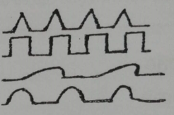
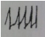
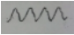
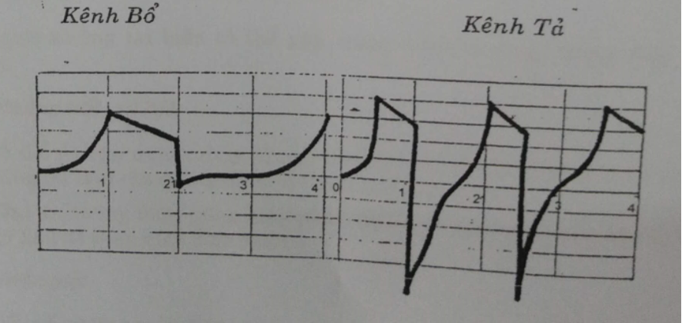

# 7 ĐIỆN CHÂM

**MỤC TIÊU**

_Sử dụng máy phát xung điện kích thích vào huyệt trong châm cứu chữa bệnh đê đạt hiệu quả cao và an toàn_

## 1. ĐẠI CƯƠNG

1. **Định nghĩa**

Điện châm là dùng dống điện một chiều hoặc dùng dòng xung điện một chiều hòặc xoay chiều tac động vào huyệt. Đâv là một phương pháp châm mới kết hợp tác dụng của dòng điện với tác dụng của châm cứu.

1. **Tác dụng của dòng điện một chiểu đều (Galvanic)**

Dòng điện này thường dùng trong vật lý trị liệu như đưa thuốc vào khớp....

1. _**Tác dụng gây bỏng ở 2 cực điện**_

- Tại cực dương bỏng acid HCl gây sẹo lồi.
- Tại cực âm bỏng kiềm NaOH gây sẹo mềm.

1. _**Tác dụng tăng cuờng dinh duỡng và chuyến hoá**_

- Làm giãn mao mạch. Tại cực âm, mẫn cảm tăng, trương lực cơ tăng.
- Làm tăng cường tuần hoàn máu. Thường dùng để điều trị suy nhược cơ thể, suy nhược thần kinh, rối loạn tuần hoàn tim, não và điều trị tê, bại, Ịiệt cơ tứ chi.

1. _**Tác dụng gỉảm đau**_

Ở cực dương cảm giác giảm, trương lực cơ giảm do đó làm mất đau nhanh chóng. Trong chẫm cứu muốn cắt cơn đau cấp dùng cực dương đặt vào điểm đau.

1. _**Tác dụng toàn thân**_

_Ở_ ngưòi đang trong trạng thái hưng phấn tăng thì có tác dụng an thần, cảm giác nhẹ nhõm.

Ở người đang trong trạng thái hưng phấn giảm thì thấy tỉnh táo, khoẻ lên.

**1.3. Tác dụng của dòng điện**

**1.3.1. Dòng xung điện dùng trong điểu trị** thường có tần số dưới 20.000 Hz/s và điện thế cảm ứng \< 300 V.

**1.3.2. Có 4 loại hình thể sóng xung điện**

  - Hình gai nhọn (Faradic)
  - Hình chữ nhật (Leduc).
  - Hình lưỡi cày (Lapique).
  - Hình sin (Diadynamic).

Những máy xung điện hiện nay thường có 2 loại dạng xung:

- Xung nghẹt (gai nhọn). Cấu tạo máy thường rất đơn giản.
- Xung đa hài: là dạng xung kết hợp giữa gai nhọn và xung chữ nhật hoặc lưỡi cày. Dạng xung này có thể dùng vừa tả vừa bổ.

**1.4. Những yếu tố ảnh hưỏng đến điểu trị bằng xung điện**

**1.4.1. Cường độ (biên độ xung)**

Cưòng độ vào kim phải đến một mức độ nhất định người bệnh mới có cảm giác nháy đập. Lên cao hơn sẽ gây co cơ (kim máy động). Nếu đưa lên quá cao sẽ gây đau buốt. Đe điều trị thường giữ cường độ ở mức cảm giác nháy đập và co cơ. Muốn tạo được rung kim, co cơ cường độ thường từ 50-100 micro ampe.

**1.4.2. Tần số xung**

- Với tần số xung thấp \< 50 Hz/giây (tương ứng với 20-30 nháy đập/phút), dòng xung gây hưng phấn thần kinh cảm giác và thần kinh vận động làm trương lực thần kinh tăng. Có tác dụng bổ.
- Với tần số xung nhanh từ 80-100 Hz/giây (tương ứng với từ trên 80 lần nháy đập/phút) hoặc liên tục sẽ có tác dụng ức chế, dùng cắt cơn đau hoặc châm tê.

**1.4.3. Hình dạng xung**

- Gai nhọn tác dụng kích thích mạnh, tác dụng dinh dưỡng kém, thưòng dùng ở tổ chức lành và để cắt cơn đau

- Xung hình chữ nhật vì sườn lên và xuống thẳng đứng nên có tác dụng kích thích và tuỳ bề mặt xung rộng hẹp mà tác dụng dính dưỡng nhiều hoặc ít.
- Xung hình lưỡi cày và hình sin thích hợp vớí _tổ chức đã bị tổ__n_ thương và có tác dụng dinh dưỡng tốt.

1. _**Cực điện**_

Dòng xung điện cũng có tác dụng giống dòng điện một chiều đều.

- Cực dương có tác dụng ức chế dẫn truyển xung động thần kinh, làm co giãn cơ, làm dịu thần kinh đang căng và giảm đau.
- Cực âm có tác dụng kích thích các chức năng bí suy yếu, tăng cường dinh dưỡng chuyển hoá, kích thích thần kính cảm giác, tăng mẫn cảm, tăng trơng lực cơ và thần kinh.

_**Chú ý:**_ Đốì với các máy tạo xung điện xoay chiểu, tác dụng bổ tả chỉ dựa vào cường độ, tần số và thời gian kích thích.

1. _**Thời gian kích thích**_

Thời gian kích thích kéo dài dù tần sô thấp tác dụng kích thích cũng giảm dần và dẫn đến tình trạng ức chế (tác dụng tả). Để chống "Trơ quen" ta phải kích thích từng đợt hoặc tăng cường độ kích thích.

## 2. KỸ THUẬT ĐIỆN CHÂM

Chọn huyệt, phối huyệt và chuẩn bị dụng cụ châm tiến hành như châm bình thường

1. _**Đại cương máy điện châm**_

Máy điện châm nói chung gồm những phần sau đây:

1. _**Nguổn diện năng**_

Thường dùng pin khô tuỳ máy điện thế từ 3-4V, 5V, 6V, 9V... Có máy dùng nguồn điện xoay chiều trực tiếp cắm vào điện lưới rồi qua bộ phân chỉnhdòng ở trong máy. Đối với những máy này cần thận trọng vì nếu máy bị "mát" sẽ gây tai nạn điện giật.

1. _**Núm điều chỉnh tẩn số xung (th** __**ường kết hợp với công tắc tắt bậ**__ **t)**_

Xung được báo hiệu băng đèn chỉ thị hoặc tiếng động qua một loa nhỏ. Mỗi máy có thể có từ 2-5 núm cường độ.

1. _**Các núm điể** __**u chỉnh cường độ vào tùng cặp ki**__ **m**_

Muốn tăng cường độ thường vặn theo chiều kim đổng hồ ổ cắm từng dây ra kim và chiết áp của núm cường độ cần được kiểm tra thường xuyên. Nếu phích cắm không chặt và chiết áp núm cường độ tiếp xúc không tốt dễ gây cường độ cao đột ngột làm co giật, bệnh nhân hoảng hốt.

1. _**Đối với một số máy có thêm núm chế độ**_ phát xung liên tục hoặc ngắt quãng hoặc thêm núm sử dụng các dạng xung.

1. _**Chuẩn bị phát xung điện**_

Ngoài việc kiểm tra máy thường xuyên, trước khi phát xung điện vào kim cần:

1. _**Kiểm tra nguồn điện, đưa các núm cường độ về**_ _**0.**_
2. _**Vặn núm tẩn số tới mức yêu cẩu.**_
3. _**Dặn dò và giải thích để bệnh nhân yên tâm**_, sẽ thấy cảm giác kiến bò, rung đập, mổ, nếu nhói buốt là bất thường.
4. _**Châm kim như**_ _**điều trị châm thường** __,_ sau đó nốỉ xung điện vào kim. Nếu có kẹp chuyên dùng thì đơn giản, kẹp vào đốc kim. Nếu không thì tuốt trần đầu dây khoảng l-2cm rồi quấn chặt vào đốc kim.
5. _**Mở từ từ núm cường độ**__,_ hỏi cảm giác bệnh nhân nếu đạt đến mức kích thích trị liệu thì ngừng lại.

1. _**Đề phòng và xử trí tai biến điện châm**_

Ngoài những tai biến có thể gặp trong châm thường, trong điện châm còn gặp:

    1. _**Hoảng hốt, sợ hãi**_

Có thể do vặn núm cường độ quá nhanh hoặc phích cắm và chiết áp tiếp xúc không tốt làm cho cường độ kích thích quá mức ngay.

_**Chú ý:**_ Không được dùng máy phát điện một chiều đều (Galvanic) dùng trong lý liệu để thay máy điện châm.

_**Điện giật**_

Đốỉ với những máy điện châm dùng nguồn 220v của điện lưới thành phố, nếu máỵ bị chạm vỏ có thể gây tai nạn đỉện giật nguy hiểm. Tiến hành cấp cứu như điện giật tuỳ mức độ nặng nhẹ. Nên dùng máy chạy điện pin vừa cơ động vừa an toàn.

_**Choáng điện**_

Khi dùng cực âm và cực dương của cùng một cặp dây cho đối diện qua tim, não, dòng điện qua tim, não có thể gây choáng điện, ngừng tim, rối loạn nhịp tim, động kinh, nhức đầu....

2.4. **Kết thúc buổi điểu trị bằng điện châm**

1. _**Vặn tắt nguồn diện vào**_

Vặn các núm điều chỉnh cường độ, tần số về vị trí 0.

1. _**Rút kĩm và gỡ dây dẫn điện**_ ra
2. _**Để bệnh nhân nghỉ 2-5 phút rồi mới ra về**_

Mỗi liệu trình nên từ 10-15 lần châm, nghỉ 5-7 ngày rồi lại tiếp liệu trình khác.

## PHỤ LỤC

## MÁY ĐIỆN CHÂM M6

Bệnh viện Châm cứu Trung ương sản xuất, máy điện châm hai tần số xung để ứng dụng kỹ thuật vừa bổ vừa tả.

**Đặc tính kỹ thuật (Output)**

| **KÊNH BỔ**| **KÊNH TẢ**|
| --- | --- |
|- Xung ra: 1 chiểu | - Xung ra: Xoay chiều |
| - Biên độ đỉnh xung |- Biên độ đỉnh xung |
|Umax = 80V, Imax = 0,95 µA |Umax = 200V, lmax= 1,5 µA |
|- Tần số xung 1 chiểu lớn nhất | - Tần số xung xoay chiểu lớn nhất
| fBmax = 30Hz |fTmax = 60 Hz |
 

Tiêu chuẩn an toàn của Tổ chức Y tế Thế giới (WHO) Công suất kích thích trung bình là: ~

PS = 1,5W

I \< 30 µA

U \< 50V

Dạng sóng

## TỰ LƯỢNG GIÁ ĐIỆN CHÂM

| **TT**| **NỘỈ DUNG CÂU HỎI**| **Đúng**| **Sai**|
| --- | --- | --- | --- |
|1.| Điện châm là một ứng dụng kỹ thuật hiện đại vào châm cứu | | |
|2.| Điện châm là sử dụng dòng điện một chiều hoặc xung điện tác động vào huyệt châm | | |
|3.| Tác dụng của điện châm là do tác dụng đơn thuẩn của dòng điện | | |
|4.| Hai cực của dòng sinh điện một chiều có tác dụng như nhau | | |
|5.| Cường độ dòng điện dùng trong châm cứu thường rất nhỏ, dưới 100 µA | | |
|6.| Mỗi cặp dây dẫn ra kim châm đều phải qua một nút điều chỉnh cường độ | | |
|7.| Khi đưa điện vào kim phải từ từ từng nấc, từ thấp đến cao | | |
|8.| Nút điểu chỉnh tần số xung điện phải riêng rẽ cho từng cặp kim | | |
|9.| Sóng xung điện hình gai nhọn thường dùng để tả | | |
|10.| Kích thích những nhóm cơ bị liệt nên dùng sóng hình sin | | |
|11.| Máy điện châm tốt nhất thường có 2 dạng sóng trở lên | | |
|12.| Cắt cơn đau dùng dạng xung đa hài là tốt nhất | | |
|13.| Cắt cơn đau chỉ nên dùng tấn số xung \< 50 Hz/gy, tương ứng với 20-30 nháy đập/phút. | | |
|14.| Để duy trì tác dụng của điện châm sạu một vài phút ta phải nâng dẩn cường độ dòng điện xung | | |
|15.| Nên đặt cực âm vào những huyệt A thị | | |
|16.| Chữa nhức đầu, đặt 2 cực của một cặp dây vào 2 huyệt Thái dương | | |
|17.| Nguồn điện dùng cho máy điện châm tốt nhất là dùng điện luới công cộng | | |
|18.| Châm tê để mổ tốt nhất là dùng máy điện châm | | |
|19.| Chữa chứng đau thường phải cho dòng điện xung điện chạy qua ổ đau | | |
|20.| Điện châm là hình thức tác động huyệt an toàn nhất | | |

_**ĐÁP ÁN**_

| l.Đ | 2.Đ | 3.S | 4.S | 5.Đ | 6.Đ | 7.Đ |
| --- | --- | --- | --- | --- | --- | --- |
| 8.S | 9.Đ, | 10.Đ | ll.Đ | 12.S | 13.S | 14.Đ |
| 15.S | 16.S | 17.S | 18.Đ | 19.Đ | 20.S |

