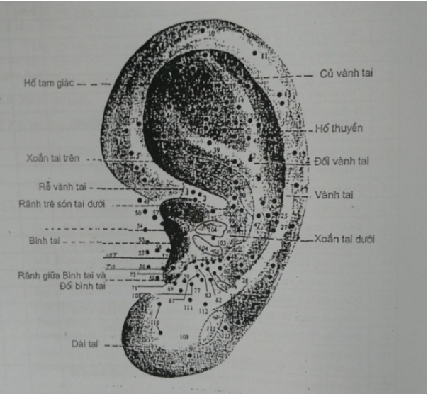
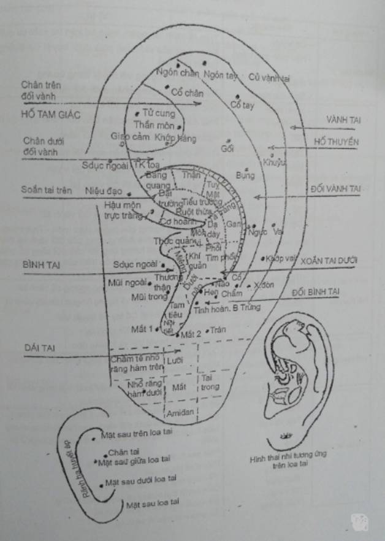

# 9 NHĨ CHÂM

## HUYỆT, VỊ TRÊN LOA TAI

## ĐỊNH HUYỆT TRÊN LOA TAI

| Vùng tai     | Tên huyệt                 | Vị trí |
|---|---|---|
| Vành taì     | - Cơ hoành               | Trên rễ vành tai, ngăn, xoắn tai trên và xoắn tai dưới                                                                 |
|              | - Hậu môn trực tràng      | Dưới đoạn dưới của vành tai, phía dưới huyệt Đại trường (xoắn tai trên)                                                |
|              | - Niệu đạo                | Trên vành tai ngang với huyệt Bàng quang                                                                               |
|              | - Sinh dục ngoài          | Trên vành tai ngang chân dưới đối vành tai                                                                             |
| Đối vành tai | - Ngón chân               | Góc ngoài rễ chân trên đối vành tai                                                                                    |
|              | - Cổ chân                 | Phía dới góc trong của chân trên đối vành tai                                                                          |
|              | - Gối                     | Ngang bờ trên của chân dưới đối vành                                                                                   |
|              | - Thần kinh toạ           | Ở nửa phía trong của chân dưới đối vành                                                                                |
|              | - Mông                    | Ở nửa phía ngoài của chân dưới đốí vành                                                                                |
|              | - Bụng                    | Ngang bờ dưới chân dưới đối vành tai                                                                                   |
|              | - Ngực                    | Ngang rãnh trên bình tai                                                                                               |
|              | - Cổ                      | Chỗ nối tiếp của đối bình tai và đối vành tai                                                                          |
|              | - Cột sống                | Kẻ hai đường ngang qua huyệt Hậu môn - Trực tràng và huyệt Khớp vai, chia đường cong của đối vành tai thành 3 phần    |
| Hố thuyền    | - Ngón tay, cổ tay        | Ngón tay ở sát vành tai. cổ tay: ngang củ vành tai, ngang rãnh trên bình tai và ngang h.ngực trên đối vành tai        |
|              | - Vai                     | Khoảng giữa huyệt cổ tay và huyệt Vai                                                                                  |
|              | - Khuỷu                   | Ngang với huyệt cổ ở đối vành tai                                                                                      |
|              | - xương đòn               | Khoảng giữa huyệt Vai và Xương đòn                                                                                    |
|              | - Khớp vai                |                                                                                                                        |
| Hố tam giác  | - Thần môn                | Dưới đỉnh hố tam giác (Góc tạo bởi 2 chân của đổi vành)                                                               |
|              | - Tử cung                 | Vùng giữa của hố tam giác                                                                                              |
|              | - Giao cảm                | Chỗ nối bờ trên chân đối vành dưới với mặt trong vành tai                                                              |
|              | - Khớp hông               | 1/3 ngoài bờ dưới của hố tam giác                                                                                      |
| Xoắn tai trên| - Bàng quang              | Bờ dưới của chân dưới đối vành, trên huyệt Đại trường                                                                  |
|              | - Thận                    | Bờ dưới của chân dưới đối vành, sau huyệt Bàng quang                                                                   |
|              | - Tụy, túi mật            | Giữa huyệt Gan và huyệt thận (Tụy ở tai trái, Túi mật ở tai phải)                                                      |
|              | - Gan                     | Phía sau huyệt Dạ dày và Tá tràng                                                                                      |
|              | - Lách                    | Phía dưới huyệt gan                                                                                                    |
|              | - Đại trường              | 1/3 trong mặt trên của rễ vành tai                                                                                     |
|              | - Ruột thừa              | Giữa huyệt Đại trường và huyệt Tiểu trường                                                                             |
|              | - Tá tràng                | 1/3 ngoài mặt trên của rễ vành tai                                                                                     |
|              | - Tiểu trường             | 1/3 giữa mặt trên rễ vành tai                                                                                          |
| Soắn tai dưới| - Thực quản               | 2/3 trong mặt dưới rễ vành tai                                                                                         |
|              | - Tâm vị                  | 1/3 ngoài mặt dưới rễ Vành tai                                                                                         |
|              | - Dạ dày                  | Xung quanh chỗ tận cùng rễ vành tai                                                                                    |
|              | - Miệng                   | Thành sau lỗ tai ngoài                                                                                                 |
|              | - Tim                     | Lõm chính giữa soắn tai dưới                                                                                           |
|              | - Phổi                    | Bao quanh huyệt Tâm                                                                                                    |
|              | - Khí quản                | Giữa huyệt Miệng và huyệt Tâm                                                                                          |
|              | - Nội tiết                | Đáy phía dưới bình tai                                                                                                 |
|              | - Tam tiêu                | Trong tam giác tạo bởi huyệt Tâm, huyệt Miệng và huyệt Nội tiết                                                        |
| Bình tai     | - Mũi ngoài               | Chính giữa mặt ngoài bình tai                                                                                          |
|              | - Họng                    | Mặt trong bình tai đối diện với lỗ tai ngoài                                                                           |
|              | - Mũi trong               | Mặt trong bình tai đối diện với huyệt Họng                                                                             |
|              | - Tuyến thượng thận       | Mặt ngoài, bờ dưới bình tai                                                                                            |
| Đối bình tai | - Thân não                | Nơi tiếp nối đối bình tai và đối vành tai                                                                              |
|              | - Điểm não                | Mặt ngoài đối bình tai giữa huyệt Định suyễn và Thân não                                                               |
|              | - Định suyễn              | Đỉnh của đối bình tai                                                                                                  |
|              | - Dưới vỏ não             | Mặt trong của đối bình tai                                                                                             |
|              | - Buồng trứng, tinh hoàn  | Mặt trong đối bình tai, dưới vùng dưới vỏ não                                                                          |
|              | - Chẩm                    | Mặt ngoài đối bình tai, phía sau trên                                                                                  |
|              | - Trán                    | Trước và dưới mặt ngoài đối bình tai                                                                                   |
| Dái tai      | - Mắt 1 - Mắt 2           | Hai bên bờ rãnh dưới bình tai                                                                                          |
|              | - Châm tê, nhổ răng       | Điểm góc ngoài, dưới vùng 1 dái tai để nhổ răng hàm trên                                                               |
|              | - Mắt                     | Điểm giữa vùng 4 dái tai để nhổ răng hàm dưới                                                                           |
|              | - Tai trong               | Giữa vùng 5 của dái tai                                                                                                |
|              | - Amiđan                  | Giữa vùng 6 của dái tai                                                                                                |
|              |                           | Giữa vùng 8 của dái tai                                                                                                |
| Mặt sau tai  | - Rãnh hạ huyết áp        | Rãnh chạy từ trên xuống phía dưới mặt sau tai                                                                           |
|              | - Mặt sau trên loa tai    | Đỉnh lồi sụn phía sau tai                                                                                              |
|              | - Mặt sau giữa loa tai    | Đĩnh lồi sụn giữa sau tai                                                                                              |
|              | - Mặt sau dưới loa tai    | Đĩnh lồi sụn dưới sau tai                                                                                              |

## CÁCH CHỌN HUYỆT VÀ PHỐI HUYỆT Ở LOA TAI

_**Cách 1**_ : Bệnh ở bộ phận X có điểm phản ứng bệnh lý đúng vào huyệt tương ứng trên loa tai: Châm huyệt tương ứng đó. Cách này hay dùng chữa chứng đau.

_**Cách 2**_ : Bệnh ỏ bộ phận X nhưng không có điểm phản ứng bệnh trên loa tai tương ứng: Châm huyệt tương ứng. Thí dụ đau mắt đỏ: Châm huyệt Mắt. Đau thần kinh toạ: Châm huyệt Thần kinh toạ v.v...

_**Cách 3**_ : Bệnh ồ bộ phận X không có hoặc có nhiều điểm phản ứng bệnh ở nhiều vùng vận dụng lý luận để chọn huyệt. Thí dụ: Đái dầm, châm huyệt Bàng quang và Thận, cơn đau dạ dày châm huyệt Gan và Dạ dày...

**MỘT SỐ CÔNG THỨC**

| **Bệnh chứng**| **Huyệt chính**| **Huyệt phụ**|
| --- | --- | --- |
| Thấp Tim | Tim, Nôi tiết, Giao cảm, Thần môn | Dưới vỏ não. Tiểu trường |
| Loạn nhịp tỉm | Tim, giao cảm, Thần môn | Dưới vỏ não |
| Tăng huyết áp | Điểm hạ áp: Giao cảm, Thẩn môn, Tim | ' Rãnh hạ áp (Xuất huyết) |
| Vẹo cổ | Khởp vai, Vaỉ, Thần môn |
| Hạ huyết áp | Giao cảm, Tim, Tuyến thượng thận |
| Víêm quanh khóp vai | Khởp vai, Vai, Thần môn | Xương đòn: Tuyến thượng thận |
| Liệt mặt | Má, Chẩm, Mắt 1, Mắt 2 | Hàm trên. Hàm dưới |
| Di chứng viêm não | Thân não, Chẩm, Thần môn, Tim | Dạ dày. Dưới vỏ não |
| Nhức nửa đầu | Chẩm, Trán, Thần môn. Dưới vỏ não |
| Suy nhược thẩn kinh | Tim, Thận, Thần môn. Chẩm, Dạ dày |
