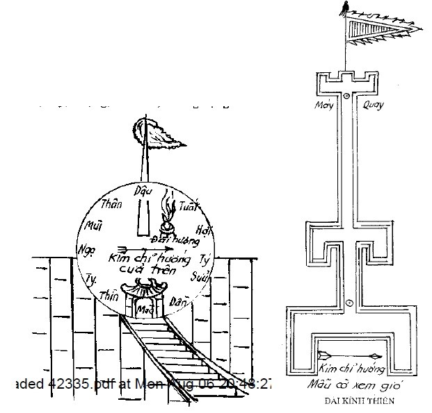
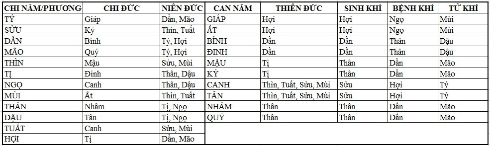
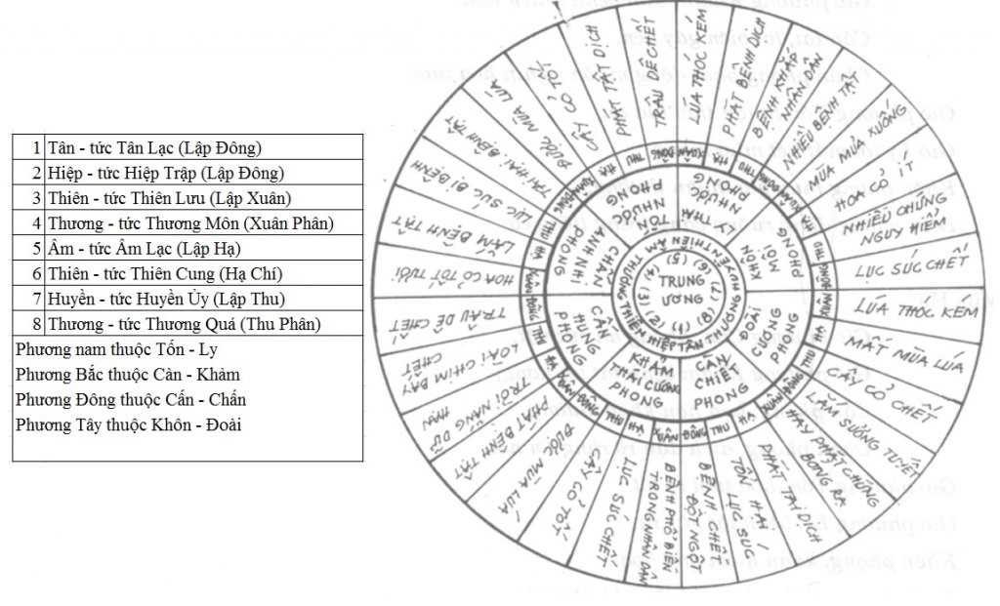
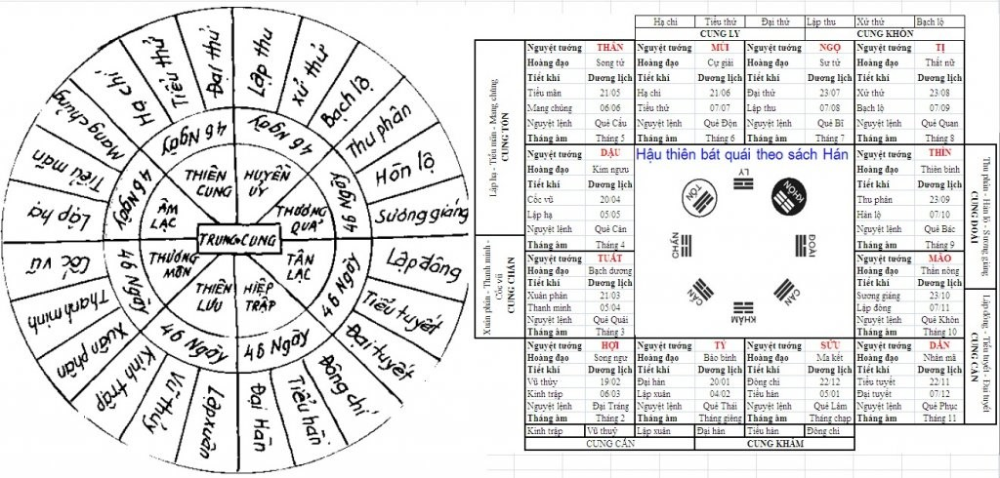

# Phần thứ nhất: XEM MÂY, GIÓ, KHÍ, SẮC

## 1. PHƯƠNG PHÁP XEM GIÓ, MÂY, KHÍ, SẮC

Bậc thánh nhân thời xưa xem "ngũ sắc" của mây, thấy vàng - trắng - đen - đỏ qua năm phương mà lâm vào vị nào trong 10 can, mới lập ra "ngũ vận". Lại xét ngũ khí kể trên đi qua 28 sao, dưới ứng với 28 phương vị mà lập ra "lục khí". Cho nên cổ nhân trông khí mây, nếu có điềm lành/điềm dữ về phương nào là biết ngay, khí của núi bốc lên thường có gió theo, mà mây là khí thăng giáng của âm dương.

Ta hãy xem lúc oi bức, âm khí bốc lên, dương khí giáng xuống mà thành mây thành gió, khi có mưa mới thôi. Cho nên mưa rồi ở nơi núi trầm, mây khói bốc lên chả phải là âm khí phát tiết hay sao?  
Lại xem loài chim bay đè khí mà đi lên, lá rụng đảo đi đảo lại rồi mới rơi xuống, cũng bởi khí vướng lại. Cho nên xem mây phải xem đến gió, xem gió không thể bỏ qua được khí của mây; mỗi khi xem khí của mây lại xem gió ứng về phương nào:
- Phương tốt: là những phương có Thiên đức, Nguyệt đức, Chi đức, Can đức, Sinh khí.
- Phương xấu: các hung thần tướng, tử khí, tam hình, lục hại.
  
Xét tam hợp, lục hợp, sinh khắc, suy vượng, Thái tuế, không vong... để hiểu hết được triệu chứng tốt hay xấu.

### Phép xem gió/mây

Lập Kính Thiên đài: đắp một cái đài ở chỗ tịch mịch, cao 12 trượng (theo về 12 chi), chung quanh rộng 4 thước (theo về 24 khí), quay lưng về hướng Tý, mặt quay về hướng Ngọ. Ở giữa cắm một cụm cờ để xem gió:
- Cán cờ xem mùa Xuân mùa Hạ cao 15 thước (vì mùa Xuân và mùa Hạ thì khí của gió trở đi trở lại)
- Cán cờ xem mùa Thu cao 20 thước (vì khí gió mùa Thu đi trên cao)
- Cán cờ xem mùa Đông cao 10 thước (vì khí gió mùa Đông đi thấp)
Ở dưới cán cờ đặt một cây kim để định phương hướng. Trên mặt đài, xung quanh cắm biển 12 giờ để chỉ rõ từng khu vực

Hàng năm, nên xem vào lúc giờ Dần ngày mùng 1 tháng Giêng. Người xem phải tắm rửa trai tịnh, sạch sẽ, lên đài thắp hương, kính lễ xong lui ra, đứng ở chính xem giữa, xem khí mây khắp cả 5 phương, hoặc thấy mây ở phương nào đó, hoặc là thấy hai lần ở cùng một phương nào, đầu hướng về phương nào, đuôi chỉ về phương nào (to mà đậm đặc là đầu, nhỏ mà loãng nhạt là đuôi), khí sắc thế nào, nhạt hay đậm? Rồi lại xem gió thổi trái chiều lá cờ từ phương nào thì biết gió từ phương ấy tới. Như trên đã nói, phải xem gió từ phương tốt hay phương xấu tới, có gặp hình khắc xung phá gì không, sinh vượng hay hưu tù... để xét tốt xấu; trong tốt có thể ẩn xấu, trong xấu có thể ẩn tốt, hoặc tốt mà gặp sinh vượng thì càng thêm tốt, xấu mà gặp hưu tù, khắc, hình hại xung phá thì càng thêm xấu. Phải xem ứng xa hay ứng gần, ngày nào giờ nào, xem xét xong, lạy tạ mà lui ra.

## 1.1 PHƯƠNG PHÁP PHÁN ĐOÁN KHÍ MÂY GIÓ ĐẦU NĂM

Phương pháp đoán, hễ thấy:
- Khí xanh là phong
- Khí đỏ là nhiệt
- Khí vàng là thấp
- Khí đen là hàn
- Khí trắng là táo

Lại nói, nếu khí hiện kiêm nhiều màu thì phải xem màu nào chiếm nhiều, màu nào kiêm ít mà làm chủ đạo, đây là nói sơ lược. Điều cốt yếu là người coi phải xem khí mây gì, sắc gì, hiện phương nào để xem biết sinh khắc chế hóa, ví dụ: thấy sắc vàng tức hành thổ hiện ra ở phương Tý, tức là khí thổ khắc khí phương vị thì phương Tý ấy gặp nhiều dịch bệnh. Lại xem phương ấy có gì sinh khắc chế hóa hay không, ví như có Can đức, Chi đức, Sinh khí lâm vào, được vượng tướng khí thì trong xấu có tốt, bệnh dịch sinh ra sẽ phải lui. Còn ngược lại bị hưu tù, gặp Tử khí, Tử thần tức là đã xấu còn xấu thêm tất bệnh dịch nghiêm trọng.

Lại xem gió lúc ấy từ phương nào thổi tới, ví như gió từ phương Ngọ thổi tới, tức là Hỏa phong xung khắc phương Tý thì tình hình càng tệ hại; còn nếu gió từ phương Thân thổi tới là Kim phong, tam hợp với phương Tý thì tai dịch đó nhất định sẽ nhẹ đi. Lại tiếp tục xem phương ấy với Thái tuế có xung khắc hình hại gì không, tốt xấu như thế nào mà phán đoán thành bại. Như năm Mão xem phương Tý thủy sinh Mão mộc thì phương Tý ấy có triệu hao tán rồi, tuy Mão mộc có thể khắc Thổ sắc vàng, nhưng Mão Tý tương hình, cái xấu không giải được, tuy có ý đến giải nhưng không thực tâm đến cứu.

- Nếu năm Dậu xem phương Tý thì Dậu sinh Tý, phương này có tai biến sẽ giải được. Sau lại xem phương nào ứng với thời sở nào, xa hay gần: ví dụ xem phương Tý có khí vàng Thổ thì suy ra phương Tý bị hại, thời gian bị hại vào các năm tháng ngày giờ hành thủy, xa thì ứng ngoài nghìn dặm, gần thì ứng trong nghìn dặm, hoặc ứng vào ngày, giờ. Còn như thấy trời trong gió nhẹ, bốn phương tạnh sáng thì đều là tươi tốt, không cần phải truy tìm nghiên cứu, hoặc thảng trên trời phảng phất có sắc hơi đỏ, hơi vàng, như hơi có ráng (hào quang), đó là mây lành triệu tốt, thì năm ấy chẳng những mọi việc yên ổn, mà còn được mùa.

- Nếu xem về ngày, mà suốt ngày mây dầm gió lạnh, âm u ảm đạm đều là triệu xấu, tuy có Nguyệt đức, Thiên đức sinh hợp với Thái tuế cũng đều vô dụng, hoặc sắc mây dầm xanh xanh như màu khí sắt, thì năm đó không những dịch lệ tai thương, mà trong nước phải có triệu binh đao. Phép xem trên đây, hễ thấy hoặc tốt hoặc xấu, hãy nên im lặng suy nghĩ. Nếu trong 3 ngày, ngày nào cũng thấy hiện tượng như vậy thì sự tốt xấu mới ứng nghiệm; nếu trong 3 ngày mà có một trận gió to hay mưa to thì việc xem hôm đầu, xấu cũng không thành xấu, tốt cũng không thành tốt, cho nên gọi là "không vong"

Ví dụ: năm Giáp Tý (nạp âm kim), tháng giêng Bính Dần (hỏa), ngày mùng 1 Ất Mão (thủy), giờ Mậu Dần (thổ) bỗng xem thấy phương Mão (mộc) hiện ra một đám mây đầu hướng về phương Tý (thủy) mà đuôi hướng về phương Ngọ (hỏa), sắc mây màu trắng phá xanh lơ - là sát khí. Lúc bấy giờ lại thấy gió từ phương Dậu tới, nghe tiếng gió giống như kêu gào thảm thương, phải rợn tóc gáy thì đoán rằng: phương Mão tuy có 3 sao tốt là Niên đức, Niên vượng và Tuế sinh (Tý đức ở Mão, Tý thủy, nên phương Mão mộc vượng, thái tuế là Tý thủy sinh phương Mão mộc), song khí mây là hành kim, tháng Bính thì hành kim của khí mây bị bệnh ở Thân, tử ở Dậu (tức khí mây là tử khí), kiêm có triệu tiếng gió kêu gào thảm thương, lại thêm phương Mão hình thái tuế Tý: kết luận năm Giáp Tý đó về phương Mão phải bị mất mùa và bệnh dịch, người chết nhiều vô kể. Nếu về mùa Hạ hỏa vượng mộc suy thì tai họa xảy ra ở nơi xa (gần thì dưới nghìn dặm, xa thì ứng trên nghìn dặm)... Trên đây là ví dụ của phép suy luận, gặp các trường hợp cứ thế mà suy ra. Lại nói đậm đặc là mây mà loãng nhạt là khí, tuy loãng nhạt mà di động thì là mây bay. Tuy đậm đặc mà trong thì là khí (trích trong quyển Kinh Thiên).

## 1.2 PHƯƠNG PHÁP PHÁN ĐOÁN 8 THỨ GIÓ BỐN MÙA

Hễ xem 8 thứ gió thì gọi là "phong giốc", giốc nghĩa là đánh trọi, giốc phong tức là gió trái thời tiết, gió phát đột ngột, kêu gào như sát khí, phải rợn tóc gáy trong cả 4 mùa - loại gió như vậy đều có thể chiêm nghiệm, chỉ lấy 8 phương mà xem, không cần hỏi tới năm, tháng, ngày, giờ. Ngoài ra chỉ chú trọng lúc đó khí trời thế nào, hoặc ban ngày, hoặc ban đêm:
- nếu khí trời sáng sủa, được gió tốt thì càng tốt, nếu gặp gió xấu cũng có thể cứu được.
- nếu khí trời âm u ảm đạm, tuy được gió tốt cũng xấu
  
Lại như trời mưa thì không kể, chỉ tính khi không mưa tự nhiên bỗng có gió tới như trào tuôn, nghe như ngựa hí, cát chạy thì gọi là "quỷ sầu phong". Hễ phương nào mà có gió này thổi tới là sẽ có đao binh dịch lệ, những người gặp phải gió này thì hay xảy ra chứng đột tử. Lại nghiệm xem tiếng gió hoặc du dương như tiếng ca nhạc, hoặc rầm rập như xe ngựa rong ruổi, hoặc bi thảm giống như tiếng kêu thương khóc lóc, gào thét như tiếng tức giận quát mắng, hoặc là tiếng đánh giết nhau, đều nên xem xét sự tốt xấu của nó. Còn như kỳ hạn ứng việc, thì xem sức gió thổi tới dài hay ngắn, chậm hay nhanh mà đoán nhật kỳ xa hay gần. Lại lấy bên bị khắc là báo ứng của kỳ xấu, bên tương sinh là báo ứng của kỳ tốt. Lại như những nơi đi qua, những phương gió tới đều là những phương bị dính tai họa/hay được cát lợi (tùy theo triệu).

Bài phú "Phong giốc" nói "muốn thông tai biến của trời đất, phải đọc thuộc sách phong giốc. Lại nói "người trên có thể đem quân đi đánh giặc, giúp nước yên dân, người dưới có thể biết điềm tốt xấu, tìm phương lánh nạn". Hoặc nói "biết rõ sự trái hướng của bốn mùa, mới định được gió mây trong 8 cõi".

**MÙA XUÂN**

Gió phương Càn, nhân dân bệnh tật  
Gió phương Khảm, cảm bệnh nhiều hơn  
Cấn lai, tai biến gây nên,  
Chấn phong phát động muôn nghìn hoa tươi  
Gió phương Tốn thuận thời lúa tốt  
Gió Ly tới mất hết mùa màng  
Khôn phong mưa gió thuận thường  
Đoài phong đồng ruộng vắng tràng tiếng ca.  

**MÙA HẠ**

Gió phương Càn, không an súc vật  
Gió phương Khảm bệnh tật tai ương,  
Cấn phong, hạn hán khác thường  
Chấn phong, dịch đậu rõ ràng nơi nơi,  
Gió phương Tốn hoa tươi cỏ tốt  
Gió phương Ly, bệnh tật gây ra  
Khôn phong, khan hiếm quả hoa  
Đoài phong, đồng ruộng nhiều nhà thất thu  

**MÙA THU**

Gió phương Càn, cỏ cây chen chúc  
Gió phương Khảm, lục súc thảm thương  
Cấn phong, chim chóc tai ương,  
Chấn phong lục súc khó đường chăn nuôi  
Tốn phong tật dịch nhiều nơi,  
Ly phong phương ấy lại người bất an  
Khôn phong ác dịch nhiều nơi  
Đoài phong cây cỏ héo mòn khó tươi  

**MÙA ĐÔNG**

Càn phong lúa tốt đầy đồng
Khảm phong tật dịch bỗng dưng chết người
Cấn phong trâu dê bị toi,
Chấn phong dịch lệ nơi nơi hoành hành
Tốn phong trâu dê chẳng lành
Ly phong tật dịch phát sinh rõ ràng
Khôn phong lục súc bất thường
Đoài phong tuyết xuống đầy đường đầy sân

## 1.3 PHƯƠNG PHÁP XEM GIÓ ĐỘC
Nội kinh nói "tà khí, gió độc phải lựa chiều mà tránh"

## 1.4 PHƯƠNG PHÁP XEM 8 THỨ GIÓ TRONG 9 CUNG
Thiên "bát phong" trong Kim Quỹ nói: sao Thái Nhất thường bắt đầu
-    Từ ngày Đông chí là ở cung Hiệp trập,
-    Qua 46 ngày đêm lại ở cung Thiên lưu,
-    Qua 46 ngày đêm lại ở cung Thương môn,
-    Qua 46 ngày đêm lại ở cung Âm lạc,
-    Qua 46 ngày đêm lại ở cung Thiên cung,
-    Qua 46 ngày đêm lại ở cung Huyền ủy,
-    Qua 46 ngày đêm lại ở cung Thương quá,
-    Qua 46 ngày đêm lại ở cung Tân lạc, qua 45 ngày nữa lại trở lại cung Hiệp trập - tức ngày Đông chí, cứ như vậy hết vòng này qua vòng khác.
  
Hễ những ngày sao Thái nhất đổi cung thì trời phải có mưa gió ứng, nên những ngày đó có mưa gió thì tốt, vì mùa màng tốt, dân yên, ít bệnh tật. Còn nếu mưa gió ứng vào trước khi sao Thái nhất đổi cung thì năm đó gió nhiều, ứng vào sau ngày đó thì năm đó đại hạn. Những cái gọi là tai biến, tức là ngày mà sao Thái nhất di chuyển qua 5 cung có gió mạnh gãy cây cối, cát đá tung bay nên căn cứ vào sở chủ của từng cung(sở chủ, nghĩa là ý nghĩa của cung đó nói về cái gì) mà phán đoán tốt xấu, lại xem phương gió thổi tới mà chiêm nghiệm. Lại xem phương gió thổi tới là chiêm nghiệm:
- Gió thổi tới từng phương có sao Thái nhất tới: gọi là Thực phong, chủ sinh trưởng muôn vật;
- Gió thổi tới từ phương đối xung (với sao Thái nhất) gọi là Hư phong, nó làm hại người, chủ sát hại;
  
Tôi (Hải Thượng Lãn Ông) căn cứ vào phương pháp xem gió trong 9 cung ở lịch Đại Thống, phối hợp với số Cửu diệu (tử bạch cửu tinh), mà nhà xem số Thái ất lấy ngày lập thành tính toán ra phương pháp Kỳ Môn Độn Giáp từ chỗ bắt đầu qua chỗ nối tiếp, ứng nghiệm của nó rất là quan trọng: như sao Thái nhất tức là nơi chuyển động hàng ngày của mặt trời (trên vòng hoàng đạo), nhà xem số Lục nhâm, chỗ là Nguyệt tướng, từ Đông chí một ngày tính số bắt đầu, rồi di chuyển đi 9 cung - từ cung Hiệp trập tới cung Tân lạc - phân bố thành 24 tiết khí là tròn 1 năm rồi lại bắt đầu Đông chí. Hễ ngày khởi đầu cung, không những (có thể biết được) trong nước có điều hay dở, (dùng cho việc) xuất quân đánh giặc, cực kỳ linh nghiệm. Như sao Thái nhất ở 5 cung, quan trọng là ở các ngày Đông chí, Xuân phân, Thu phân, Hạ chí, những ngày đó các nhà làm lịch gọi là ngày Tứ tuyệt - lúc âm dương giao hội, là nơi khởi phát điềm của các việc tốt xấu.

[source](https://thuochay.net/yttl-van-khi-bi-dien-1.html)