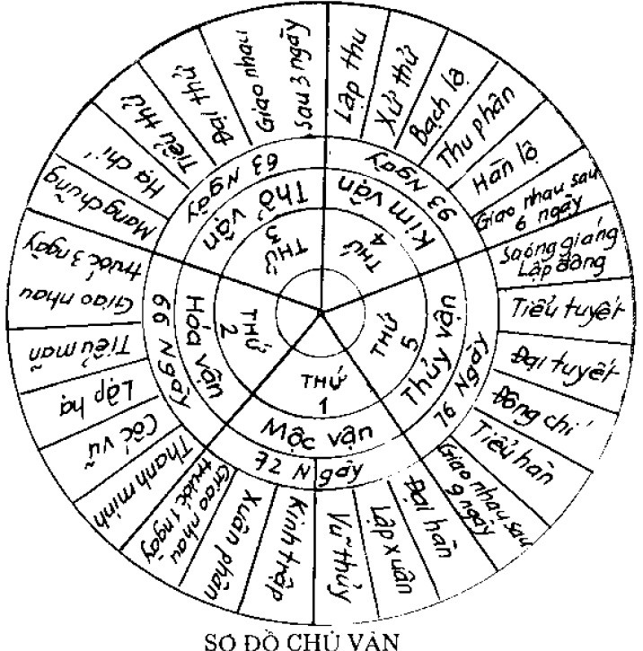
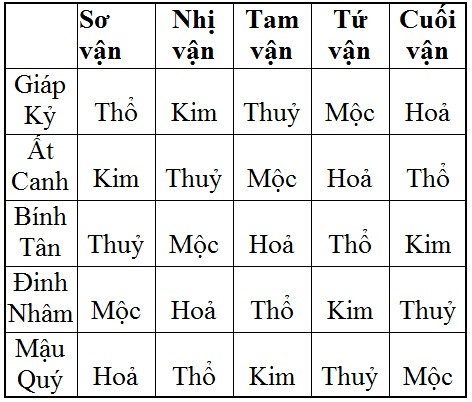
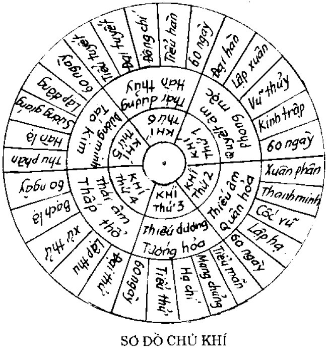
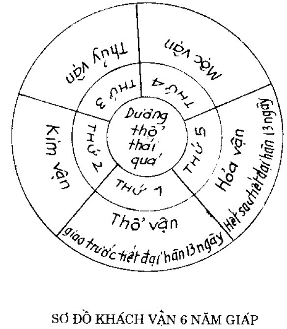
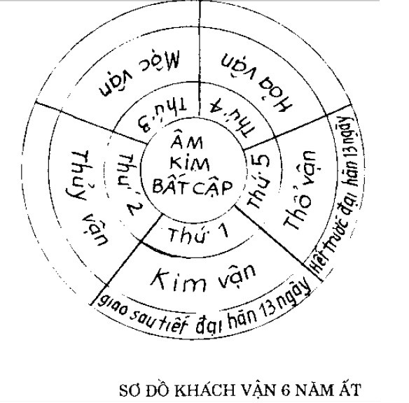
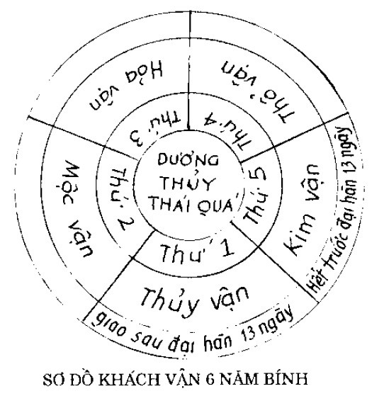
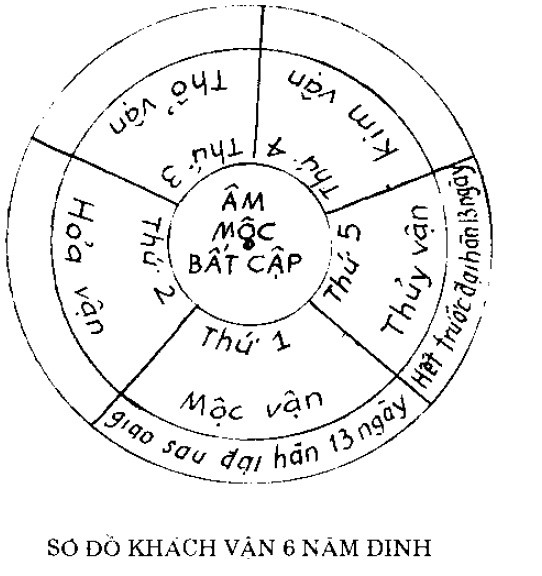
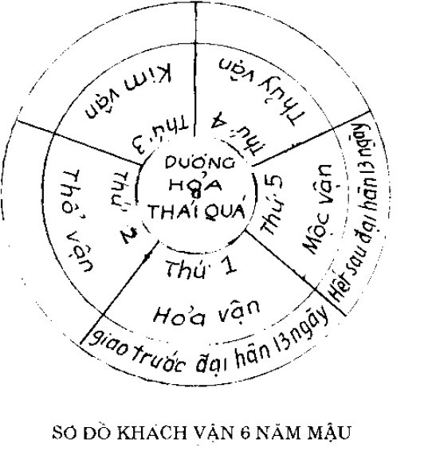

# 1. VẬN KHÍ - THUYẾT CHỦ VẬN

> Bậc thánh nhân thời xưa xem "ngũ sắc" của mây, thấy vàng - trắng - đen - đỏ qua năm phương mà lâm vào vị nào trong 10 can, mới lập ra "ngũ vận". Lại xét ngũ khí kể trên đi qua 28 sao, dưới ứng với 28 phương vị mà lập ra "lục khí". Cho nên cổ nhân trông khí mây, nếu có điềm lành/điềm dữ về phương nào là biết ngay, khí của núi bốc lên thường có gió theo, mà mây là khí thăng giáng của âm dương.

Ngũ vận so với Ngũ hành, thì ngũ vận là bản thể mà ngũ hành là tác dụng:
- Mộc: nghĩa là xúc, dương khí tiếp xúc với đất mà sinh ra, quẻ thuộc loại Khúc trực (cong thẳng: là hình tượng của cây, gỗ);
- Hỏa: nghĩa là biến hóa, đốt cháy mạnh để biến hóa mọi vật, quẻ thuộc loại Viêm thượng (bốc lên, hình tượng của lửa);
- Kim: nghĩa là cấm, ngăn cấm mọi vật thay đổi, quẻ thuộc loại Tòng cách (tòng cách: thay đổi tùy theo lúc);
- Thủy: có tính thấm nhuận nuôi dưỡng vạn vật, quẻ thuộc loại Nhuận hạ (tính của nước);
- Thổ: nghĩa là nhả ra, ngậm mọi vật vào. Cái lẽ sinh ra cũng do đất, mà chết đi cũng về đất (quy thổ), quẻ thuộc loại Giá sắc (là cày cấy).
Vì trời lấy ngũ hành ngự trị ngũ vị để sinh ra khí: hàn, thử, táo, thấp, phong; người có ngũ tạng, hóa sinh ra 5 khí để sinh ra mừng, giận, lo, nghĩ, sợ; do đó ta thấy vạn vật, muôn lý, âm dương trời đất gì cũng không ra khỏi được lý của ngũ hành.

### CHỦ VẬN LÀ GÌ?

Chủ vận có nghĩa là thời gian vận hành cố định của thời tiết trong tự nhiên của một năm, mỗi năm có 5 giai đoạn. Suy đoán chủ vận bắt đầu từ ngày tiết Đại hàn, mỗi vận quý chiếm khoảng 73 ngày lẻ 5 khắc. Theo ngũ hành tương sinh:

- Mộc thuộc sơ vận: bắt đầu từ Đại hàn, tới Lập xuân, Vũ thủy, Kinh trập, Xuân phân, giao nhau 3 ngày trước Thanh minh. Sơ vận: mộc khí chủ phong
- Hoả thuộc nhị vận: giao nhau khoảng Thanh minh, tới Vũ cốc, Lập hạ, Tiểu mãn, giao nhau 3 ngày trước Mang chủng. Nhị vận hoả khí chủ thử nhiệt
- Thổ thuộc tam vận: từ Mang chủng, Hạ chí, Tiểu thử, Đại thử, giao nhau 3 ngày sau Lập thu. Tam vận hoả khí chủ thấp
- Kim thuộc tứ vận: từ Lập thu, Xử thử, Bạch lộ, Thu phân, giao nhau 6 ngày trước Sương giáng. Tứ vận kim khí chủ táo
- Thuỷ thuộc cuối vận: từ Sương giáng, Lập đông, Tiểu tuyết, Đại tuyết, Đông chí, Tiểu hàn, giao nhau sau 9 ngày Đại hàn. cuối vận thuỷ khí chủ hàn

**Thơ rằng:**   
*Ngày Đại hàn bắt đầu giao mộc vận*  
*Hỏa vận sang ba hôm trước Thanh minh*  
*Sau mang chủng 3 hôm là thổ vận,*  
*Lập thu qua sáu tối vận kim tinh*  
*Thủy vận sau Lập đông ngày thứ 9*  
*Muôn ngàn năm cứ thế vần quanh.*  

- Phương pháp này cứ mỗi năm đều lấy tiết Đại hàn làm mộc vận thứ nhất; trước tiết Thanh minh 3 ngày giao hỏa vận thứ hai; sau tiết Mang chủng 3 ngày giao thổ vận thứ 3; sau tiết Lập thu 6 ngày giao kim vận thứ tư; sau tiết Lập đông 9 ngày giao thủy vận thứ năm, năm nào cũng thế - không thay đổi. Mỗi vận làm chủ 73 ngày 5 khắc, nhân với 5 vận là 365,25 ngày mỗi năm.
- Đại khái lấy lý mà suy thì ngũ vận không thay đổi, chỉ lấy vị thứ xếp đặt trên dưới nhau, không bao giờ biến đổi mới thành ra mùa xuân ấm, mùa hạ nóng, mùa thu mát, mùa đông lạnh. Cho nên khí Phong để chuyển Đông, Hỏa để ấm nóng, nắng để nung nấu, thấp để tẩm nhuần, táo để khô ráo, hàn để cứng rắn là sự đồng hóa trong bốn mùa mà thành ra chính khí của trời đất.
- Chỉ có khách khí "gia" lên chủ vận (ví dụ như khách khí hỏa, chủ vận mộc, tức là chủ vận sinh khách khí, chủ vận là mẹ khách khí là con, con ở trên mẹ gọi là gia lên) là lúc thời tiết không bình thường, nhân dân bị bệnh tật nhiều, như thấy khí tự nhiên đến khắc chủ vận thì thuận, khách khí đến khắc chủ vận thì không thuận. Phương pháp chữa tùy theo, nghịch thì ức chế, dùng công phạt khí thiên hòa (thiên lệch), đó là điều cốt yếu.

### LÀM QUEN VỚI ĐỊNH NGHĨA
- **Chủ khí**: là khí chủ thời dùng để chỉ rõ quy luật khí hậu bình thường trong mỗi năm, có ý nghĩa giống như vận chủ tứ thời. Lục khí chủ thời cố định hay biến đổi được gọi là chủ khí.
- **Khách vận**: chỉ sự biến đổi khí hậu khác thường trong 5 vận quý của mỗi năm. Suy đoán khách vận dựa theo năm thiên can đại vận là sơ vạn, khách vận kết hợp với 5 tiết quý và 5 bước suy đoán.
  
- **Đại vận**: là suy đoán biến hoá khí tượng của các năm, 10 năm một vòng theo thiên can (5 năm thái quá, 5 năm bất cập).
- **Chủ vận**: là chủ biến hoá khí hậu bình thường của 5 giai đoạn trong một năm. Khách vận là suy đoán khí hậu khác thường của năm giai đoạn (tiết quý) của mỗi năm.
Chuyển dịch của lục khí: là sáu khí trong vũ bao gồm: phong, nhiệt, hoả, thấp, táo, hàn. Mỗi năm lục khí được chia làm hai loại: chủ khí và khách khí.
Chủ khí là chỉ biến đổi khí hậu bình thường
Khách khí là chỉ khí hậu biến đổi thất thường
Khách chủ gia lãm (khách khí thêm chủ khí) phân tích sâu thêm sự biến hoá phức tạp của khí hậu.
Đoạn trên có nghĩa là năm nào thì cũng đều đặn 4 mùa xuân hạ thu đông chia đều cho 12 tháng thành ra mỗi mùa 3 tháng, nhưng tháng âm lịch có khi vận hành không trùng với tiết khí cho nên phân ra làm 5 giai đoạn vận hành (tức 5 vận) lấy mốc theo tiết khí. Đoạn tiếp theo sẽ trình bày về "khí" thời tiết...  

## 2.1 THUYẾT CHỦ KHÍ

Chủ khí tức là lục khí, do tương ứng với lục phủ của cơ thể con người nên gọi là "lục hóa":, bao gồm:
- Mộc khí, hóa phong, là Quyết âm phong mộc, chủ về mùa xuân. Dương khí cổ vũ mà làm thành hiệu lệnh.
- Hỏa khí, Thiếu âm Quân hỏa hóa nhiệt, chủ về cuối mùa xuân và đầu mùa hạ, thời lệnh ấm áp mà không nắng nực;
- Hỏa khí, Thiếu dương Tướng hỏa chủ về mùa hạ, nắng nực dữ dội
- Thổ khí, Thái âm Thấp thổ, nắng làm cho đất ướt hóa nóng ẩm, thấp hóa lưu hành. Vì ẩm thấp thì thổ mới sinh trưởng được. Còn thổ mà hàn/lạnh thì mọi vật trong đất đều phải chết.
- Kim khí, Dương minh táo kim: hóa thành táo, thời lệnh mát mẻ, vì kim là phần âm của Bính, có kèm hỏa khí cho nên khô táo.
- Thủy khí, Thái dương hàn thủy, thời lệnh rét dữ dội.

Suối ở trong lòng đất/thổ, đó là thấp hóa phong (mộc), cho nên linh khí của ở trời là Phong, ở đất là mộc, ở người là giận dữ. Linh khí của hành hỏa ở trời là nhiệt, ở đất là hỏa, ở người là mừng rỡ; Linh khí của hành thổ ở trời là thấp, ở đất là đất, ở người là suy nghĩ; linh khí của hành kim ở trời là táo, ở đất là kim loại, ở người là lo lắng; linh khí của hành thủy ở trời là khí hàn, ở đất là nước, ở người là sợ sệt. Các khí đều có chỗ xuất phát của nó, đúng vào vị trí thì gọi là chính khí, không đúng vào vị trí của nó thì là tà khí, chính khí suy thì tà khí vượng.
### PHƯƠNG PHÁP LẬP CHỦ KHÍ
**Thơ rằng:**  
*Đại hàn, mộc khí đầu tiên,*  
*Xuân phân, Quân hỏa tiếp liền thứ hai*  
*Ba Tiểu mãn Tướng hỏa ngay,*  
*Thái âm Đại thử khí này thứ tư*  
*Năm, Thu phân dương minh chờ*  
*Thứ sáu Tiểu tuyết khí là Thái dương*  

Phương pháp này hàng năm đều lấy từ ngày Đại hàn đến ngày Kinh trập làm mộc khí thứ nhất; từ ngày Xuân phân khởi hỏa khí thứ hai; từ ngày Tiểu mãn khởi hỏa khí thứ ba; từ ngày Đại thử khởi thổ khí thứ tư; từ ngày Thu phân khởi kim khí thứ năm; từ ngày Tiểu tuyết khởi thủy khí thứ sáu. Cứ thế hết vòng này qua vòng khác, không bao giờ thay đổi.

## 2.2 PHƯƠNG PHÁP ĐOÁN CHỦ KHÍ

Đại khái chủ khí chỉ tuân theo khách khí ở trên mà thôi, khách thắng (khắc) chủ thì thuận, chủ thắng khách thì nghịch, hai khí ấy chỉ có thắng mà không có phục (con phục thù cho mẹ). Chủ thắng thì tả chủ bổ khách, khách thắng thì tả khách bổ chủ. Lại nói: chủ khí mà "lâm" vào dưới khách khí, thiên thời vì thế không điều hòa, tật bệnh trong nhân dân do đó mà sinh ra.

Ví dụ: năm Thìn, năm Tuất (Thìn/Tuất quy định là Thái dương hàn thủy):
- Khách khí của vận 1 là Thiếu dương tướng hỏa, "gia" lên chủ khí là Quyết âm phong mộc
- Khách khí thứ hai là Dương minh Táo kim, "gia" lên chủ khí Thiếu âm quân hỏa;
- Khách khí thứ ba là Thái dương hàn thủy, "gia" lên chủ khí Thiếu dương tướng hỏa;
- Khách khí thứ tư là Quyết âm phong mộc, gia lên chủ khí Thái âm thấp thổ...
Lấy hai nằm Thìn Tuất này làm ví dụ, các năm khác cứ theo đó mà suy ra.  

Hễ gọi là "lâm", tức là con lại ở trên, mẹ lại ở dưới: như mộc chủ khí sinh ra hỏa khách khí chẳng hạn - đó là nghịch. Nếu mẹ ở trên, mà con ở dưới - đó là thuận. Chú thích rằng:

Chủ thắng thì nghịch, nghịch thì dùng phương pháp chính trị (có nghĩa là bản chất của bệnh bên trong phù hợp với triệu chứng bên ngoài, ví dụ thấy chứng hàn thì lấy thuốc nhiệt để trị, thấy chứng nhiệt thì lấy thuốc hàn để trị - như thế gọi là chính trị).

Khách thắng thì thuận, thuận thì dùng phương pháp phản trị (nghĩa là triệu chứng bệnh không phù hợp hợp với bản chất của bệnh, ví dụ như chứng chân nhiệt giả hàn... mặc dầu thầy thuốc thấy triệu chứng hàn nhưng vẫn cho thuốc hàn để trị - như thế gọi là phản trị).

Như nói: chỉ có thắng mà không có phục - nghĩa là thịnh quá thì sẽ hại chỗ nó thắng, chỗ thắng nó không ức chế lại (theo lý ngũ hành thì chỗ bị khắc sẽ sinh ra một hành để ức chế lại, ví dụ như hỏa cương thịnh quá sẽ khắc hại kim, kim phải sinh thủy để ức chế hỏa - như thế gọi là phục thù... nhưng trong việc trị bệnh không nói như thế, nếu có một hành thái quá khắc chế, hành bị khắc sẽ tổn hại chứ không có chuyện sinh ra hành khác khắc chế lại).

Đoạn này diễn giải giữa Chủ khí: tức là khí hậu tự nhiên bản chất phải có tại một thời điểm nhất định. Lấy ví dụ như vào vận 1 của mỗi năm thì Chủ khí là Quyết âm Phong mộc (tức khí của mùa Xuân), nếu năm đó là năm Thìn/Tuất thì khách khí tới thăm chính là Thiếu dương tướng hỏa - tức Chủ khí sinh Khách khí.

## 2.3 THUYẾT KHÁCH VẬN

Âm dương ngũ hành chu lưu thành 10 can, ngũ hành vận hành quanh khắp trong trời đất thành ra nguồn gốc của vạn vật, cho nên hàng năm xoay vần biến đổi theo thứ tự mà làm khách vận. Tính vận thì theo 10 thiên can, phối hợp lại chia thành 5 vận. Theo tính chất anh em, âm dương, phương vị của 10 can thì:
- Giáp dương là anh, Ất âm là em, vị trí ở phương Đông thuộc quẻ Chấn, Tốn - hành mộc;
- Bính dương là anh, Đinh âm là em, vị trí ở phía phương Nam, thuộc quẻ Ly - hành hỏa;
- Mậu dương là anh, Kỷ âm là em, vị trí thuộc trung ương, thuộc quẻ Cấn, Khôn - hành thổ;
- Canh dương là anh, Tân âm là em, vị trí ở phía Tây, thuộc quẻ Càn, Đoài - hành kim;
- Nhâm dương là anh, Quý âm là em, vị trí ở phía Bắc, thuộc quẻ Khảm - hành Thủy.
Cho nên nói: Giáp là đầu mùa xuân, cây cỏ bắt đầu từ trong vỏ phát triển ra; Ất là dương khí còn ẩn khuất; Bính là vạn vật xuất hiện ra rõ rệt; Đinh là gặp lúc đương hành động mạnh mà được lớn mạnh lên; Mậu là dương thổ, vạn vật sinh trưởng cũng từ đó mà ra - mà tiêu diệt cũng từ chỗ đó; Kỷ là âm thổ không làm gì được riêng một mình; Canh là dương biến đổi mà bao gồm; Tân là âm cực ở chỗ đó mà thay đổi mới; Nhâm là dương khí mới sinh - cũng "nhâm" là đã có thai - cùng với chữ "tử" là con có chung một ý nghĩa; Quý là vạn vật bế tàng, trong thai nghén, chứ mầm mống một cách kín đáo, đó là sự tinh vi của trời đất.

###PHƯƠNG PHÁP LẬP KHÁCH VẬN (theo thiên âm dương trong sách "Tam tài bí chỉ")
Phương pháp này mô tả sự hình thành khách vận theo nguyên tắc "vợ chồng lấy nhau, rồi sinh con đẻ cháu" - theo lịch pháp lấy vượng số sinh thành, còn lẻ ra thì lấy số trưởng nam để làm nguyệt kiến cho tháng giêng. Theo nghĩa "vợ chồng phối hợp", "con cháu sinh thành" thì:

- Giáp là chồng, Kỷ là vợ; vượng ở Dần mới sinh con là Bính, Bính sinh cháu là Mậu - vận hành thổ.
- Canh là chồng, Ất là vợ; vượng ở Kỷ (hay Tị?) mới sinh con là Mậu, Mậu sinh cháu là Canh - vận hành kim.
- Bính là chồng, Tân là vợ; vượng ở Sửu mới sinh con là Canh, Canh sinh cháu là Nhâm - vận hành thủy.
- Đinh là chồng, Nhâm là vợ; vượng ở Hợi mới sinh con là Nhâm, Nhâm sinh cháu là Giáp - vận mộc.
- Mậu là chồng, Quý là vợ, vượng Mùi mới sinh con là Giáp, Giáp sinh cháu là Bính - vận hỏa.

(chú thích: bảng này VN cũng không hiểu "vượng" là thế nào, có lẽ người dịch sách bị nhầm)

## 2.4 PHÉP ĐOÁN KHÁCH VẬN
Phương pháp này lấy:
những năm Giáp Bính Mậu Canh Nhâm dương can - là những năm thái quá - gọi là thiên thiên, thì tuế vận giao trước tiết Đại hàn là 13 ngày.
những năm Ất Đinh Kỷ Tân Quý âm can - là những năm bất cập - gọi là hậu thiên, thì tuế vận giao sau tiết Đại hàn 13 ngày. Căn cứ vào sơ đồ và dự đoán sau:

### 6 NĂM GIÁP

Thổ vận thái quá thì mưa thấp lan tràn, bệnh thấp phát sinh, thận thủy bì tà. Điều trị nên trừ thấp bổ thận. Lại nói: người ta cảm phải bệnh tà trước tiên tổn thận, sau thương tổn Tỳ, mạch thận suy, gây thành bệnh thổ thắng khắc thủy. Người bệnh hay đau bụng, âm quyết (chứng chân tay lạnh), mình nặng nề, buồn phiền vật vã, bí kết, da vàng, chân liệt, tay không cất nhắc lên được:

- Giáp Tý: hỏa kim hợp thổ
- Giáp Dần: đầu, giữa thịnh; cuối hư
- Giáp Thân: đầu, giữa thịnh; cuối hư
- Giáp Thìn: đầu rất thịnh
- Giáp Tuất: cuối rất thịnh

Thổ thắng thì khắc thủy, khinh nhờn thủy, sắc vàng kiêm sắc trắng; vàng là sắc thổ thắng, trắng là sắc mẹ của thủy. Khí của con và mẹ cần phải tương ứng, cho nên thấy cả hai sắc cùng hiện ra. Thấp khí lưu hành mạnh, cho nên nước suối chảy mạnh, sông tràn đầy, tưới nhuần loài cá sinh nở; thấp nhiều phong lấn vào; mưa to gió lớn đến đất bị lở vỡ, loài cá ngược lên trên đất cạn.

### 6 NĂM ẤT

kim vận bất cập thì hỏa khí thừa thế vượng, lại hóa thành nhiệt mới lan ra. Điều trị nên thanh phế để giáng hỏa. Lại nói: người ta cảm phải thời khí ấy, kim bị hỏa tà, thì mũi hắt hơi, ỉa ra máu. Lại nói: bệnh âm quyết cách dương (tức chứng âm thịnh quá ngăn trở dương, âm dương không giao hợp nhau tạo thành chứng thượng giả nhiệt, hạ chân hàn), dương đó ngược lên làm thành chứng hỏa không có gốc. Đầu, não, miệng, lưỡi đều bị bệnh, nặng thì đau ở tâm.

- Ất Sửu: thổ thủy hợp kim
- Ất Mùi: thổ thủy hợp kim
- Ất Mão: kim khí hợp
- Ất Dậu: kim khí hợp
- Ất Tị: kim hư, hỏa khắc, thủy thịnh

Kim bất cập, hỏa thừa thế bốc lên mạnh, kim không thắng được mộc nên cây cỏ tươi tốt, chỉ có một hỏa khí vượng nên thiêu đốt mạnh, hỏa quá thịnh, thủy phục thù lại thì mưa rét bỗng chốc đến, tiếp theo đó là có băng giá, mưa đá, sương tuyết làm tai họa muôn vật, mùa màng cũng mất. Nếu mùa hạ có biến cố: nắng nóng thiêu đốt thì đến mùa thu có tổn hại nạn băng giá, mưa đá, sương giá. Không thắng thì không có phục thù lại (nghĩa là mùa hạ không hạn thì mùa thu không nạn băng giá).

### 6 NĂM BÍNH

Thủy vận thái quá, thì hàn khí lan tràn, bệnh hàn sinh ra, tâm hỏa bị tà. Điều trị nên trục hàn để bổ tâm. Lại nói: người cảm phải thời khí ấy thì phát bênh mình nóng tâm phiền, kinh sợ, âm quyết (lạnh) khắp trên dưới, nói nhảm, đau ở tâm, (nếu bệnh) nửa người trên còn chưa nặng lắm, nếu nặng thì thủy tự khắc sinh bệnh bụng to, chân thũng, suyễn ho, ra mồ hôi trộm, sợ gió. Lại nói: âm thịnh dương suy, thủy khắc ngược tỳ thổ sinh chứng bụng sôi, ỉa lỏng, ăn không tiêu. Nếu thủy khinh nhờn thổ, thì tâm mất chức năng, sinh bệnh khát mà hôn mê, thành bệnh tâm phế suy.

- Bính Tý: thủy hợp khắc hỏa
- Bính Ngọ: thủy hợp khắc hỏa
- Bính Dần: kiêm thủy hỏa, không rét lắm
- Bính Thân: kiêm thủy hỏa, không rét lắm
- Bính Thìn: kiêm thủy hỏa, không rét lắm
- Bính Tuất: kiêm thủy hỏa, không rét lắm

Thủy thắng khắc hỏa, thủy thắng thổ phục thù cho nên mưa lụt đến, mưa mù u uất, năm Bính Thìn và Bính Tuất đầu năm gặp khí Thái dương hàn thủy tư thiên gia lâm, nên mưa lụt sương giá xuống đột ngột, thấp khí làm biến đổi mọi vật, âm thịnh dương suy.

### 6 NĂM ĐINH

Mộc vận bất cập thì kim khí thừa thế vượng lên, ngược lại hóa táo. Bệnh táo lan tràn, điều trị nên lấy thanh táo để bổ can. Lại nói: người ta cảm phải thời khí ấy thì kim khác mộc, hàn ở trong và gân đau, bụng dưới đau, mộc mất chức năng không sinh được hỏa nên sinh bệnh sôi bụng, ỉa chảy. Lại nói: người ta mắc bệnh chân tay bại liệt, phong, ung nhọt, tê liệt, phù thũng, mụn lở.

- Đinh Sửu: mộc quá bất cập
- Đinh Mùi: mộc quá bất cập
- Đinh Mão: mộc quá bất cập
- Đinh Dậu: mộc quá bất cập
- Đinh Tị: mộc bất cập, có giúp đỡ
- Đinh Hợi: mộc bất cập, có giúp đỡ

Mộc bất cập, kim thừa thế lấn át, cây cỏ ủ rũ, nếu kim khí nặng lắm thì cả loài gỗ cũng bị nứt nẻ, loài gỗ mềm thì héo khô - những năm ấy thường có mưa lạnh. Mộc vận bất cập thì thổ không được ức chế, những quả chính bị sâu ăn. Kim thịnh hỏa phục thù, nên sinh nhiều giống sâu mọt - do hỏa khí hóa ra. Tới bước hỏa vận (tức tới năm Mậu) lại củng cố nhiều. Kim thắng mộc thì héo nát, hỏa phục thù thì nắng nóng dữ, mộc uất thì phát sấm sét.

### 6 NĂM MẬU

Hỏa vận thái quá thì nhiệt khí lan tràn, bệnh nhiệt mới sinh ra, phế kim bị tà. Điều trị nên giáng hỏa để thanh phế. Lại nói, người ta cảm phải khí ấy thì sinh sốt rét, ho. Nhiệt thì bụng đau, sườn đầy tức, vai lưng đau, mình nóng, xương nhức. Lại nói, trước tổn thương tỳ, sau tổn thương tâm.

- Mậu Tý: hỏa thái quá không được ức chế
- Mậu Ngọ: hỏa thái quá không được ức chế
- Mậu Dần/Mậu Thân: hỏa rất mạnh
- Mậu Thìn: thủy ức chế hỏa không nhiều
- Mậu Tuất: thủy ức chế hỏa không nhiều
Hỏa thịnh kim suy, thủy tất lấn vào, những năm ấy nhiều mưa lụt, sương giá, hòa quá thịnh kim phục thù lại.

### 6 NĂM KỶ

Thổ vận bất cập thì mộc khí thừa thế vượng, lại hóa sinh hỏa, bệnh phong mới sinh ra. Điều trị nên lấy bổ tỳ để bình mộc. Lại nói, người ta cảm phải thời khí ấy thì mình nặng, bụng đầy, da thịt máy dựt, hay giận. Thổ hư nên thủy không còn gì nữa.
- Kỷ Sửu: thổ hư có giúp đỡ
- Kỷ Mùi: thổ bất cập
- Kỷ Mão: thổ bất cập
- Kỷ Dậu: thổ bất cập
- Kỷ Tị: thổ bất cập, thủy thắng
- Kỷ Hợi: thổ bất cập, thủy thắng

Thổ bất cập, mộc thừa thế lấn vào, gió to thịnh hành, mộc thịnh thì cây cỏ tốt tương, nhưng thành quả là do ở thổ, do thổ khí không đầy đủ nên tuy cây cối tốt mà không ra trái. Trên khí quyết âm gia lâm, dưới khác tướng hỏa, nước không thành băng - sâu bọ xuất hiện. Lửa ẩn nấp dưới đất cho nên thủy không có tác dụng mà kim khí không phục vụ cho được. Chưa được chuyên chủ về thời bệnh của nó, nên người cũng được khỏe mạnh ít bệnh. Năm Kỷ Mão và Kỷ Dậu mộc thăng thổ rung chuyển trời đất, phục thù kim, phục thù mộc cho nên bệnh ghẻ lở khô và tróc vảy, 4 tháng cuối bốn mùa có gió to là do mộc khắc thổ. Mùa thu heo hắt mưa dầm là do kim phục thù mộc, không có thắng thì không có phục thù.

### 6 NĂM CANH

Kim vận thái quá thì táo khí lan tràn, bệnh táo mới sinh ra, can mộc bị tà. Điều trị nên lấy thanh táo bổ can. Lại nói, người ta cảm phải thời khí ấy thì kim thắng tổn thương tới can, bị bệnh đau gân, mắt đỏ, mình lở, tai điếc. Nặng thì tổn thương phế, bản thân phế bị bệnh thì ho nghịch lên, đau vai. Kim bị bệnh không sinh được thủy, gây ra bộ phận dưới đều bị bệnh. Lại nói, trước tổn thương gan, sau tổn thương tỳ.
- Canh Tý/Canh Ngọ: kim khí thái quá có giúp đỡ
- Canh Dần/Canh Thân: kim khắc quá, hóa hình lại
- Canh Tuất/Canh Thìn: kim thái quá, không có ức chế
Kim thịnh thì mộc suy, cây cỏ khô gầy, kim thịnh quá hỏa mới lấn vào.

### 6 NĂM TÂN

Thủy vận bất cập thì thổ khí vượng, lại hóa thành thấp, bệnh thấp mới lan ra. Điều trị nên bổ thận để trừ thấp. Lại nói, người cảm phải thời khí này phần nhiều là bệnh ở bộ phận dưới, sắc mặt thường biến đổi, gân xương co rút, thịt máy dựt, mắt không trông rõ ràng, phong chẩn phát ra ngoài, đau bụng, đau vùng tim.
- Tân Sửu/Tân Mùi: thủy trên hư, dưới thực thịnh
- Tân Mão/Tân Dậu: thủy bất cập
- Tân Tị/Tân Hợi: thủy đại hư
Thủy bất cập, thổ thừa thế lấn át, thấp lan tràn. Thủy suy, thổ với hỏa đồng hóa, cho nên gọi là "hỏa khí dụng sự". Hóa nhanh chóng, nắng mưa luôn, giống lúa đen không thu hoạch, giống lúa vàng cũng không tốt.
người phần đông bị bệnh ở hạ bộ. Thổ mạnh quá thì mộc phục thù cho nên gió to phát ra bất ngờ, cỏ lướt cây đổ, sự sinh trưởng sai mùa, mọi vật không tươi sáng.

### 6 NĂM NHÂM

Mộc vận thái quá thì phong khí lan tràn, bệnh phong sinh ra, tỳ thổ bị tà. Điều trị nên bình mộc để bổ tỳ. Lại nói, người ta cảm phải thời khí ấy thì tỳ tổn thương nặng nên hay giận, hay đau bụng, về 6 tháng cuối năm mạnh tỳ hơi vi, thì bệnh càng phát triển. Lại nói, trước tổn thương tỳ sau tổn thương can.
Nhâm Tý/Nhâm Ngọ: mộc thái qua
Nhâm Dần/Nhâm Thân: mộc thịnh quá
Nhâm Thìn/Nhâm Tuất: mộc thái quá, không có ức chế
Mộc thái quá nên nhiều gió to, mộc thịnh thổ suy, trong không gian mây mù bay chuyển, cây cỏ không yên. Mộc thắng kim lấn vào, đến nỗi cây cỏ tàn rụng. Sao Thái bạch sáng thì kim khí phục thù lại. Các năm Tý Ngọ Dần Thân mộc khí có thừa (thái quá), mà hỏa khí tư thiên (hỏa khí làm chủ nửa năm đầu) thì khí của mẹ (mộc) và khí của con (hỏa) đều ngược lên, nên sinh ra bệnh nôn mửa.

### 6 NĂM QUÝ

Hỏa vận bất cập thì thủy khí thừa thế vượng lại hóa thành hàn, bệnh hàn phát sinh. Điều trị nên bổ tâm để trục hàn. Lại nói, người ta cảm phải thời khí ấy thì sinh bệnh hỏa bất cập mà âm tà thịnh, tâm khí tổn thương nên đau gân vai, lưng đau, mắt mờ, bụng đau nặng, đau khắp sườn eo và lưng. Lại nói, người ta cảm phải thời khí ấy thì sinh bệnh ỉa lỏng, bụng đầy, không ăn được, bổng nhiên co rút, tê liệt, chân không đứng được xuống đất.
- Quý Sửu/Quý Mùi: hỏa mộc bất cập
- Quý Mão/Quý Dậu: hỏa hợp với tuế hội
- Quý Tị/Quý Hợi: hỏa hư có giúp đỡ
Hỏa khí bất cập, thủy khí thừa thế lấn át, hàn khí lan tràn, mọi vật chỉ tươi tốt ở phần dưới mà không tươi tốt ở phần trên, rét lắm dương suy, mất hết tươi tốt. Thủy mạnh quá thì thổ phục thù, thành bụi mù ra u uất, mưa lụt to. Thủy thắng thì hỏa ngưng, nên rét dữ run rẩy. Thổ phục thù thì bỗng nhiên mưa dầm, hỏa uất thì sấm sét dữ dội, khiến cho mùa hạ mà có thắng khí; rét mướt, ngưng đọng, nứt nẻ; bất thình lịnh lại có phục khí: bụi mù, tối tăm, mưa to. Nếu không có thắng khí thì không có phục khí.

### SỰ THUẬN NGHỊCH GIỮA VẬN VÀ KHÍ

Khách khí tư thiên tới khắc khách vận, thì năm đó khí và vận thuận với nhau, người và súc vận đều yên ổn ít tật bệnh. Nếu thấy khách vận tới thắng khách khí thì khí và vận nghịch với nhau, người và súc vật không yên, nhiều bệnh tật. Phương pháp điều trị:
khí và vận thuận nhau: thì thuận theo
khí và vận nghịch nhau: thì ức chế đi
chớ nên phục khí thiên hòa (là khí của thời bệnh, ví dụ: năm thiếu âm quân hỏa tư thiên thì mạch hai bộ thốn không ứng, tức là hai mạch bộ thốn trầm tế, hễ thấy như thế là phù hợp với tuế vận. Nếu cho là mạch hai bộ thốn kém rồi dùng thuốc nâng hai bộ mạch đó lên tức là phát khí thiên hòa). Ví dụ: năm Tý thiếu âm quân hỏa tư thiên sẽ khắc vận Canh kim; năm Thìn khách khí là Thái dương hàn thủy tư thiên sẽ khắc vận Mậu hỏa; năm vận Giáp thổ khắc khách khí năm Thìn là Thái dương hàn thủy tư thiên..vv... về phần khách khí sẽ nói rõ ở phần sau.

[source](https://thuochay.net/yttl-van-khi-bi-dien-2.html)