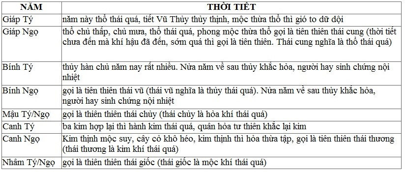

# VẬN KHÍ BÍ ĐIỂN (Tiếp)

## 2.5 THUYẾT KHÁCH KHÍ

Phương pháp lập khách khí như sau: ví dụ như xem năm Tý thì lấy Thiếu âm quân hỏa ở Tý là khí tư thiên (khí 6 tháng đầu năm), như vậy:

- Ngọ đối diện với Tý  
- Sửu Thái âm thấp thổ phía bên trái của Tý gọi là "tả gian"
- Dần Thiếu dương tướng hỏa là khí bên phải "hữu gian" của khí tại tuyền (đó là hai khí bên trái khí tư thiên, chi phối thiên khí và mọi vật)
- Một khí ở trên là Ngọ, chi phối thiên khí một năm, lại chủ về nửa năm đầu; một khí ở dưới là Tý, chi phối địa khí một năm, lại chủ về nửa năm cuối. Sau Tý 3 vị trí là Dậu Dương minh Táo kim tại tuyền (tư địa), sau Tý 2 vị trí là Tuất Thái dương hàn thủy là khách khí đầu thuận chiều tới Hợi Quyết âm phong mộc là khách khí thứ hai; Tý thiếu âm quân hỏa là khách khí thứ 3; Sửu thái âm thấp thổ là khách khí thứ 4; Dần thiếu dương tướng hỏa là khách khí thứ năm; Mão dương minh táo kim là khách khí thứ 6.
Cứ thế mà suy ra. Mỗi khí chủ vượng 60 ngày lẻ 87 khắc rưỡi (mỗi ngày có 100 khắc)

## NĂM TÝ NGỌ
Năm Tý Ngọ Thiếu âm quân hỏa tư thiên, Dương minh táo kim tại tuyền. Nếu là năm thuộc Nam chính thì mạch hai bộ thốn không ứng; nếu là năm thuộc Bắc chính thì mạch hai bộ xích không ứng (Nam chính là năm Giáp/Kỷ, Bắc chính là năm Bính, Mậu, Canh, Nhâm. Mạch không ứng là mạch trầm tế).

- Khí thứ 1

nếu năm trước là năm Kỷ Hợi thì từ tiết Đại Hàn trở về trước, ấm ấp tới lúc này mới bắt đầu rét, loại sâu bọ trước vì ấm mà ra, đến lúc này lại ẩn nấp; nước thành băng, sương lại xuống, gió bắt đầu đến dương khí uấư thiên, nhân dân bị bệnh hàn, cơ da răng và eo lưng bị đau. Đến đầu tháng 3, nắng bức sắp bắt đầu - các nơi có chứng mụn lở, do Thiếu âm quân hỏa tư thiên, lại gặp chủ khí thứ 2 nên có bệnh ấy.

- Khí thứ 2

khách khí phong mộc gia lên chủ khí quân hỏa dương khí phân bố, phong khí mới hành động. Xuân khí phát sinh, muôn vật tươi tốt, lúc khí tư thiên quân hỏa chưa thịnh, hàn khí thường đến, mộc hỏa tương ứng với thời tiết, người bị bệnh mắt mờ, mắt đỏ, khí uất ở trên và nóng, là bệnh thuộc quân hỏa.

- Khí thứ 3

Khách khí quân hỏa tư thiên gia lên chủ khí tướng hỏa, khí tư thiên phân bố, hỏa hành động mạnh, mọi vật phồn thịnh tươi tốt. Hỏa đến cực độ thì thủy phục thù lại, nhiệt cực sinh hàn, hàn khí thường đến, quân hỏa và tướng hỏa kết hợp nhau thiêu đốt. Người bị bệnh khí quyết (bỗng nhiên tay chân giá lạnh, ngã lăn ra) đau vùng tim, nóng rét thay đổi nhau, ho suyễn, mắt đỏ.

- Khí thứ 4

Thấp thổ thịnh, nắng nóng đến thường có mưa to, nóng lạnh thay đổi nhau đến, người bị bệnh nóng rét họng khô, hoàng đản, đổ máu mũi, nhiệt khát.

- Khí thứ 5

Sợ hỏa đến (chủ khí kim sợ khách khí hỏa) nên nắng đến một cách bất thường, thì dương khí mới hóa muôn vật tươi tốt, dân mới khỏe mạnh. Song thời tiết lạnh mà khí lại nóng, dương tà thắng nên nhân dân bị bệnh ôn.

- Khí cuối cùng

Khách khí kim gia lên chủ khí thủy, kim chủ thu liễm, khí thời bệnh lưu hành là táo, dư hỏa (tà hỏa còn sót lại) của ngũ hành làm ngăn cách ở trong, hàn khi1bo61c lên luôn thì sương mù che lấp; nhân dân bị bệnh thũng, ho suyền, ra máu, đau các đốt xương chân tay, thớ thịt và gan.

Mười năm kể trên năm nào quân hỏa tư thiên thì kim uất; táo kim tại tuyền thì mộc uất. Dùng vị mặn làm cho mềm đi, để điều hòa quân hỏa ở trên, nặng lắm thì dùng vị đắng để cho hỏa phát tiết ra, dùng vị chua để cho kim thu liễm lại. Quân hỏa bình thì táo kim được yên, song hỏa thuộc nhiệt, kim thuộc táo, nếu không có vị đắng tính hàn làm cho phát tiết ra là không phát được. Hỏa khắc kim, năm ấy nóng nhiệt nhiều, mụn lở và bệnh dịch nhiều.

Phương pháp điều trị chung: bộ phận trên thuộc quân hỏa, chữa nên dùng vị mặn, tính lạnh (lấy thủy trị hỏa); bộ phận giữa thuộc Giáp thấp thổ, Canh táo kim, chữa nên dùng vị đắng tính nóng, vị cay khí ôn làm cho phát tiết ra, làm cho ấm lại. Bính là hàn thủy, chữa nên dùng phương pháp tòng chị (tức chính trị) làm cho ấm lại. Bộ phận dưới thuộc táo kim, chữa nên dùng vị chua cho ôn lại. Nửa năm trước nên xa vị nóng, chữa bộ phận giữa và bộ phận dưới nên xa vị lạnh (riêng năm Mậu Ngọ thì không xa vị lạnh).

Tóm lại, năm Tý/Ngọ hỏa tư thiên ở trên nên nhiệt hóa. Khiến cho mùa xuân hay mát lạnh, gió to không mưa; đó là do phong vận của năm Tị/Hợi chưa lui hết. Cho nên dùng phương pháp tả quyết âm là phải, nhưng đến thiết Xuân phân đã tới thì vị trí hỏa, mộc tuy có thừa cũng không thể quá mức. Táo tại tuyền ở dưới thì vật ẩm thấp không thành được, loại có lông cánh hòa đồng với thiên khí thì yên ổn, không bị tổn hại; loại thực trùng (sâu) hòa đồng với địa khí, sinh dục nhiều. Kim tới thì mộc suy, loài có lông không thành thai. Kim hỏa không điều hòa, loài có lông cánh cũng không thành. Năm Canh Tý/Ngọ kim thừa kim vận thì loài có lông tổn thương càng nhiều.

## NĂM SỬU MÙI

năm Sửu Mùi: Thái âm thấp thổ tư thiên; Thái dương hàn thủy tại tuyền. Nếu là năm thuộc Nam chính thì mạch bộ thốn bên trái không ứng; nếu là năm thuộc Bắc chính thì mạch bộ xích không ứng (nam chính là năm Giáp Kỷ, bắc chính là Ất, Bính, Đinh, Mậu, canh, Tân, Nhâm Quý. Mạch không ứng là mạch trầm tế).

- Khí thứ 1

khách khí, chủ khí đều là phong, rét hết, khí mùa xuân đến phong khí lại về; mọi vật tươi tốt, thấp thổ tư thiên, phong thấp kết hợp nhau, phong thắng thấp sau khi mưa; phong thương can, phong lại lan ra. Nhân dân bị các chứng huyết tràn ra các khiếu (huyết giật), gân co cứng, khớp xương không thuận lợi, mình nặng, liệt gân.

- Khí thứ 2

chủ khí, khách khí đều là quân hỏa, giữa mùa khí nóng, Thái âm tư thiên, thấp nhiệt kết hợp nhau, mùa mưa xuống, hỏa thịnh khí nóng; người bị bệnh ôn dịch nặng, xa gần một loạt như nhau.

- Khí thứ 3

Chủ khí hỏa sinh khách khí thổ, thời lệnh của khí tư thiên phân bố ra, thấp khí giáng xuống, sau khi mưa có lạnh tiếp theo, vì Thái dương tại tuyền bắt đầu tác dụng. Cảm về khí hàn thấp, thì nhân dân bị bệnh mình nặng, chân thũng, ngực bụng đầy.

- Khí thứ 4

Khách khí tướng hỏa sinh chủ khí thấp thổ, thổ hỏa khí hợp lại thì thấp khí bốc lên, thiên khí ngăn cách. Song khí Thái dương tại tuyền, gió lạnh theo đó mà phát ra hàng ngày, thấp nhiệt kết hợp nhau, cây có có hơi đọng lại do thấp gặp hỏa. Thấp không hóa được, chỉ có sương buông tỏa trong đêm để thành thời lệnh mùa thu. Thấp nhiệt cũng lan ra, nhân dân bị bệnh nhiệt ở thấu lý, huyết bỗng tràn ra, sốt rét, bụng trên đầy, nóng lắm thì sinh phù thũng.

- Khí thứ 5

Khách khí, chủ khí đều thuộc kim, thời lệnh thê thảm (do tính sát của kim), sương lạnh xuống, sương giá có sớm, cây cỏ úa rụng, khí lạnh làm cho người ta rùng rợn, bệnh gây ra ở da và thớ thịt.

Mười năm kể trên Thấp thổ tư thiên, thổ khắc, thủy ứng, tâm hỏa bị bệnh; hàn thủy tại tuyền, thủy khắc hỏa, hay bị bệnh ở bụng dưới. Trong hai năm Ất Sửu Ất Mùi thừa vận kim, kim có thể sinh thủy, lại gặp lục thủy vượng, lúc đó rét càng dữ (đất lạnh, vật nóng không thành được), loại động vật không lông đồng hóa với thiên khí yên tĩnh thì không bị tổn hại, song khí thủy thổ không điều hòa, tuy sinh nở mà không nuôi được. Loài cá cùng đồng hóa với địa khí thì sinh dục nhiều. Thủy thịnh hỏa suy nên loài chim (thuộc hỏa) không sinh nở. Hai năm Tân Sửu Tân Mùi thủy thừa thủy vận, hỏa bị khắc nặng nên loài chim thương tổn càng nặng.

### PHƯƠNG PHÁP ĐIỀU TRỊ NÓI CHUNG

bộ phận trên là thấp thổ, chữa dùng vị đắng tính ôn, hóa theo hỏa để trị thấp, bộ phận giữa là Ất táo kim, Đinh phong mộc, nên dùng vị đắng, hóa theo hỏa để trị kim; vị cay tính ôn, hóa theo kim để trị mộc; Kỷ thấp thổ, Tân hàn thủy, nên dùng vị đắng tính hòa bình. Chữa chứng hàn dùng vị nhiệt, nếu bất cập thì nên ôn bổ.
Bổ bộ phận dưới nên dùng vị ngọt tính nhiệt, hóa theo thổ để chữa hàn. Năm Tân không nên dùng vị đắng tính nhiệt. Hai năm Sửu Mùi thổ tư thiên, nên hóa theo mưa, mà nhiệt khí vẫn còn nhiều là do dư hóa của hai năm Tý Ngọ chưa lui hết, hỏa lại trở thành hỏa, thì tà hỏa là đúng.
Thấp sinh về mùa xuân, là hiện tượng Thiếu âm không thoái vị, thổ khí không được di chuyển đúng chỗ, muôn vật đương lúc vượng mà không phát sinh được, người ta hay bị bệnh ở tỳ. Về mùa đó hay nóng không mưa, tức là hỏa lui mà thổ hợp lại, gặp tiết Tiểu thử thì thổ không thể hợp lại mà đến lúc hỏa nung nấu.

## NĂM DẦN THÂN

năm Dần Thân: Thiếu dương tướng hỏa tư thiên; Quyết âm phong mộc tại tuyền. Nếu là năm thuộc nam chính (Giáp) thì bộ mạch xích bên trái không ứng; nếu năm thuộc bắc chính (ngoài năm Giáp ra) thì mạch bộ thốn bên phải không ứng.

- Khí thứ 1

là Quân hỏa kiêm tướng hỏa tư thiên, phong thắng làm lay động lạnh hết; khí hậu lại quá ấm, cây cỏ sớm tươi tốt, lạnh tới mà không buốt; quân hỏa và tướng hỏa hợp lại, bệnh ôn bắt đầu có, bệnh khí nghịch lên trên, huyết tràn ra, mắt đỏ, ho rực lên, đau đầu, băng huyết, gân căng tức, trong làn da thớ thịt bị lở.

- Khí thứ 2

Thấp thổ tác dụng, chủ khí Quân hỏa bị uất lại, bụi trắng bốc lên khắp nơi, mây mưa dồn dập, phong không thắng thấp, mưa vặt, chủ khí và khách khí tương sinh, nhân dân được khỏe mạnh. Thấp nhiệt gây bệnh, nhiệt uất lên trên, nôn nghịch lnê, phát lở bên trong, ngực đầy không thoải mái, đau đầu, mình nóng, hôn mê, lở loét.

- Khí thứ 3

Chủ khí và khách khí đều là tướng hỏa, nắng nực đến, mưa ít, hai hỏa kết hợp nhau bốc lên gây thành bệnh nhiệt: tai điếc, chảy máu, khát, hắt hơi, ngáp, họng tê, mắt đỏ, hay chết đột tử.

- Khí thứ 4

Khách khí kim, chủ khí thổ, khí mát đến, nắng nực lục có lúc không, biến hóa xen kẽ nhau, thổ và kim tương sinh, sức khỏe của dân bình thường. Táo thắng thì phế bị bệnh ngực đầy; thấp thắng thì tỳ bị bệnh mình nặng.

- Khí thứ 5

Khách khí thủy gia lên chủ khí, thủy hàn làm kim han rỉ, dương đi thì hàn tới, mưa xuống khí bế tắc, loài cây cứng tàn rụng sớm, người phải tránh hàn tà, giữ gìn cơ thể cho kín đáo.

- Khí cuối cùng

Mộc tác dụng được chủ khí thủy tương sinh, khí tại tuyền được chính đáng, phong khí đến, sương móc xuống, vừa thời lệnh bế tàng, mà có phong khí lưu động, phong tà dương tà, sinh bệnh đau vùng tim, dương khí không bế tàng lại được mà sinh ho.

Mười năm kể trên: hỏa ở trên khắc kim, năm đó nắng nhiều tổn thương phế, nhiều bệnh nhiệt, mộc khắc thổ; nửa năm sau nhiều phong, nhiều bệnh ở tỳ vị; dương đúng vị trí của nó thì khí trời chính thường, phong động ở dưới, địa khí rối loạn, phong mới cử động dữ dội, cây lướt cát bay, hỏa bốc nóng khắp, âm vận hành, dương biến hóa; nửa năm trước mưa là thời tiết ứng trong vòng hai khí tư thiên và tại tuyền.

### PHƯƠNG PHÁP ĐIỀU TRỊ CHUNG

- Tướng hỏa ở trên chữa dùng vị chua (lấy mộc trị hỏa),  
- Bính thủy, Mậu hỏa ở giữa - chữa dùng vị mặn tính ôn  
- Canh kim, Nhâm mộc, Giáp thổ: chữa dùng vị cay tính ôn, lấy kim trị mộc  
- năm Mậu dùng vị cay khí ôn để đề phòng hỏa thái quá  
  
năm Dần Thân tướng hỏa tư thiên, nên hóa theo cách đó. Nếu mưa ẩm thấp còn nhiều đó là dư khí thổ của hai năm Sửu Mùi chưa lui hết, thổ lại làm hại trở lại, nên tả trung châu (vị) là đúng. Khí thái âm không chịu lui, bốn tháng cuối mùa nắng rét bất thường, mùa hạ lại mát, mùa thu lại nóng, mùa màng thu hoạch đều muộn. Nếu tiết Tiểu mãn, Tiểu thư nóng tợn, là hỏa lệnh, nếu không thì tai hại; phong mộc tại tuyền, mát mà không sinh nở, giống thú đống hóa với địa khí nên sinh dục nhiều. Mộc uất ở dưới hỏa mất thời lệnh, giống sinh trùng tuy không sinh nở, song song đồng hóa với thiên khí yên tĩnh nên không bị tổn hại. Mộc khắc thổ, loài động vật không long bị hao tổn. Năm Nhâm Dần, Nhâm Thân, mộc ở vào vị trí mộc nên (động vật không lông) càng thương tổn nặng.

[source](https://thuochay.net/yttl-van-khi-bi-dien-3.html)