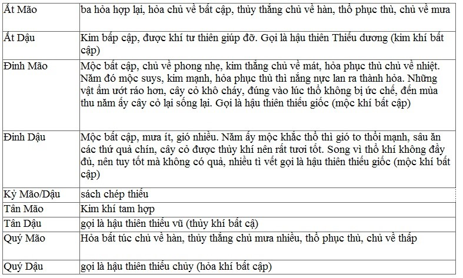
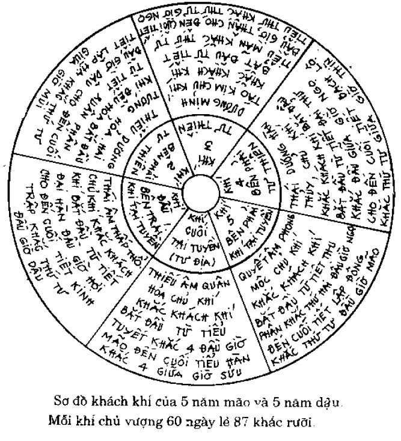
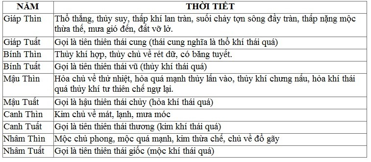
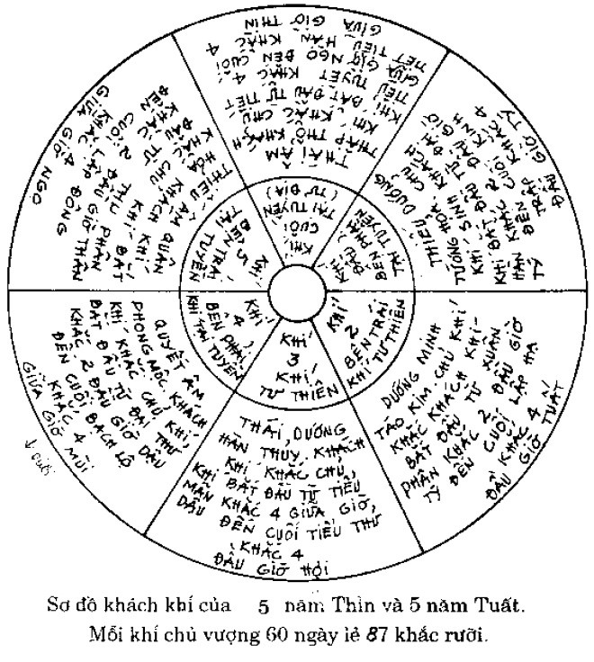
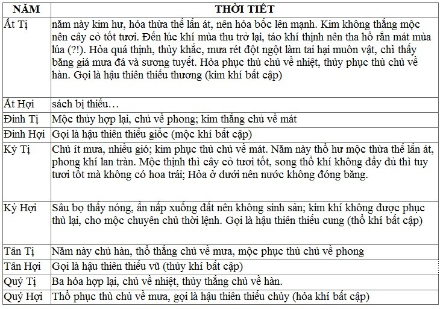
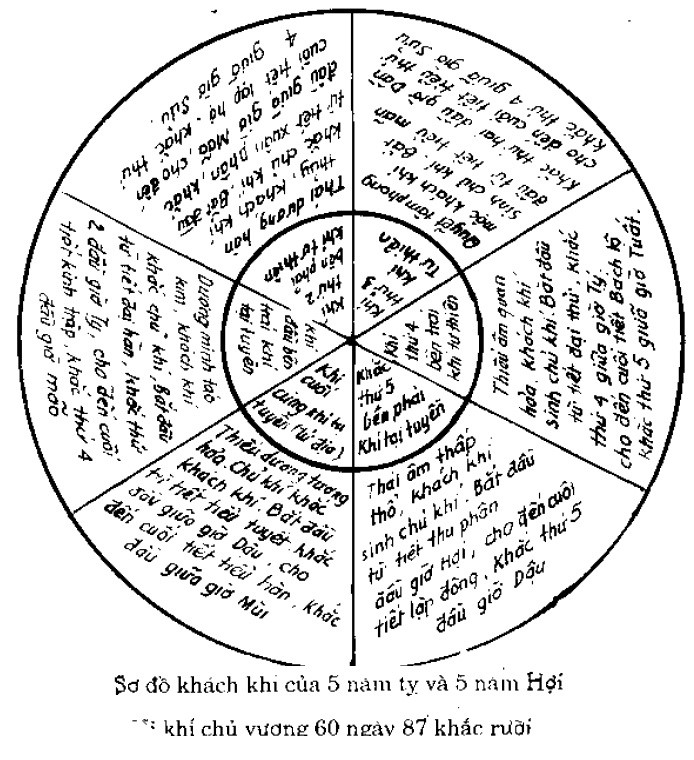

# VẬN KHÍ BÍ ĐIỂN (Tiếp)

## NĂM MÃO DẬU
Năm Mão và năm Dậu: Dương minh táo kim tư thiên, Thiếu âm quân hỏa tại tuyền. Nếu là năm thuộc Nam chính (Kỷ) thì mạch hai bộ Xích không ứng; nếu năm thuộc Bắc chính thì mạch hai bộ Thốn không ứng.

- Khí thứ 1

Thái âm tác dụng, thời tiết lạnh khí thấp cho nên âm ngưng đọng. Táo kim tư thiên cho nên khí heo hắt, vì khí heo hắt mà nước hồ đóng băng, vì âm ngưng đọng mà hóa thành mưa lạnh. Chủ khí là phong mộc, khách khí là thấp thổ, phong là dương tà, thấp là âm tà gây thành bệnh. Mộc khắc thổ, thổ khắc thủy, tỳ thận bị tổn thương gây thành chứng nhiệt trướng ở trung tiêu, mặt mắt phù thũng, đổ máu mũi, hắt hơi, ngáp, nôn ọe, tiểu tiện vàng/đỏ và rắt buốt.

- Khí thứ 2

Tướng hỏa tác dụng ở sau tiết Xuân phân, chủ khí là quân hỏa, âm mới thay đổi, dương mới thư thái mọi vật mới tươi tốt. Quân hỏa và tướng hỏa kết hợp bốc lên, tướng hỏa gia lên trên quân hỏa, bệnh dịch gây ra dữ dội, nhân dân hay bị chết đột ngột.

- Khí thứ 3

Kim tác dụng, khí mát lưu hành, song thời lệnh đang lúc hỏa làm chủ khí cho nên táo và nhiệt kết hợp lại, đến cuối khí thứ 3 chủ khí là Thái âm, khách khí là Thái dương thì táo cực độ thành nhuận, thời lệnh thuộc thu kim, nhân dân bị bệnh nóng lạnh.

- Khí thứ 4

Thủy tác dụng trong khi thấp thổ vượng, nên thời tiết lạnh, mưa xuống. Sau khí thứ 4, tại tuyền là Quân hỏa gia lên chủ khí thủy, thủy hỏa mâu thuẫn nhau sinh chứng bỗng chốc bị ngã, run giật, nói nhảm, khí thiếu đầy khan, hay là đau vùng tim, ung thũng mụn nhọt, sốt rét, cốt nuy, ỉa ra máu, đều là bệnh ở thận.

- Khí thứ 5

Phong thuộc mộc tác dụng, khí tại tuyền là hỏa, ôn; mùa thu mà hành lệnh mùa xuân, cây cỏ trở lại tươi tốt, nhân dân bình thường không có tật bệnh.

- Khí thứ 6

Thiếu âm quân hỏa tác dụng, dương khí phân bố, khí hậu trở lại ấm, loài sâu bọ lại thấy (đáng lẽ phải ẩn nấp mới đúng), nước chảy không đóng băng, nhân dân bị bệnh ôn dịch.

## PHƯƠNG PHÁP ĐOÁN CHUNG

- Năm Ất Mão, Ất Dậu: bệnh phổi nhiều

- năm Đinh Mão, Đinh Dậu: người hay bị chứng nóng rét, mụn nhọt

- năm Kỷ Mão, Kỷ Dậu: bệnh cảm ở tỳ, ăn ít, mất khẩu vị

- năm Tân Mão, Tân Dậu: phần nhiều bị chứng hàn dịch

- năm Quý Mão, Quý Dậu: bị chứng nóng rét.

Mười năm kể trên sương mù xuống sớm, mưa rét làm hại mọi vật. Song kim thịnh hỏa suy, thổ cũng suy nhược, những vị ngọt sắc vàng tất sinh ra sâu, người cảm phải thời khí ấy là tỷ thổ bị tà ngay. Nửa năm sau hỏa khí muộn, mất mùa lúa trắng, được mùa lúa đỏ. Quân hỏa tại tuyền, vật lạnh không sinh được, loài chim đồng hóa với địa khí (hỏa) sinh dục nhiều, loài thực trùng đồng hóa với thiên khí không tổn hại gì. Song địa khí (khí tại tuyền) khác thiên khí (khí tư thiên), loài thực trùng cũng không thành. Năm Quý Mão, Quý Dậu hỏa lại gặp hỏa vận, loài thực trùng tổn thương càng nặng.

## PHƯƠNG PHÁP ĐIỀU TRỊ CHUNG

Bộ phận trên dùng vị đắng, tính hơi ôn (hỏa hóa, trị kim), bộ phận giữa là Đinh mộc, dùng vị cay tính hòa bình (bổ thổ), Tân thủy dùng vị đắng tính hòa bình (lấy hỏa để ôn trung). Quý hỏa dùng vị mặn, tính ôn (vị mặn để trị hỏa, để ôn bổ bất túc). Ất kim dùng vị đắng, tính hòa bình (vị đẳng thuộc hỏa để trị kim, để hòa bổ bất túc);

Bộ phận dướng dùng vị mặn khí lạnh (lấy thủy trị hỏa), mặn trị quân hỏa, đắng trị táo kim, song đắng tất phải kiêm cay, năm ấy hỏa thịnh kim thịnh, cay theo kim hóa, để mong cho nó thăng bằng. Nửa năm đầu khí táo kim thu liễm, nên phát hãn để làm cho tán đi, nửa năm về sau quân hỏa nóng quá, nên làm cho mát đi. Năm Mão/Dậu kim khí tư thiên, nên thanh hỏa đi, song thứ nhiệt còn nhiều, mùa xuân mà nhiệt nhiều là dư hỏa của năm Dần năm Thân chưa lui hết, hỏa làm hại trở lại, dùng phương pháp tả tướng hỏa là đúng. Khí thiếu dương năm trước không lui hết, tất nhiên sau mùa thu có nhiệt, gió tây đến chậm, kim suy bị bệnh (kim khí tư thiên ở trước, mộc bị nó khắc, loài thú vật chết, ứng vào nửa năm trước; hỏa khí tại tuyền ở sau, kim bị nó khắc, loài thực trùng bị hại, ứng nửa năm về sau. Nửa năm về trước lạnh nhiều, người hay bị bệnh về gân; nửa năm sau nóng nhiều, người hay bị bệnh nóng rét.

## NĂM THÌN TUẤT

Năm Thìn/Tuất: Thái dương hàn thủy tư thiên; Thái âm thấp thổ tại tuyền. Nếu là năm thuộc Nam chính (Giáp) thì mạch bộ Xích bên phải không ứng; nếu năm thuộc Bắc chính thì mạch bộ Thốn bên trái không ứng.

- Khí thứ 1

Tướng hỏa tác dụng, thay thế cho quân hỏa năm trước, hai hỏa giao nhau, khí quá ấm, cây cỏ tươi tốt sớm; khách khí hỏa, chủ khí mộc, phong và hỏa kết hợp nhau nên người bị bệnh ôn, mình nóng, đau đầu, nôn mửa, mụn nhọt, ban chẩn.

- Khí thứ 2

Kim tác dụng, khí mát lạnh đến, hỏa khí bị ức chế, hàn ngưng trệ ở trong, dương khí không lưu thông được; người ta bị bệnh khí uất, ngực bụng đầy.

- Khí thứ 3

Thủy tác dụng, hàn khí lưu hành, mưa xuống, hàn khí đi xuống, tâm khí đi lên; hàn thủy mưa xuống, người ta bị chứng rét bên ngoài nóng bên trong, ung thư, ỉa lỏng, tâm nhiệt, hôn mê, buồn bực: thuộc chứng chết không chữa được.

- Khí thứ 4
Khách khí thuộc mộc gia lên chủ khí thổ, phong thấp giành nhau, phong hỏa thành mưa, mộc tiết Đại thử là lúc mộc sinh hỏa, người ta bị chứng nóng tợn vì khách thắng chủ, tỳ thổ bị tổn thương; người ta bị bệnh khí ít, liệt cơ nhục, liệt chân, ỉa chảy, xích bạch lỵ.

- Khí thứ 5
Dương khí lại hóa sinh, loài cây cỏ được lớn lên/sinh ra, được thành thục, nhân dân được thoải mái.

- Khí thứ 6

Thổ khí tại tuyền, thấp khí lưu hành, âm ngưng đọng, đại hư, bụi bay mù mịt khắp nơi, phong hàn tràn đến, phong có thể thắng được thấp, thì thấp chống lại, sâu bọ theo thổ hóa sinh ra; phong mộc trái thời tiết cũng gia lên, thì những cái do thổ hóa sinh ra không sinh dục được - người ta phần nhiều bị bệnh thai sản.

### PHƯƠNG PHÁP ĐOÁN BỆNH CHUNG

- năm Giáp Thìn/Tuất: bệnh thấp, bộ phận dưới nặng

- năm Bính Thìn/Tuất: bị nhiễm bệnh do Đại hàn ngưng đọng ở khe nước, hang sâu (ý nói hàn tà đọng lại ở khe khớp, xương)

- năm Mậu Thìn/Tuất: người hay bị chứng hàn uất

- năm Canh Thìn/Tuất: bệnh táo, lưng buồn bực, tối tăm, ruột/bụng đau

- năm Nhâm Thìn/Tuất: bệnh đầu lắc đảo, mắt hoa tối tăm

### PHƯƠNG PHÁP ĐIỀU TRỊ NÓI CHUNG

Bộ phận trên trị thủy, dùng vị đắng tính ôn
Bộ phận giữa là Mậu hỏa, dùng vị ngọt tính bình hòa
Canh kim, bộ phận trên dùng vị đắng tính nóng; bộ phận giữa dùng vị cay tính ôn; bộ phận dưới dùng vị ngọt tính nóng
Giáp thổ dùng vị đắng tính ôn; Bính thủy dùng vị mặn tính ôn. Bộ phận dưới thuộc thổ, chữa dùng vị ngọt tính ôn. Dùng táo trị thấp để chữa bộ phận dưới, dùng ôn nhiệt trị hàn để chữa bộ phận trên, dùng vị đắng là theo hỏa hóa để chữa hàn.
Năm Canh bộ phận trên và dưới chữa có khác nhau, là vì kim thuộc về mát, cho nên dùng ôn nhiệt để đề phòng mát quá. Mùa xuân sinh mát lạnh nhưng chỉ mát mà không rét lắm: đó là khí Dương minh táo kim của năm Mão/Dậu chưa lui hết, táo trở lại thực nên tả kim là đúng. Thấp khí tại tuyền nhưng táo vật không sinh nở, loài động vật không long đồng hóa với địa khí thì sinh dục nhiều, loài cá bị khắc chế không sinh trưởng, song thứ nào đã đồng hóa với thiên khí thành rồi thì yên tĩnh không tổn hại gì. Năm Giáp Thìn, Giáp Tuất thổ thừa thổ vô vận, loài cá hay bị tổn thương, không sinh trưởng được.

## NĂM TỊ HỢI

Năm Tị/Hợi: Quyết âm phong mộc tư thiên, Thiếu dương tướng hỏa tại tuyền. Nếu là năm thuộc Nam chính (Kỷ), thì mạch bộ thốn bên phải không ứng; nếu là năm thuộc Bắc chính thì mạch bộ Xích bên trái không ứng.

- Khí thứ 1

Kim khí tác dụng, rét bắt đầu; khí heo hắt tới, kim vượng tổn thương can, người hay bị chứng co rút.

- Khí thứ 2

Thủy tác dụng, rét không lui, có tuyết, nước đóng băng. Sát khí lan rộng, có sương xuống, mưa rét luôn, song khách khí thủy gia nên chủ khí hòa, thì khí của nó phải ứng; dương chuyển hóa trở lại, khách khí hàn giá vào ngoài, hỏa ứng lại thì sinh bệnh nhiệt ở trong.

- Khí thứ 3

Mộc khí tư thiên tác dụng, gió thường đến, mưa nhỏ; chứng bệnh thuộc về phong mộc, chảy máu, ù tai, váng đầu hoa mắt.

- Khí thứ 4

Khách khí hỏa gia lên chủ khí thổ, chủ thấp nhiệt lan tràn, người bị bệnh hoàng đản, phù thũng.

- Khí thứ 5

Khách khí thổ gia lên thổ khí kim, táo ôn lại thắng, khí lạnh phân bổ ra, rét đến thân thể; có mưa gió, nhân dân ít bệnh.

- Khí thứ 6

Tướng hỏa tại tuyền, dương chuyển hóa mạnh, loài sâu bọ đang ẩn nấp lại suốt hiện, nước không đóng băng, địa khí phát tiết mạnh, loài cá sinh nở, người được thoải mái, nhân dân bị bệnh ôn dịch.

### PHƯƠNG PHÁP ĐOÁN NÓI CHUNG

- Năm Ất Tị/Hợi: người bị chứng hỏa tà, gây ra hắt hơi, chảy máu, bệnh âm quyết cách dương, huyết phần nhiều đi lên, thành chứng hỏa vô căn; đầu, não, miệng, lưỡi đều bị bệnh

- Năm Đinh Tị/Hợi: chủ về bệnh nhiệt

- Năm Kỷ Tị/Hợi: người bị chứng hay khát, mình nặng

- Năm Tân Tị/Hợi: nhiều bệnh phong

- Năm Quý Tị/Hợi: chủ bệnh nhiệt

- Mười năm kể trên mộc khí tư thiên, mộc khắc thổ ứng nhiều chứng mình nặng, cốt nuy, liệt mắt, ù tai. Hỏa khắc kim, năm ấy hay bị bệnh nhiệt.

### PHƯƠNG PHÁP ĐIỀU TRỊ NÓI CHUNG

- Bộ phận trên là mộc, chữa dùng vị cay khí mát (hóa theo kim để trị thủy). Bộ phận giữa là Kỷ thổ, chữa dùng vị ngọt, khí hòa (thổ hư thì bổ); Tân thủy, chữa dùng vị đắng khí hòa (hòa theo hỏa để ôn thủy);

- Quý hỏa, chữa dùng vị mặn khí hòa (trị hỏa để bổ thủy bất túc); Ất kim, chữa dùng vị ngọt khí hòa (thu liễm kim, bổ kim);
Đinh mộc, chữa dùng vị cay khí hòa (ức chế mộc để hạ hỏa); Vị chưa khí lạnh (để hóa hỏa trị hỏa), vị cay để điều hòa (lấy kim trị mộc). Khí hòa để trị bộ phận giữa, để bồi bổ bất cập (thiếu). Vị mặn để điều hòa bộ phận dưới, để trị hóa, tướng hỏa hư thực phần nhiều khó phân biệt, phải cẩn thận không nên sử dụng nhiều mà sai phạm.

- Năm Tị/Hợi mộc khí tư thiên, nên theo phong hóa, nếu hàn khí còn nhiều, đó là dư hàn của năm Thìn/Tuất chưa lui hết, mộc khí muốn hành lệnh mà hàn thủy chưa đi hết thì mùa xuân phải rét, đó là mùa xuân trái thời tiết - mộc khí mất sự bình thường của nó nên người ta hay bị bệnh co rút gân (thuộc kinh can), như chỉ trong 3 tháng xuân rét hết thì phong khí được lưu hành, mộc khí tư thiên; nếu không như thế thì tai hại lớn sẽ đến; hỏa khí tại tuyền, vật lạnh không sinh trưởng, loài thú đồng hóa với thiên khí không tổn hại gì, loài chim đồng hóa với địa khí sinh dục nhiều. Hỏa khắc chế thì kim biến hỏa, loài thú cũng không sinh dục.

- Lại nói, khí tương đắc với nhau thì hòa, tức khách khí sinh chủ khí; khí không tương đắc với nhau thì sinh bệnh, tức khách khí khắc chủ khí. Vì vị trí chủ khí ở dưới, vị trí khách khí ở trên, nếu chủ sinh khách thì chủ lại ở trên là nghịch, là sinh bệnh.

## 2.7 TÓM TẮT CÁCH ĐOÁN VẬN KHÍ

***Nội kinh nói***: trước hết phải lập thành năm đó để rõ ràng vận khí của nó. Mỗi năm, trước hết lập vận khí để xét khí thái quá/bất cập của nó, rồi sau mới lấy chủ khí ở dưới làm gốc, khách khí gia lên trên chủ khí làm ngọn để tìm ra sự biến đổi của lục hóa. Nếu khí đó thắng (tức khách khí khắc chủ khí) thì giúp đỡ bên yếu; mạnh quá thì ức chế bên mạnh; khí đó phục thù lại (tức là chủ khí bị khắc thì con của khí bị khắc phục thù lại cho mẹ), hòa bình thì giải quyết một cách hòa bình, dữ dội thì giải quyết một cách thô bạo... đều tùy theo tình thế ưu thắng của khí đó mà khuất phục cho nó yên, lấy thăng bằng làm mức độ, chủ khí chỉ thuận theo khách khí ở trên mà thôi:

- khách khí thắng chủ khí là thuận

- chủ khí thắng khách khí là nghịch

hai khí ấy chỉ có thiên thắng mà không có phục thù (nghĩa là chủ thắng thì tả chủ bổ khách; khách thắng thì tả khách bổ chủ - chứ không lấy hành con để phục thù).

Năm dương khí chuyển hóa trước thời tiết thì bản thân chủ khí mạnh, mà có thể lấy khí bên trong thắng được chứng thực bên ngoài (chủ khắc khách), cho nên khí không thắng bị tà; năm âm khí chuyển hóa sau thời tiết, thì bản thân chủ khí suy nhược, mà có thể lấy khí bên ngoài thắng được chứng suy bên trong (khách thắng chủ) cho nên khí thắng nó tới khắc.

[source](https://thuochay.net/yttl-van-khi-bi-dien-4.html)