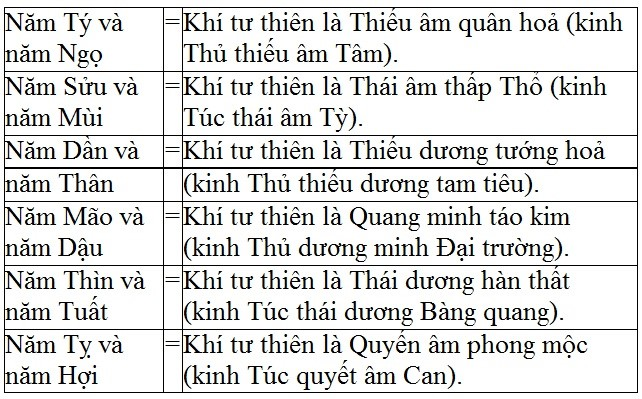
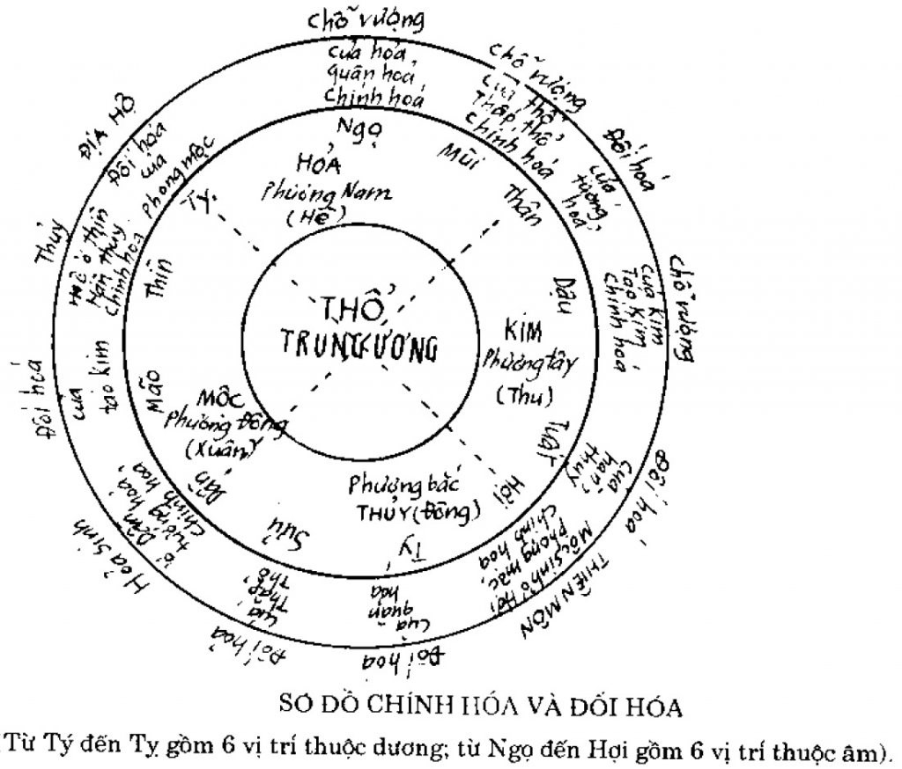
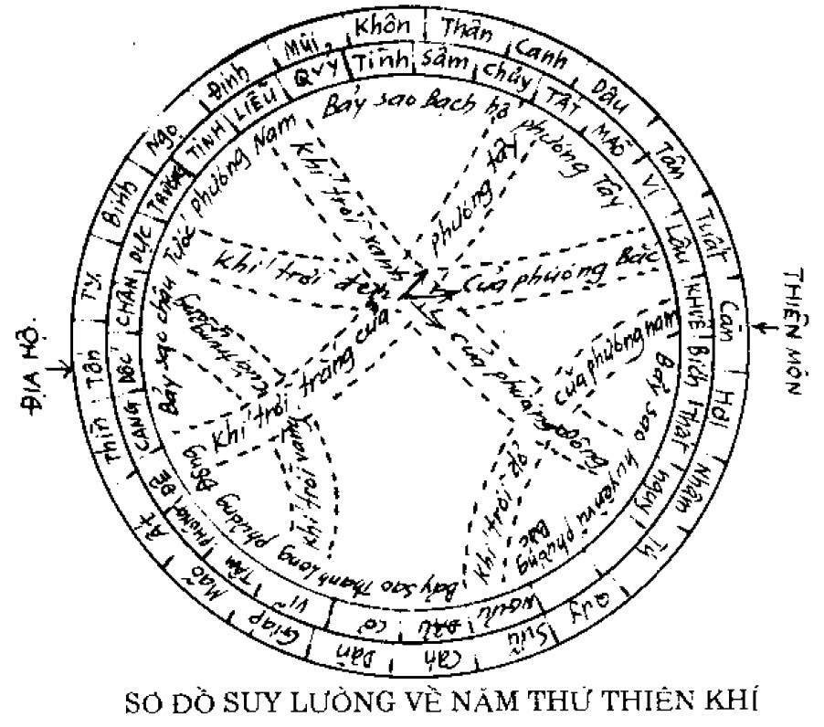

# VẬN KHÍ BÍ ĐIỂN ( Tiếp và hết)

## 2.8 HƯỚNG DẪN CÁCH ĐOÁN VẬN KHÍ
(Bí quyết này kết hợp tham khảo với khí trong Thất chính đại hội, và phương pháp tiểu vận trong Tam tài phú)
Phương pháp này, chủ vận không bằng khách vận, chủ khí không bằng khách khí, xét cách xem mây trong sơ đồ Kính thiên của họ Cam có nói "Thiên vận, địa vận là số thủ thường, không thể tả hết được sự biến đổi của trời đất, thiên khí, địa khi, vận hành, thắng phục, thăng giáng, âm dương chi phối điều khiển và biến hóa tự nhiên vô cùng tận; cho nên người xem rất là quan trọng".
Vì chủ vận, chủ khí chỉ xếp theo thứ tự ở dưới, cũng như mùa xuân ấm, mùa hạ nắng, mùa thu mát, mùa đông lạnh; còn khách vận khách khí đều theo khí của nó chu lưu ở trên, đúng vị trí của nó thì trời đất hanh thông, mọi vật bình thường, sai vị trí của nó thì trời đất bế tắc, mọi vật bệnh tật. Hễ muốn xem vận khí hàng năm, cần phải:

**Bước 1**: lập thành chủ vận của năm ấy, để biết năm ấy từ tiết nào tới tiết nào, thuộc vận nào.

**Bước 2**: lập thành khách vận của năm ấy, để biết năm ấy thái quá hay bất cập (5 năm dương là thái quá, 5 năm âm là bất cập). Lại xem giữa 5 bước khách vận với 5 bước chủ vận sinh khắc tỷ hòa ra sao, để biết thuận hay nghịch, suy hay hòa:

Đối với khách vận thái quá:

- Khách vận khắc chủ vận là nghịch: nghịch thì ức chế nó đi

- Khách vận sinh chủ vận là thuận: thuận thì theo nó

- Chủ vận khắc khách vận là suy: suy thì phải dìu dắt

- Chủ vận sinh khách vận là hòa: hòa thì phân giải

Đối với vận thái quá, thuận thì theo nó (tuy nó có mạnh, nhưng đã sinh ta thì khí mạnh của nó đã phát tiết rồi, nên theo đó mà chữa); nghịch thì ức chế đi (nó mạnh mà lại nghịch, chữa nên ức chế nó để giúp ta). Suy thì phải dìu dắt (nó tuy mạnh nhưng ta thắng được, khí nó đã suy, chữa nên dìu dắt). Hòa thì phân giải (nó tuy mạnh nhưng cùng một khí với ta, thì cũng chẳng làm hại gì, chữa nên dùng hòa giải).

Đối với khách vận bất cập

- Khách vận sinh chủ vận là thuận: thuận thì ngăn chặn

- Khách vận khắc chủ vận là nghịch: nghịch thì dẫn nó đi

- Chủ vận khắc khách vận là suy: suy thì làm ẩn phục nó đi

- Chủ vận sinh khách vận là hòa: hòa thì phân giải nó đi

Đối với vận bất cập, thuận thì ta ngăn chặn gấp đi (nó đã yếu mà khí lại suy, chữa nên ngăn chặn kịp thời); nghịch thì dắt dẫn nó đi (nó đã yếu mà lại lấn ta, là thế nó đã sắp tàn, chữa nên công phạt mà kiêm cả dắt dẫn nó). Suy thì làm cho nó ẩn phục đi (nó đã yếu ta lại thắng thế thì nó phải ẩn phục, chữa nên ức chế, làm cho nó tự ẩn phục). Hòa thì phân giải đi (nó tuy mạnh mà cùng khí với ta thì cũng chẳng làm hại gì, chữa nên hòa giải đi). Lại thêm tham khảo thiên vận, địa vận mà đoán; chỉ rất cần là lấy thiên khí địa khí làm căn bản, cho nên lại phải lập thành cục thứ 3 và cục thứ 4 nữa.

**Bước 3**: Lập thành chủ khí của năm ấy, để biết rõ năm ấy từ tiết nào tới tiết nào, thuộc khí nào

**Bước 4**: Lập thành khách khí của năm ấy, để biết rõ địa chi nào tư thiên, địa chi nào tư địa (tại tuyền); địa chi nào thuộc bước khí đầu, địa chi nào thuộc bước khí 2..vv.. Lại xét làm chủ năm ấy là khí nào, ví dụ: năm Tý/Ngọ: khí Quân hỏa làm chủ, chữa nên dùng vị mặn, khí lạnh..vv.. Lại xét xem 6 bước khách khí với 6 bước chủ khí của năm ấy sinh hay khắc, hay tỷ hòa.

Ví dụ xem năm Tý thì: Tý là khí tư thiên, Dậu là khí tư địa (tại tuyền);

- bước khách khí 1 là Tuất hàn thùy gia lên chủ khí là phong mộc - tức trên sinh dưới;
- bước khách khí thứ 2 là Hợi phong mộc gia lên chủ khí là Quân hỏa - tức là trên sinh dưới;
- bước khách khí thứ 3 là Tý quân hỏa gia lên chủ khí là tướng hỏa - tức là trên dưới tỷ hòa;
- bước khách khí thứ 4 là Sửu thấp thổ gia lên chủ khí cũng là thấp thổ - tức hai khí tỷ hòa.
- bước khách khí thứ 5 là Dần tướng hỏa gia lên chủ khí táo kim - tức trên khắc dưới
- bước khách khí thứ 6 là Mão táo kim gia lên chủ khí hàn thủy, tức là trên sinh dưới

Trên sinh dưới là tương đắc; dưới sinh trên tuy có tương đắc nhưng không tề chính (tức là loạn trật tự, con ở trên mẹ, chủ khí lâm dưới khách khí), nhân dân vẫn dễ bị bệnh tật; trên khắc dưới hay dưới khắc trên là không tương đắc - không tương đắc thì sinh bệnh. Cho nên, đắc là thuận, không tương đắc là nghịch. Thuận thì bên nào suy ta phải bổ bên ấy; nghịch thì bên nào mạnh ta phải ức chế bên ấy. Lại đem khách vận và lục khí gia lên nhau mà đoán:

### BẢNG KHÁCH KHÍ HÀNG NĂM

12 NĂM THIÊN PHÙ

8 NĂM TUẾ HỘI

6 NĂM ĐỒNG THIÊN PHÙ

4 NĂM THÁI ẤT THIÊN PHÙ

6 NĂM ĐỒNG TUẾ HỘI

12 NĂM BÌNH KHÍ

## 2.9 CƠ CHẾ BỆNH CỦA VẬN KHÍ

Cơ chế bệnh theo ngũ vận

- Mộc vận thuộc về can: hễ các chứng phong đầu lắc, mắt hoa đều là triệu chứng của Can
- Hỏa vận thuộc về Tâm: hễ các chứng đau ngứa, mụn nhọt đều là triệu chứng của Tâm.
- Thổ vận thuộc Tỳ: hễ các chứng thấp thũng, đầy đều là triệu chứng của Tỳ.
- Kim vận thuộc về Phế: hễ các chứng thuộc về khí nghịch lên, uất lại đều là triệu chứng của Phế.
- Thủy vận thuộc Thận: hễ các chứng hàn, run rẩy đều là triệu chứng của Thận.

Cơ chế bệnh theo lục khí

- Quyết âm phong mộc (Tị/Hợi): chủ khí của Can và Đởm, hễ các chứng bỗng nhiên sinh ra cứng đờ chân tay, đau liệt, bụng căng cứng, chân tay co rút đều là triệu chứng của nó.  
- Thiếu âm quân hỏa (Tí/Ngọ): chủ về khí của Tâm và Tiểu tràng, hễ các chứng suyễn, mửa, nôn chua, ỉa chảy đột ngột, chuột rút, tiểu tiện đỏ, phiền khát, đầy chướng, mụn, nhọt, lở, sởi, bướu, hạch, nôn mửa, ỉa chảy, hắc loạn, tối tăm, uất, phù thũng, tắc mũi, chảy máu mũi, máu tràn qua các khiếu, ỉa ra máu, đái ra máu, huyết bế lại, mình nóng sợ lạnh, rét run, kinh sợ, hoặc khóc cười nói nhảm, mồ hôi tuôn ra... đều là triệu chứng của nó.  
- Thái âm thấp thổ (Sửu/Mùi): chủ về khí của Tỳ và Vị, hễ các chứng kinh cứng đờ, phù thũng, tích đầy (bì mãn), nôn ra giun, hoắc loạn, mình nằng nặng, thịt nhão như bùn, ất xuống không nổi lên đều là triệu chứng của nó.
- Thiếu dương tướng hỏa (Dần/Thân): chủ về khí Tâm bào lạc và Tam tiêu; hễ các chứng nhiệt, buồn phiền rối loạn, co rút, bỗng nhiên câm, uất ức, hôn mê vật vã, phát cuồng, hay chạy, chửi mắng, kinh sợ, phù thũng, nhức nhối, xông nghịch lên, run sợ như mất hồn, hắt hơi, mụn nhọt, viêm họng, ù tai, điếc tai, nôn mửa, thực quản không nuốt được đồ ăn, mắt mờ, bỗng nhiên ỉa như tháo nước, thịt máy, gân co... thuộc về các chứng bạo bệnh thì đều là triệu chứng của nó.  
- Dương minh táo kim (Mão/Dậu): chủ về khí của Phế và Đại tràng. Hễ các chứng khô sáp, ho khát, đờ đẫn đều là triệu chứng của nó.  
  
Thái dương hàn thủy (Thìn/Tuất): chủ khí của Thận với Bàng quang, hễ những chứng thủy dịch chảy ra ở bộ phận trên hoặc dưới - trong suốt mát lạnh, trung hà (tích khối ở bụng dưới), sưng bìu giái, bụng đầy căng đau, đi lỵ ra chất trắng trong, ăn vào lâu thấy tiêu đói, mửa/ỉa ra chất tanh hôi, co duỗi không dễ dàng, quyết nghịch bế tắc đều là triệu chứng của nó.

## 2.10 CHÍNH HÓA VÀ ĐỐI HÓA

*(Từ đây trở đi theo trong quyển Vận Khí Tầm Nguyên)*

Xét bài tổng luận về vận khí trong Đồ Thư có nói:

- năm chính hóa có 6 là Ngọ, Mùi, Dần, Thìn, Dậu, Hợi  
- năm đối hóa có 6 là Tý, Sửu, Thân, Tuất, Mão, Tị  

- Vì Ngọ là phương chính Nam là chỗ vượng của Hỏa; Mùi là phương Tây Nam chỗ vượng của Thổ; Dần là phương Đông Bắc chỗ sinh của Hỏa; Thìn là phương Đông Nam cái Kho của Thủy; Dậu là phương Chính Tây chỗ vượng của Kim; Hợi là phương Tây Bắc là chỗ sinh của Mộc - đó là những năm chính hóa.  
- Tý đối diện với Ngọ được khí của Hỏa; Sửu đối diện với Mùi được khí của thổ; Thân đối diện với Dần được khí của Hỏa; Tuất đối diện với Thìn được khí của Thủy; Mão đối diện với Dậu được khí của kim; Tị đối diện với Hợi được khí của mộc - đó là những năm đối hóa.

**Chính hóa nghĩa là**:

- Ngọ nguyên là Hỏa  
- Mùi nguyên là Thổ  
- Thìn nguyên là Thủy  
- Dậu nguyên là Kim  
  
những khí mà lâm vào lục dâm ở hai bên trái phải khí Tư thiên và khí Tại tuyền là thời lệnh thực - tham khảo với Hà đồ xem các số 1, 2, 3, 4, 5 ở tầng trong, từ bản chất mà sinh ra, thuộc về sinh số của trời đất - phương pháp chữa nên theo gốc của nó.

**Đối hóa nghĩa là**:

- Tý không phải là Hỏa, mà do đối diện với Ngọ nên được khí Hỏa  
- Sửu không phải là Thổi, mà do đối diện với Mùi nên được khí Thổ  
- Thân không phải là Hỏa, mà do đối diện với Dần nên được khí Hỏa  
- Mão không phải là Kim, mà do đối diện với Dậu nên được khí Kim  
- Tị không phải là Mộc, mà do đối diện với Hợi nên được khí Dậu  

những khí ấy mà phối hợp với lục dâm ở trên hoặc ở dưới, tới trước hay tới sau là thời lệnh hư - tham khảo với Hà đồ xem số 6, 7, 8, 9, 10 ở tầng ngoài từ dư khí (khí thừa) mà thành ra, thuộc về số thành của trời đất - phương pháp chữa nên theo ngọn của nó.

## 2.11 PHƯƠNG PHÁP SUY LƯỜNG VỀ 5 THỨ THIÊN KHÍ

**Có người hỏi**: Giáp không phải là Mộc, mà cùng với Kỷ âm Thổ đều hóa làm thổ. Ất không phải là mộc, mà cung Canh dương kim đều hóa thành kim; Bính không phải là hỏa, Tân không phải là kim mà cùng hóa làm thủy; Đinh không phải là hỏa, Nhâm không phải là thủy mà cùng hóa làm mộc; Mậu lại không phải là thổ, Quý không phải là thủy mà cùng hóa làm hỏa là cớ làm sao?

**Trả lời**: 12 chi bắt đầu khởi từ Tý, gia 5 dương can (Giáp, Bính, Mậu, Canh, Nhâm) lên trên, đếm xuôi 5 vị tới Thìn, rồi đối chiếu xem trên Thìn là can nào tức hóa thành lần ấy. Xem trong Hà đồ chỉ có 10 số, có năm số sinh và năm số thành, mà số 5 (Thìn/Mậu) làm tác nhân sinh thành, ví dụ:

**Thiên nhất (1) sinh thủy, địa lục (6) thành chi (1 +5 = 6)**

- Do số 5 này là tác nhân hợp hóa, nên ta có thể dựa trên năm khởi tháng theo quy luật cứ 5 bước sẽ gặp can hợp, đồng thời khi khởi (lấy năm khởi tháng, lấy ngày khởi giờ) ta sẽ thấy 1 vòng hoa giáp 60 đơn vị đã hoàn thành. Ví dụ: năm nay là năm Ất Mùi, đếm tới 5 ta sẽ được năm Canh Tý, và năm Ất Mùi khởi tháng Bính Tý thì năm Canh Tý cũng khởi tháng Bính Tý (tức là hoa giáp đã vận hành đủ 60 đơn vị).

- Theo cách lấy năm khởi tháng, lấy ngày khởi giờ thì bắt đầu khởi từ cung Tý, đủ 5 bước sẽ đến cung Thìn, thấy Can nào độn với Thìn thì tính vận đó. Bởi Thìn tượng là con rồng, có thể biến hóa, cho nên mới hóa thành ngũ hành của vận khí. Ta thấy:
  
- năm Giáp/Kỷ: thì gia Giáp lên Tý thành Giáp Tý, tới cung Thìn thì lâm vào dưới Mậu, Mậu thuộc thổ cho nên Giáp/Kỷ mới hóa thành thổ.  
- năm Ất/Canh: gia Bính lên Tý thành Bính Tý, đếm xuối tới cung Thìn thì lâm vào dưới can Canh, Canh thuộc kim cho nên Ất/Canh mới hợp hóa Kim.  
- năm Bính/Tân: gia Mậu lên Tý thành Mậu Tý, đếm xuôi tới Thìn thành Nhâm Thìn, Nhâm thuộc thủy cho nên Bính/Tân mới hợp hóa thủy.  
- năm Mậu/Quý: gia Nhâm lên Tý thành Nhâm Tý, đếm xuôi tới Thìn thì Thìn lâm dưới Bính, cho nên Mậu/Quý mới hợp hóa hỏa.  

#### PHƯƠNG PHÁP SUY LƯỜNG VỀ 5 THỨ THIÊN KHÍ

Các thánh nhân thời thượng cổ tới ngày Đông Chí xem xét hiện tượng thiên văn của năm mới:

- Thấy khí trời xanh của phương Đông thẳng từ sao Quỷ, Liễu tới sao Nguy, Thất - lập Đinh/Nhâm làm mộc vận.  
- Thấy khí trời đỏ của phương Nam thẳng từ sao Khuê, Bích tới sao Ngưu, Nữ - lập Mậu/Quý làm hỏa vận.  
- Thấy khí trời vàng của trung ương thẳng từ sao Tâm, Vĩ tới sao Chẩn, Giác - lập Giáp/Kỷ làm thổ vận.  
- Thấy khí trời trắng của phương Tây thẳng từ sao Cang đến sao Tất, Chủy - lập Ất/Canh làm kim vận.  
- Thấy khí trời đen của phương Bắc thẳng từ sao Trương, Dực tới sao Lâu, Vị - lập Bính/Tân làm thủy vận (chú thích rõ ở loại tụ).  

**Thiếu Giốc là 6 năm Đinh mộc bất cập (âm mộc),**

lại cùng với kim kiêm hóa thì thổ được bình thường. Thượng cung (tức khí ở trên - thấp thổ tư thiên) cùng với Chính cung (Kỷ Sửu/Kỷ Mùi thổ) chung một khí (Đinh Sửu, Đinh Mùi).

**Thiếu chủy là 6 năm Quý (âm hỏa)**

trong đó gặp năm Mão, năm Dậu khí táo kim thư thiên, Quý hỏa bất cập, lại kiêm hóa với thủy thì kim khí được lệnh, thượng thương (tức khí ở trên - táo kim tư thiên) với chính thương (Ất Dậu kim) chung một khí (Quý Mão, Quý Dậu).

**Thiếu cung là 6 năm Kỷ (âm thổ),** 

trong đó gặp năm Sửu, năm Mùi khí thấp thổ tư thiên, là vận được giúp đỡ - Thượng cung (Kỷ Sửu, Kỷ Mùi) chung một khí (Đinh Sửu, Đinh Mùi), gặp năm Tị/Hợi khí phong mộc tư thiên, kiêm hóa với vận, Thượng Giốc (tức khí ở trên - phong mộc tư thiên) với Chính Giốc (Đinh Mão mộc) chung một khí (Kỷ Tị, Kỷ Hợi).

**Thiếu thương là 6 năm Ất (âm kim),**

Trong đó gặp năm Mão/Dậu khí táo kim tư thiên, là vận được giúp đỡ, Thượng thương (tức khí ở trên - táo kim tư thiên). Với chính thương (Ất Dậu kim) chung một khí (Ất Mão, Ất Dậu), gặp năm Tị/Hợi khí phong mộc tư thiên - Ất kim bất cập kiêm hóa với hỏa thì mộc được bình thường, Thượng Giốc (tức khí ở trên - phong mộc tư thiên) với Chính Giốc (Đinh Mão mộc) chung một khí (Ất Tị, Ất Hợi).

**Thiếu vũ là 6 năm Tân (âm thủy),**  

Trong đó gặp năm Sửu năm Mùi khí thấp thổ tư thiên kiêm hóa với vận, Thượng cung (tức khí ở trên - thấp thổ tư thiên) với Chính cung (Kỷ Sửu, Kỷ Mùi) chung một khí (Tân Sửu, Tân Mùi)

**Giải thích:**

Khí ở trên (Thượng cung) tức là khí thời lệnh tư thiên. Thái và Thiếu tức chỉ 5 vận khí thái quá, 5 vận khí bất cập, mỗi năm khác nhau bởi gặp các khí tư thiên khác nhau nên phát sinh nhiều trường hợp như:
khí tư thiên thắng khách vận (thiên hình)
- vận thắng khí tư thiên (bất hòa)  
- vận thái quá, không được ức chế (dâm khí)  
- vận bất cập, lánh chỗ thắng nó, không chịu kiêm hóa.  

## 2.12 SỰ TƯƠNG QUAN, ĐỒNG HÓA GIỮA VẬN VÀ KHÍ

Vận nào, khí nào hoặc thái quá, hoặc bất cập đều lần lượt làm chủ thời lệnh hàng năm mà thay đổi thịnh suy - trên thông lên trời thì có ứng với sự tăng giảm của 5 ngôi sao, dưới suy ra ở mặt đất - thì có nghiệm với sự tiêu hao sinh trưởng của lục khí về ngũ cốc/ngũ vị/ngũ sắc theo loại mà biến hóa. Không năm nào không có, chỉ khác có kết quả của ngũ cốc có khi nhiều khi ít, ngũ sắc ngũ vị có khi nồng khi nhạt, vì kim mộc thủy hỏa thổ đều vận hành biến hóa - có hưu tù vượng tướng khác nhau - gặp năm âm thì khí suy mà bất cập, khí thái quá được thắng thì muốn hóa cả khí mình đã thắng, khí bất cập đã yếu thì bị khí thắng mình đến kiêm hóa cả đi.

**Năm thái quá là:**

- năm Giáp: thổ cùng mộc hóa  
- năm Bính: thủy cùng thổ hóa  
- năm Mậu: hỏa cùng thủy hóa  
- năm Canh: kim cùng hỏa hóa  
- năm Nhâm: mộc cùng kim hóa  

**Năm bất cập là:**  

- năm Ất: kim kiêm cả hỏa đồng hóa   
- năm Đinh: mộc kiêm cả kim đồng hóa  
- năm Kỷ: thổ kiêm cả mộc đồng hóa  
- năm Tân: thủy kiêm cả thổ đồng hóa  
- năm Quý: hỏa kiêm cả thủy đồng hóa  

Về khí tư thiên với khách khí khách vận "gia" "lâm" lên nhau cũng có các trường hợp thuận, nghịch, hại, thù nhau. Vận với khí tư thiên giống nhau (tỉ hòa) là chính khí, khí tư thiên khắc chế vận thì trái với bình thường - như thế là ngụ khí bình thường thì không lấn hại nhau.

Tới đây đã hết phần trích lược sách "Vận Khí Bí Điển" - một tập sách trong bộ "Hải thượng lãn ông Y Tông Tâm Lĩnh". Trong đây miêu tả nguyên lý vận hành của thời tiết, ngũ hành, can chi ..vv.. rất là quan trọng. Tuy có hơi thô cứng, nhưng mà:
Chấp đại tượng, thiên hạ vãng. Vãng nhi bất hại. An bình thái.

Nhạc dữ nhị, quá khách chỉ. Đạo chi xuất khẩu, đạm hồ kỳ vô vị. Thị chi nhi bất túc kiến, thính chi nhi bất túc văn. Dụng chi bất khả ký.

**Dịch xuôi:**  
1. Thánh nhân cầm gương lớn, cho thiên hạ theo. Theo mà chẳng hại, lại an ổn, thanh bình.
2. Nhã nhạc, cỗ bàn khi khách về rồi thời hết. Đạo ra khỏi miệng thời nhạt nhẽo như thể là vô vi, không đáng xem, không đáng nghe, nhưng đem dùng thì vô tận.

**Dịch thơ:**  
1. Đấng thánh nhân là gương trong trẻo,  
Soi Đạo trời cho mọi người theo,  
Ai theo nào hại đâu nào,  
Lại còn an lạc, ra vào thái khang.  
1. Bao nhã nhạc cỗ bàn yến ẩm,  
Khách đi rồi vắng lặng như không.  
Đạo Trời ra khỏi tấc lòng,  
Nói ra ngoài miệng, nhạt không, nhạt phèo.  
Để mắt nhìn, như chiều chẳng xứng,  
Lắng tai nghe ngỡ chẳng đáng nghe,  
Nhưng đem dùng thật thỏa thuê.  
Muôn nghìn ứng dụng chẳng hề có vơi.  

[source](https://thuochay.net/yttl-van-khi-bi-dien-5.html)