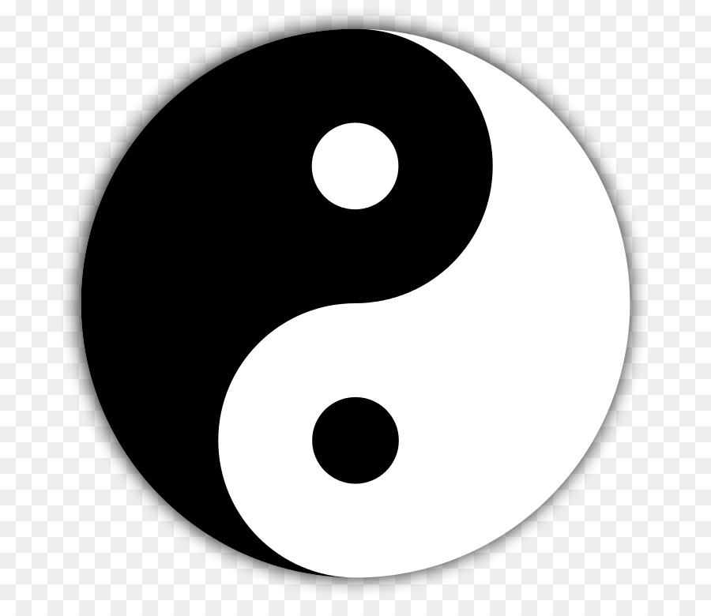

###### 1. Âm dương là một danh từ trừu tượng. 

Từ khi mù mịt không có gì gọi là Vô cực, mà đến khi đã thành hình gọi là Thái cực. Thái cực động mà sinh dương, tĩnh mà sinh âm, phình ra bóp vào, nén xuống đưa lên, là cái khí trong trời đất, khi đầy khi vơi, lúc lớn lên, lúc nhỏ xuống, vốn không có hình gì. Muôn vật trong trời đất, giống mang thai, loài đẻ trứng, sinh hóa bằng hình thể hay khí thể, có tri giác, có sinh sản, không một loài nào là không bẩm thụ khí âm dương để thành hình. Sách nói: *âm dương tuy là vô hình trừu tượng, nhưng thực tế làm căn bản cho mọi sinh vật*. Lại nói: *rét và nắng là đức năng của âm dương, thủy hỏa là dấu hiệu của âm dương.*

###### 2. Dương đạo thực, âm đạo hư. 

Trời bao bọc lấy đất, khí dương thống quản khí âm. Trong sách Chu Dịch vẽ quẻ Ly (☲) rỗng ở giữa, quẻ Khảm (☵) đầy ở trong là thể theo cái lý **dương thực mà âm hư**. Phàm trai hay gái lúc sơ sinh đều bẩm thụ chất thuần dương (hoàn toàn dương), trai 16 tuổi, gái 14 tuổi thì mới có [[keyword#Thiên quý|thiên quý]] răng mới thay, tóc mới dài, đến lúc trai đã 64, gái đã 49 tuổi thì thiên quý hết mà không còn sinh dục được. Tính lại sự hưởng thụ của một đời người chẳng qua vài mươi năm thì âm tinh đã cạn. Sách Nội Kinh nói: *"Con người sống được 40 tuổi thì âm khí suy đi một nửa"*. Đó là chứng minh rõ về câu *“Dương thường hữu dư, âm thường bất túc”* vậy.

###### 3. Âm ở trong để chấn thủ cho dương, dương ở ngoài để bảo vệ cho âm.

Phần dương chủ bên ngoài, phần âm chủ bên trong, dương chủ động, âm chủ tĩnh, âm là cơ sở của dương, vì dương mà chấn thủ. Dương để che chở cho âm, vì âm mà giúp đỡ, cũng như trong một gia đình cha là chủ thì tiếp ứng ở ngoài, mẹ thì thu xếp cất đặt ở trong.

###### 4. Dương kín đáo mới giữ vững, dương mạnh quá thì không kín đáo.

Trong hỏa không có thủy thì hỏa cháy mạnh, trong dương không có âm thì dương mạnh quá, nghĩa là nếu dương có âm kiềm chế thì không bốc lên trên. Nếu dương không được âm giúp đỡ thì phát tán ra ngoài không kín đáo. Nội kinh nói: *“Âm khí bình hòa, dương khí kín đáo thì tinh thần mới được bình thường”* là chí lý.
###### 5. Căn bản của dương hỏa (tâm) là thận (dưới đất). Căn bản của âm hỏa (thận) là tâm (trên trời) .
Tâm là dương hỏa, thận là âm hỏa. Dương hỏa không thể giáng xuống, (tâm được sánh với quẻ [[keyword#離 Ly|Ly]] ☲ rỗng giữa), trong tâm chứa máu đỏ là chỗ ở của chân âm mà căn bản thì ở dưới thận. Âm hỏa không bốc lên, thận (sánh với quẻ Khảm ☵ đầy ở trong),  trong quả thận có màng trắng là chỗ ở của chân dương mà căn bản thì ở trên tâm. Sách nói: *“Rồng lặn dưới đáy biển, rồng nổi dậy thì hỏa theo, chân dương chứa ở thận (khảm phủ) khi vận dụng thì ứng với tâm (ly cung)”* chính là như thế.
> Ghi chú: từ "căn bản" không phù hợp bằng "nguồn gốc" , hiểu câu này là: nguồn gốc của dương là từ âm-quả thận  (dương ở đây là khí, thận là âm), nguồn gốc của âm là từ dương-quả tim. Thận = Chân dương vì sinh ra khí, Tim = Chân âm vì sinh ra máu [[THIÊN THỨ HAI - THỦY HỎA#4. Hỏa làm chủ cho thủy, thủy tức là nguồn cho hỏa; nguồn của thủy và hỏa không thể lìa nhau.| Xem thêm]]
###### 6) Về dương khí, chất tinh vi nuôi thần, chất nhu nhuận (huyết) thì nuôi gân. 
Nói về quan hệ giữa tinh với huyết thì tinh là chất thanh, là dương, huyết là chất trọc, là âm. Quan hệ tinh huyết đối với thần khí, thì tinh huyết hữu hình là âm, thần khí vô hình là dương. 
- Tinh ở trong khí là âm ở trong dương. Nhưng tinh là chất thanh và là dương, khi ở trong khí thì đóng vai âm, cho nên nuôi được thần, thể dương cương, thể âm nhu. 
- Nhu ở trong cương là huyết ở trong khí. Nhưng huyết là chất trọc là âm ở trong âm, cho nên nuôi được gân. Vì thế hiện ra âm hư thì thần suy, huyết khô thì gân co rút.
> Ghi chú: không hiểu lắm ? #tinh, #huyết, #khí #thần 
 <table style="border-collapse: collapse; width: 100%;">
  <tr>
    <th style="text-align: center; border: 1px solid black;">Tinh</th>
    <th style="text-align: center; border: 1px solid black;">Huyết</th>
    <th style="text-align: center; border: 1px solid black;">Khí</th>
    <th style="text-align: center; border: 1px solid black;">Thần</th>
  </tr>
  <tr>
    <td style="text-align: center; border: 1px solid black;">+</td>
    <td style="text-align: center; border: 1px solid black;">-</td>
    <td style="text-align: center; border: 1px solid black;">-</td>
    <td style="text-align: center; border: 1px solid black;">+</td>
  </tr>
  <tr>
    <td colspan="2" style="text-align: center; border: 1px solid black;">-</td>
    <td colspan="2" style="text-align: center; border: 1px solid black;">+</td>
  </tr>
</table>

###### 7) Thần yên tĩnh thì âm sinh trưởng, hình thể lao nhọc thì dương càng thịnh.

Thần của thân thể con người, cần tiềm tàng mà vận dụng kín đáo. Sách nói: “Giữ gìn thần để nuôi âm” nghĩa là thần không thể để vượt ra ngoài. Âm ưa yên tĩnh, âm yên tĩnh thì sinh huyết, nếu hình thể lao nhọc thì thương âm mà tổn huyết. Trong dương không có âm, dương càng thịnh một mình sẽ sinh ra cái nạn khô háo.

###### 8) Dương chứng phần nhiều hay mừng, âm chứng phần nhiều hay giận.

Dương là máy phát sinh của mùa xuân, mùa hạ. Âm là khí heo hắt của mùa thu, mùa đông. Dương tượng trưng cho hỏa, âm tượng trưng cho thủy, tính hỏa bốc lên chủ về vui cười, tính thủy nhuần xuống chủ về trầm uất. Cho nên bệnh hiện ra chứng dương phần nhiều hay cười, hiện ra chứng âm phần nhiều hay giận (lược).
>Ghi chú: ĐY lý luận Dương như lửa bốc lên, âm như nước lặng xuống, từ đó chứng bệnh suy ra theo Âm-Dương

###### 9) Dương là căn bản của sự sống, âm là cơ sở của sự chết.

Đây là dương chủ phát sinh, âm chủ sát phạt. Bởi vì dương tức là hỏa, hỏa tức là khí, muôn vật không có khí thì chỉ là tro tàn, cũng như hoa cỏ ở chỗ sáng (dương) thì tốt tươi lớn mạnh, ở trong chỗ tối (âm) thì vàng héo, yếu ớt. Làm thuốc mà biết quý trọng thuốc ôn nhiệt, tránh xa thuốc khổ hàn là con đường cốt yếu hướng về dương mà trái với âm, tới chỗ sống xa chỗ chết.

###### 10) Một phần âm chưa hết thì không thành tiên, một phần dương chưa hết thì không chết.

Đây là lời nói huyền bí của đạo tu tiên, phàm người tu luyện mà một phần âm khí còn chưa hết thì không thành tiên, cũng như người bệnh nguy nặng mà một phần dương khí còn chưa hết thì không đến nỗi chết. Về phép đạo dẫn tu tiên, cho thận hỏa làm lò luyện đơn, cho mệnh môn hỏa làm thuốc đơn (đan mẫu), lấy phép nuốt nước bọt và hít khí trời làm thuốc luyện đơn, tu luyện 7 lần 7 để thông mạch Nhâm, hội mạch Đốc để cổ vũ mọi phần âm, cốt cho khí “nhất chân” biến thành “thuần dương” rồi sau mới thôi. Bài luận tiên thiên sách Cẩm nang có dẫn câu sách Tiên kinh nói rằng: một điểm sáng ở quãng giữa hai quả thận, nghịch là thuốc đơn (đan mẫu), thuận thì thành con người. Câu này phần nhiều người ta khó hiểu chính là chỉ sâu vào chân tinh mà nói. “Nghịch” nghĩa là đóng kín mà giữ lại thì như là thuốc đơn (đan mẫu), “thuận” là nam nữ giao cấu mà tiết ra thì thành thai nghén.

###### 11) Cái trong trẻo của phần dương là nguyên khí, cái vẩn đục là âm hỏa. Cái trong trẻo của phần âm là tân dịch, cái vẩn đục là đờm dãi.

Dương tức là hỏa là khí, trong trẻo là thiếu hỏa vô hình, vẩn đục là tráng hỏa hữu hình. Âm tức là thủy là huyết, cái trong trẻo là tân dịch để bảo vệ sự sống, vẩn đục là âm ế làm hại con người. Cho nên nói: “tăng thêm nguồn gốc của hỏa để làm tan hết vẩn đục âm ế” cũng là nghĩa đó.

###### 12) Dương suy không thở ra được, âm suy không hít vào được. Dương bị bệnh thì không cúi được, âm bị bệnh thì không ngửa lên được.

Suy tức là hư, dương chủ đưa ra, thở ra thì khí ra. Hơi ngắn thì không thở ra được. Âm chủ thu nạp, hít vào thì khí vào, sức yếu thì không hít vào được. Ở thân thể con người, lưng thuộc dương, bụng thuộc âm, bệnh ở lưng mà làm sao cúi xuống được, bệnh ở bụng mà làm sao nằm ngửa được.
###### 13) Dương thịnh thì trừng mắt, âm thịnh thì nhắm mắt.
Dương chủ động, âm chủ tĩnh, ban ngày thì dương thịnh ở ngoài, ban đêm thì âm thịnh ở trong. Dương thịnh thì thức, âm thịnh thì ngủ. Nội kinh nói: “sáng sớm thì phần âm hết, dương khí phát ra ở mắt, mắt mở thì khí lưu hành ỏ trên đầu, ban đêm thì khí hành ở phần âm mà nhắm mắt”.
###### 14) Dương khí cũng như trời với mặt trời, mất vị trí của nó thì bớt tuổi thọ mà không sáng tỏ.
Dương là phần khí để sinh sống, trời không có nó thì không sinh vạn vật được, người không có nó thì không sống được. Cũng như trời với mặt trời, mất vị trí của nó thì không sáng tỏ, mây mù 4 phía nổi lên, thành ra trời đất ảm đạm. Dương khí của người ta suy thì chết non, cho nên chủ yếu của sự sống trước hết phải quý trọng chân dương.
###### 15) Bệnh dương thì thăng lên, hết mức thì giáng xuống. Bệnh âm thì giáng xuống, hết mức lại thăng lên.
Dương vốn thăng lên, âm vốn giáng xuống, nhưng thăng lên hết mức thì giáng xuống, giáng xuống hết mức thì thăng lên đó là lẽ thông thường. Huống gì, âm có bệnh thì dương lấn át mà thăng lên, dương có bệnh thì âm lấn át mà giáng xuống. Cho nên Bổ trung thang lấy thăng làm giáng, hoàn Lục vị lấy giáng làm thăng, là hiểu sâu được cái lẽ tự nhiên của âm dương. Thực ra Bổ trung không chỉ có thăng, mà Địa hoàng không chỉ có giáng.
###### 16) Bệnh thuộc âm, phát chậm, khỏi cũng chậm. Bệnh thuộc dương, phát nhanh, khỏi cũng nhanh.
Âm thuộc thủy vốn nhuần xuống dưới mà chủ trầm tĩnh. Dương thuộc hỏa vốn bốc lên mà chủ mau chóng. Nội kinh nói: “Bệnh đã lâu không phải dương chứng, bệnh bạo phát không phải âm chứng” cũng vì lẽ đó.
###### 17) Dương hư sinh lạnh ở ngoài, âm hư sinh nóng ở trong. Dương thịnh quá sinh nóng ở ngoài, âm thịnh quá sinh lạnh ở trong.
Dương thuộc hỏa vốn nóng mà chủ ở ngoài, âm thuộc thủy vốn lạnh mà chủ ở trong. Nếu dương hư thì âm lấn tới mà lạnh ngoài, âm hư thì dương lấn tới mà nóng ở trong. Nếu dương thịnh quá thì nó sẽ tự nóng ở ngoài, âm thịnh quá thì nó tự lạnh ở trong. Đó là nó tự vượng ở bộ vị của nó, không có gì thắng hơn nó mà gây ra.
###### 18) Dương bốc lên thì tự phát sốt, âm suy yếu thì tự đổ mồ hôi.
Nhiệt là dương là hỏa, tính hỏa bốc lên. Thổ hư không chứa giữ được dương, thủy hư không kiềm chế được hỏa, cho nên hỏa bốc lung tung vượt ra ngoài da mà phát sốt. Mồ hôi là thủy là âm, âm chủ đóng kín, âm yếu thì dương lấn, âm bị dương quấy rối mà tự đổ mồ hôi, sự tự đổ mồ hôi đó không riêng gì vì chứng dương hư.
###### 19) Âm hư cực đại thì dương phát quyết lạnh, dương hư cực đại thì âm phát táo.
Âm bị hư thì dương lấn, dương không có âm liễm lại mà quá mạnh, đó là hỏa đến cực đại thì giống như thủy, cho nên nói: nóng nhiều quyết lạnh cũng nhiều (nhiệt thâm quyết diệc thâm). Dương hư thì âm lấn, âm không có dương bảo vệ thì rét đông lại, đó là thủy đến cực độ giống như hỏa cho nên nói: táo thuộc âm.

###### 20) Dương khí không thăng lên được, gọi là “cách” (cách cự). Âm khí không giáng xuống được, gọi là “ế” (nghẹn).
Dương vốn thăng lên nhưng bị âm ngăn lại mà không thăng lên được. Âm vốn giáng xuống, bị dương đóng lại mà không giáng xuống được. Cho nên hiện ra chứng trên không vào được, dưới không ra được, đó là chứng quan cách. Phàm những chứng cồn cào mà nuốt chua và ợ hơi cùng nghẹn hay phiên vị (ăn vào bị mửa ra), đều là đầu mối phát sinh chứng quan cách.

###### 21) Dương sinh ở nhiệt, nhiệt thì dãn ra. Âm sinh ở hàn, hàn thì co lại.
Nhiệt (nóng) thì khí tán, khí đã tán thì đường lạc chi nhánh mở ngang ra mà dãn nở. Hàn (lạnh) thì huyết đặc, huyết đặc thì đường kinh lạc kết bó mà co lại. Sách nói: “trong huyết không có khí thì bệnh phát buông rã rời rạc, trong khí không có huyết thì bệnh phát run giật co rút” là ý nghĩa rất sâu sắc. Nên suy nghĩ mà hiểu lấy.

###### 22) Dương tà đã hóa nhiệt, nhiệt thì hại khí. Âm tà đã hóa hàn, hàn thì hại hình.
Dương thuộc nhiệt, dương vốn vô hình mà chủ khí. Âm thuộc hàn, âm vốn hữu hình mà chủ huyết. Hỏa khí nóng quá (tráng hỏa) làm hao tổn khí, phế chủ về khí, hỏa thì khắc kim cho nên nhiệt tất phải hại khí. Hàn thì huyết đặc, huyết làm tươi nhuận cho da thịt, cho nên tất phải hại hình.

###### 23) Dương không đầy đủ thì hàn thấp ngưng đọng, âm không đầy đủ thì hỏa nhiệt sôi bốc.
Dương vốn nhiệt, âm vốn hàn. Dương không đầy đủ thì âm lấn mà sinh hàn thấp là vì không có hỏa. Âm không đầy đủ thì dương lấn mà sinh nhiệt bốc, là vì không có thủy.

###### 24) Khí âm ít, khí dương nhiều cho nên mình nóng mà buồn đầy. Khí dương ít, khí âm nhiều cho nên mình rét lạnh như ở trong nước ra.
Dương vốn nhiệt, âm vốn hàn, âm dương cốt thăng bằng, nếu hư thì có một bên thắng, cho nên chứng buồn đầy là âm hư. Chứng mình rét lạnh là dương hư. Do đó có thể biết người béo mập thì âm thắng hơn dương, da dẻ lạnh như băng tuyết.

###### 25) Dương khí suy yếu ở phần trên thì thành “hàn quyết”, âm khí suy yếu ở phần dưới thì thành “nhiệt quyết”.
Chứng quyết có âm, có dương. Không phải chỉ quyết có riêng là hàn lạnh. Phàm âm suy thì dương thắng, dương suy thì âm thắng, tính dương thì nhiệt, tính âm thì hàn.

###### 26) Dương hư thì khí thoát, thần khí do đó mà mê loạn. Âm hư thì huyết bại, tay chân do đó mà rời rạc.
Dương tức là hỏa, hỏa tức là khí, khí sinh ra thần. Khí bị hư không thực hiện được tác dụng linh lợi, thần khí do đó mà sinh mê loạn, đó là thần không giữ vững được vị trí. Âm thuộc thủy, thủy thuộc huyết, huyết sinh ra cơ nhục. Huyết bị hư không có tác dụng vinh nhuận cho gân xương, tay chân do đó mà rời rạc, đó là lý do của chứng co giật chân tay.

###### 27) Dương thịnh quá thì sẽ chảy máu cam, âm hư thì tiểu tiện khó đi.
Dương sinh hỏa, tính hỏa bốc lên. Hỏa thịnh thì bức huyết đi bừa bãi mà gây ra chảy máu cam. Âm đã hư thì hỏa bốc lên mà hại phế kim, phế mất chức năng trị tiết, thủy không có khí thì không hóa được mà tiểu tiện khó đi.

###### 28) Khí âm lấn lên vào trong phần dương thì sợ lạnh. Khí dương hãm xuống vào trong phần âm thì phát sốt.
Dương ở ngoài, âm ở trong; dương chủ nhiệt, âm chủ hàn; Âm lấn ra ngoài thì sợ lạnh, dương hãm vào trong lý thì phát sốt; đó là lẽ âm dương hơn kém chênh lệch lấn át lẫn nhau, cho nên nói: Dương hư thì sinh lạnh ở ngoài, âm hư thì sinh nóng ở trong.

###### 29) Âm hư thì dương phải tụ lại, phát sốt mà đổ mồ hôi trộm; dương hư thì âm tất lấn, phát quyết lạnh mà tự ra mồ hôi.
Con người có mồ hôi cũng như trời có mưa; mồ hôi là loại nước, thuộc âm, âm chủ ở trong, dương chủ ở ngoài, âm hư thì không giữ vững ở trong được, bị dương quấy rối, thủy theo hỏa đi ra, phát sốt mà đổ mồ hôi trộm, cho nên nói đổ mồ hôi trộm là thuộc về âm hư; dương hư không bảo vệ ở ngoài được, âm lấn ra dương, phát ra quyết lạnh mà tự đổ mồ hôi, cho nên nói tự ra mồ hôi là thuộc dương hư.

###### 30) Trong âm không thể không có dương, trong dương không thể không có âm. Dương làm hại âm thì tinh huyết khô cháy, âm làm hại dương thì thần khí lặng tắt.
Phàm mọi bệnh sinh ra, không một bệnh nào là không phải vì âm dương hại nhau mà mất điều hòa.
Dương gốc ở âm, âm gốc ở dương, âm dương không thể lìa nhau. Dương thuộc hỏa, âm thuộc thủy, dương thắng hơn âm thì hỏa bốc vượt ra, cháy cả đồng nội, tinh huyết khô cạn; âm thắng hơn dương thì cũng như khí hậu heo hắt, muôn vật tiêu điều mà thần khí lặng tắt. Phàm trăm bệnh của con người không gì là không do âm dương chênh lệch nhau, điều đó quan hệ đến sự sống chết.

###### 31) Âm sợ dương lấn lên, cho nên âm gặp dương tà không bị cạn thì bị khô. Dương sợ độc của âm, cho nên dương gặp âm tà không chạy tan thì bay mất; đó là cơ chuyển của âm dương đố kỵ lẫn nhau.
Không bị cạn thì bị khô đó là nói: “Huyền phủ” [[keyword#^ded741|huyền phủ]] nóng khô, năm chất dịch cạn hết; Không chạy tan thì bay mất, đó là nói thế nóng cùng kiệt thì chân dương lìa thoát. Trong sách nói: “Làm mạnh chân thủy để chế bớt sự chói sáng, thêm nguồn chân hỏa để tiêu tan mây mù”. Câu đó thực là cách chữa thủy hỏa âm dương, rất đúng thuốc đúng chứng.

###### 32) Âm thoát thì mắt bị mờ đi, dương thoát thì mắt thấy quỷ.
Hai thiên Khí huyết Bệnh nguyên đều nói: “Khí đã thoát thì mắt không sáng tỏ”, ở đây nói âm bị thoát thì mắt mờ đi, vậy đủ biết rằng mắt sáng tỏ không phải riêng vì hỏa mà còn có quan hệ với chân âm. Sách nói: “Phần âm không đưa sáng vào mắt”. Lại nói: “mắt nhờ huyết mà trông thấy”, đó là không có âm thì mờ tối, bộ phận mắt có thần quang, thần cao, thần thủy không phải chân âm là gì. Nhưng công dụng của thần minh lại chủ ở chân dương, nếu thần minh không có chủ thì tà khí do đó quấy rối phần chính khí, cho nên âm thoát thì mắt mờ, dương thoát thì mắt thấy quỷ.
###### 33) Khí dương quá thừa thì mình nóng không có mồ hôi; khí âm quá thừa thì mình rét mồ hôi ra nhiều.
Tà thịnh ở ngoài biểu thì hỏa uất lại ở trong lý, cho nên mình nóng không có mồ hôi, mới biết là vì khí dương quá thừa; Chính khí hư ở trong, thì khí âm phát động trong nội bộ, cho nên mình lạnh có nhiều mồ hôi; đó là âm thắng hơn dương.

###### 34) Bệnh ở phần dương thì buổi sáng yên, bệnh ở phần âm thì ban đêm yên, chứng dương hư thì nặng về buổi tối, chứng âm hư thì nặng về buổi mai.
Nói “Bệnh” là do âm dương tự sinh ra bệnh; nói “hư” là có một bên thắng hơn. Dương hư thì âm thắng; âm hư thì dương thắng. Dương bị bệnh thì buổi sáng yên là vì dương được dương giúp đỡ; âm bị bệnh thì ban đêm yên là vì âm được âm giúp đỡ; Chứng dương hư nặng nề về buổi tối, là phần âm thắng phần dương; chứng âm hư nặng về buổi mai là phần dương thắng phần âm. Còn chứng hậu của “thực tà” thì khác, tà của dương thịnh thì buổi sáng nặng, buổi tối nhẹ. Tà của âm thịnh thì buổi sáng nhẹ, buổi tối nặng đó là dương gặp dương thì vượng, âm gặp âm thì mạnh; lại có bệnh lúc phát lúc khỏi, hoặc buổi sáng hoặc buổi tối, ban ngày, ban đêm, đó là chính khí không tự chủ được, âm dương hơn kém cùng lẫn lộn giằng co nhau.

###### 35) Mồ hôi thuộc phần dương là mồ hôi nóng, mồ hôi thuộc phần âm là mồ hôi lạnh; người ta chỉ biết nhiệt nóng ra mồ hôi mà không biết hàn lạnh cũng ra mồ hôi.
Mồ hôi của người cũng như nước mưa của trời, khí trời bốc lên đọng lại mà thành mưa, khi người nóng uất mà đổ mồ hôi, đó là nhiệt thì có mồ hôi mọi người đều biết. Nhưng hàn cũng có mồ hôi gọi là mồ hôi lạnh thì người ta khó hiểu, tức như kinh sợ hết sức mà toát mồ hôi. Nội kinh nói: “*Khí âm quá thừa, thì mình lạnh ra nhiều mồ hôi*” cũng là lẽ đó.
###### 36) Nóng rét qua lại là âm dương tranh chấp nhau; dương không đầy đủ thì rét trước nóng sau; âm không đầy đủ thì nóng trước rét sau.
Phần trên thịnh thì phát nóng; phần dưới thịnh thì phát rét. Ngoài da lạnh mà ráo là dương kém, ngoài da nóng mà ráo là âm kém. Ngoài da lạnh mà rét là âm thịnh, ngoài da ấm mà nóng là dương thịnh; Dương vốn nhiệt, âm vốn hàn; âm dương tranh chấp nhau thì có nóng rét qua lại; dương hư âm thắng hơn thì rét trước, âm hư dương thắng hơn thì nóng trước; ở trên là phần dương, trên thịnh thì phát nóng, ở dưới là phần âm, dưới thịnh thì phát rét. Ngoài da rét mà ráo là âm thắng hơn dương, ngoài da nóng mà ráo là dương thắng hơn âm; Hoàn toàn rét là âm thịnh dương hư, hoàn toàn nóng là âm hư dương thịnh.
###### 37) Âm hư không thắng được dương thì mạch nhanh và mạnh, dồn lại thì phát cuồng; dương hư không thắng được âm thì khí năm tạng giao tranh với nhau mà chín khiếu chẳng thông.
Chứng cuồng phần nhiều do hỏa do nhiệt, âm không thắng được dương chỉ một mình dương lấn mạnh; chứng bí đái phần nhiều do thủy do hàn, dương không thống quản được âm thì một mình âm sẽ thịnh.
###### 38) Bệnh âm phát ở xương, bệnh dương phát ở thịt, bệnh dương phát về mùa đông, bệnh âm phát về mùa hè.
Xương ở trong thuộc âm huyết, cùng với thịt cũng đều là âm loại; nhưng huyết có hành động là dương ở trong âm; tiết đông chí đã có dương chớm nở, tiết hạ chí đã có âm ẩn nấp, cho nên khi bệnh phát cũng đều theo loại của nó.
###### 39) Tà vào trong dương thì phát “cuồng”, tà vào trong âm thì sinh bệnh tê (tý), va chạm với dương thì phát “điên”, va chạm với âm thì sinh ra “câm”, dương nhập vào âm thì yên tĩnh, âm xuất ra dương thì giận dữ, đó là năm chứng rối loạn.
Tà vào phần âm thì huyết ngừng lại mà sinh bệnh tê; va chạm với dương và va chạm với âm đều là âm dương giao tranh lẫn nhau; dương vốn động nhập vào âm thì yên tĩnh, âm vốn tĩnh xuất ra dương thì giận dữ.

###### 40) Âm và dương chia lìa nhau, tinh thần sẽ hết.

Người ta sống được toàn nhờ âm dương thăng giáng và thủy hỏa tác dụng lẫn nhau; nhưng âm gốc ở dương, dương gốc ở âm, cùng làm thể và tác dụng lẫn nhau nếu âm lìa thì tinh thần tan, dương thiếu thì khí tuyệt, hình thể bại hoại mà chết.

###### 41) Sáng sớm thì âm phận hết, khí dương xuất hiện ở mắt, mắt mở thì khí đi lên trên đầu, ban đêm thì khí hành ở âm mà hợp lại ở con mắt.
Ban ngày thì khí dương hoạt động, âm vận hành ở trong dương, ban đêm thì khí âm hoạt động, dương vận hành ở trong âm; cho nên dương động thì thức, âm tĩnh thì ngủ.
###### 42) Chân âm chân dương hao kém, cũng như cây không có gốc.
Chân âm và chân dương trong thận là “Thái cực” của thân thể, gốc rễ của sinh mạng; Cho nên nói: chứng thương hàn nguy kịch nên xem mạch “Thái khê”, mạch “Thái khê” còn thì có khi sống lại, “Thái khê” là mạch thận. Lại nói: mạch hai bộ xích của con người ta cũng như cây có gốc, cành lá tuy khô héo, gốc rễ hãy còn, tưới bón cho nó tươi tốt.
###### 43) Phát sốt ớn lạnh là chứng xuất phát ở phần dương; không sốt ớn lạnh là chứng xuất phát ở phần âm.
Hàn tà bó ở ngoài biểu, chính khí phẫn uất ở trong, cho nên phát nóng mà sợ lạnh. Nguyên khí suy yếu ở trong, hàn tà thẳng vào, cho nên chứng hậu hiện ra hoàn toàn là âm (thuần âm).